# Phần 1 — Bài toán kiến trúc dẫn đến `ChatModel`

Điểm xuất phát không phải là interface Java. Điểm xuất phát là **sự biến động của hệ sinh thái AI provider**.

> Spring AI không cố gắng abstraction hóa “trí thông minh” của model. Nó abstraction hóa việc application giao tiếp với model.

Đây là phân biệt rất quan trọng.

<details open>
<summary><strong>1. Mục tiêu chính thức của Spring AI</strong></summary>

README của dự án nêu ba nguyên tắc:

- **Portability**: code nghiệp vụ tương tác với AI thông qua abstraction chung của
  Spring AI, thay vì phụ thuộc trực tiếp vào SDK và kiểu dữ liệu của một provider.
  Nhờ đó, application có thể chuyển từ OpenAI sang Anthropic, Ollama hoặc một
  provider khác với ít thay đổi code nhất có thể.
- **Modular design**: phần API chung và phần tích hợp từng provider được chia thành
  các module có trách nhiệm riêng. Application chỉ cần đưa những module phù hợp
  vào dependency graph của mình.
- **Strongly typed data structures và APIs**: request, response, message, options
  và metadata được biểu diễn bằng Java types thay vì dùng `String`, `Map` hoặc
  JSON không có contract ở mọi nơi.

### 1.1. **Portability** cụ thể có nghĩa là gì?

Trong ngữ cảnh Spring AI, `portability` có thể hiểu là **khả năng mang phần lớn
application code từ provider này sang provider khác mà không phải viết lại phần
nghiệp vụ**.

Nếu application phụ thuộc trực tiếp vào OpenAI SDK:

```java
class CustomerSupportService {
    private final OpenAIClient client;
}
```

thì `CustomerSupportService` chỉ hoạt động với OpenAI. Đổi sang Anthropic đồng
nghĩa với việc sửa dependency, request types, response types và logic gọi SDK
ngay trong service.

Nếu application phụ thuộc vào abstraction chung:

```java
class CustomerSupportService {
    private final ChatModel chatModel;
}
```

thì service chỉ tuyên bố rằng nó cần khả năng gọi một chat model. OpenAI,
Anthropic hay Ollama là implementation được nối vào phía sau `ChatModel`. Khi
đổi provider, phần thường phải thay là dependency, configuration và bean wiring;
logic chính của `CustomerSupportService` có thể được giữ lại.

Ta có thể hình dung thiết kế OOP bằng UML class diagram:

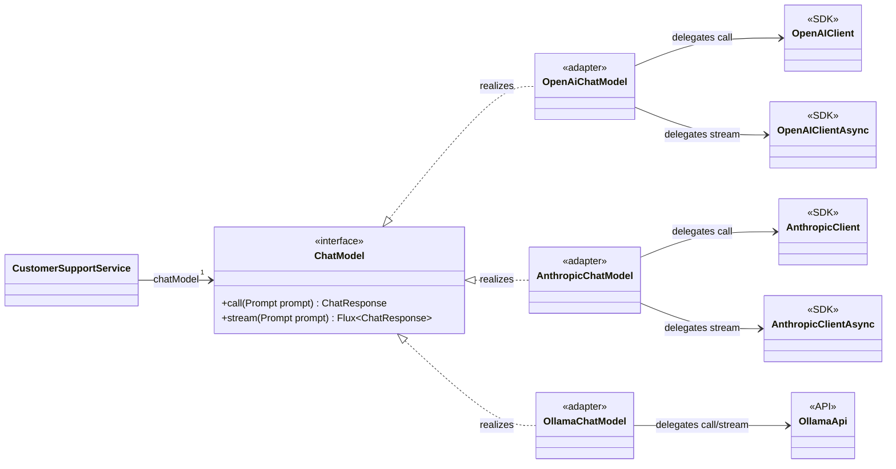

Ý nghĩa các quan hệ UML:

- `CustomerSupportService --> ChatModel` là navigable association:
  `CustomerSupportService` giữ một reference kiểu `ChatModel`.
- `ChatModel <|.. OpenAiChatModel` là realization: class
  `OpenAiChatModel` implement interface `ChatModel`. Hai adapter còn lại có cùng
  quan hệ.
- `OpenAiChatModel --> OpenAIClient` là association/delegation: adapter chuyển
  request của Spring AI sang lời gọi của provider client. Các provider khác có
  cấu trúc tương tự.

Điểm quan trọng của sơ đồ là `CustomerSupportService` chỉ nhìn thấy
`ChatModel`. Nó không có association trực tiếp đến bất kỳ provider client nào.

Như vậy, thứ được làm cho portable chủ yếu là **integration contract của
application**:

- Cách application gửi một model request.
- Cách application nhận model response.
- Cách biểu diễn những capability chung như messages, generation options và
  usage metadata.
- Cách application phụ thuộc vào model thông qua Spring dependency injection.

`Portability` không có nghĩa là mọi provider có tính năng giống nhau hoặc sẽ trả
về câu trả lời giống nhau. Nó cũng không đảm bảo việc đổi provider luôn chỉ cần
thay một dòng configuration. Nếu application sử dụng capability riêng của
OpenAI, phần code đó vẫn phụ thuộc OpenAI và có thể phải thay khi chuyển provider.

Do đó, cách hiểu chính xác là:

> Spring AI làm cho code tích hợp với model có khả năng chuyển đổi provider với
> ít thay đổi nhất có thể; nó không làm cho các model trở nên tương đương về tính
> năng và hành vi.

Phần 12 sẽ phân biệt kỹ hơn ba cấp độ: source portability, wiring portability và
behavioral portability.

### 1.2. **Modular design** cụ thể có nghĩa là gì?

Trong Spring AI, `modular design` có nghĩa là framework được chia thành các
**build module có trách nhiệm và dependency boundary rõ ràng**, thay vì đặt API
chung, provider SDK, auto-configuration và API cấp cao vào cùng một artifact.

Từ `module` ở đây chủ yếu nói về Maven/Gradle artifact và source module của dự
án; nó không có nghĩa Spring AI bắt buộc phải sử dụng Java Platform Module System
hay `module-info.java`.

Một số module tiêu biểu:

| Nhóm module        | Trách nhiệm                                                  | Ví dụ                                                                                                                |
| ------------------ | ------------------------------------------------------------ | -------------------------------------------------------------------------------------------------------------------- |
| Core model         | Chứa abstraction và canonical types chung                    | [`spring-ai-model`](../../../spring-ai-model)                                                                        |
| High-level client  | Cung cấp fluent API và orchestration phía trên model         | [`spring-ai-client-chat`](../../../spring-ai-client-chat)                                                            |
| Provider adapter   | Chuyển đổi giữa Spring AI types và SDK/API của từng provider | [`spring-ai-openai`](../../../models/spring-ai-openai), [`spring-ai-anthropic`](../../../models/spring-ai-anthropic) |
| Auto-configuration | Tạo bean và wiring provider vào Spring Boot application      | [`spring-ai-autoconfigure-model-openai`](../../../auto-configurations/models/spring-ai-autoconfigure-model-openai)   |

Dependency giữa các module đi theo hướng vào abstraction ổn định:

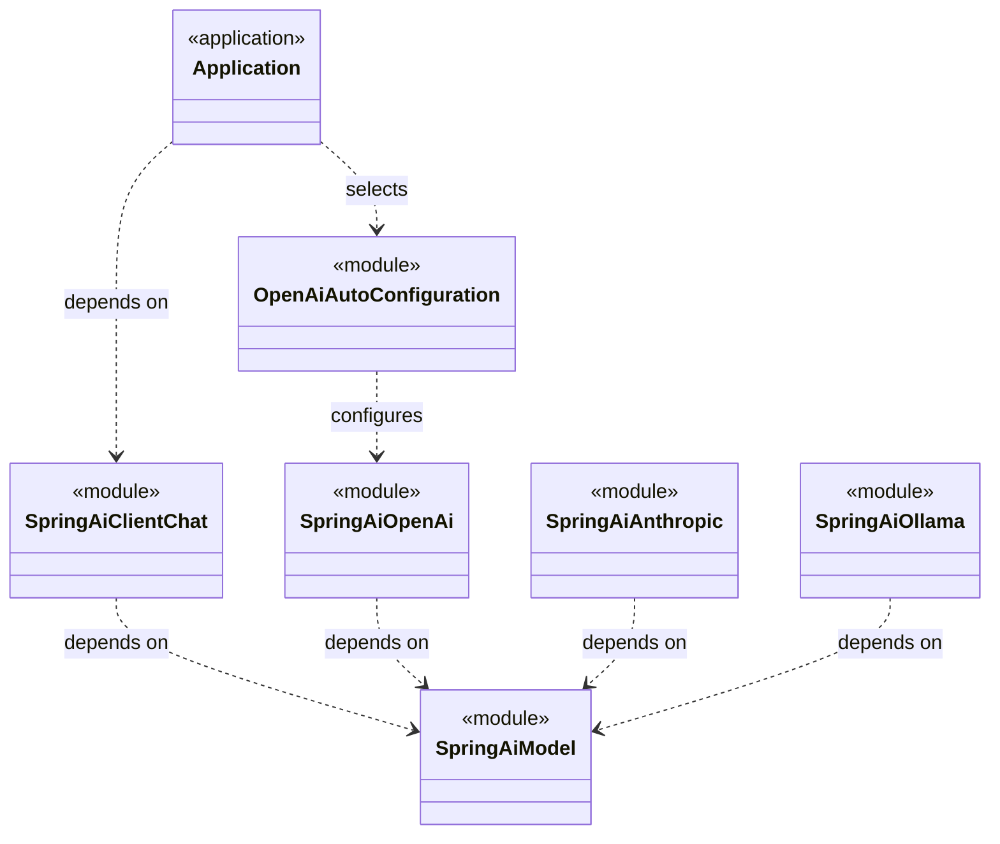

Đường dependency UML `..>` có nghĩa là module nguồn phụ thuộc vào module đích.
Điểm quan trọng là các provider module phụ thuộc vào `spring-ai-model` để
implement contract chung; `spring-ai-model` không phụ thuộc ngược lại vào
OpenAI, Anthropic hay Ollama.

Quy tắc dependency này tạo ra các lợi ích:

- **Chọn đúng phần cần dùng**: application dùng OpenAI không bắt buộc phải kéo
  Anthropic, Ollama và SDK của các provider khác vào classpath.
- **Cô lập thay đổi**: khi OpenAI SDK thay đổi, phần mapping chủ yếu được xử lý
  trong `spring-ai-openai` thay vì lan vào core API và application code.
- **Tránh dependency pollution**: các SDK, HTTP client và transitive dependency
  riêng của provider không bị gom vào một artifact khổng lồ.
- **Mở rộng theo cùng một khuôn mẫu**: provider mới có thể được thêm dưới dạng
  một module adapter mới phụ thuộc vào core contract.
- **Tách optional convenience khỏi core**: Spring Boot auto-configuration giúp
  wiring thuận tiện nhưng không phải là bản thân Model API.
- **Có thể composition**: application có thể chọn một provider hoặc đồng thời
  đưa nhiều provider module vào nếu use case cần nhiều `ChatModel` bean.

Ví dụ, application đang dùng OpenAI có thể chọn OpenAI provider module và
auto-configuration tương ứng. Khi chuyển sang Anthropic, phần thay đổi chủ yếu
là provider dependency, configuration và bean selection. Service phụ thuộc vào
`ChatModel` không cần biết provider module nào đang được sử dụng.

#### Quan hệ giữa **modularity** và **portability**

Hai mục tiêu này bổ trợ nhau nhưng không giống nhau:

- **Portability** là khả năng giữ lại application code khi đổi implementation.
- **Modularity** là khả năng đóng gói, chọn, thay thế và cô lập các
  implementation ở cấp dependency/build artifact.

`ChatModel` tạo ra polymorphism ở cấp Java type. Các provider module tạo ra sự
cô lập ở cấp build và dependency graph.

Nếu chỉ có portability mà không có modularity, application có thể gọi một
interface chung nhưng vẫn phải mang theo một artifact chứa SDK của tất cả
provider. Nếu chỉ có modularity mà không có `ChatModel`, mỗi provider được đóng
gói riêng nhưng application vẫn phải viết code theo API riêng của từng module.

Do đó, cách hiểu ngắn gọn là:

> Portability giúp application không bị khóa vào một provider contract;
> modularity giúp provider implementation và dependency của nó không bị trộn
> vào phần còn lại của framework.

Xem [`README.md`, dòng 3–5](../../../README.md).

Tài liệu `ChatModel` diễn đạt mục tiêu cụ thể hơn:

> Cho phép tương tác với nhiều AI model thông qua một interface đơn giản, portable, và đổi model với ít thay đổi code.

Xem [`chatmodel.adoc`, dòng 8–12](../../../spring-ai-docs/src/main/antora/modules/ROOT/pages/api/chatmodel.adoc).

</details>

---

<details>
<summary><strong>2. Hãy hình dung Spring AI chưa tồn tại</strong></summary>

Giả sử application gọi trực tiếp OpenAI SDK. Ví dụ sau được rút gọn để làm nổi
bật coupling; phần backoff, logging và tool schema đầy đủ được lược bỏ:

```java
import java.util.List;
import java.util.concurrent.CompletableFuture;
import java.util.function.Consumer;

import com.openai.client.OpenAIClient;
import com.openai.client.OpenAIClientAsync;
import com.openai.core.JsonValue;
import com.openai.errors.InternalServerException;
import com.openai.errors.OpenAIRetryableException;
import com.openai.errors.RateLimitException;
import com.openai.models.FunctionDefinition;
import com.openai.models.FunctionParameters;
import com.openai.models.chat.completions.ChatCompletion;
import com.openai.models.chat.completions.ChatCompletionChunk;
import com.openai.models.chat.completions.ChatCompletionCreateParams;
import com.openai.models.chat.completions.ChatCompletionFunctionTool;
import com.openai.models.chat.completions.ChatCompletionMessage;
import com.openai.models.chat.completions.ChatCompletionMessageToolCall;
import com.openai.models.chat.completions.ChatCompletionTool;
import com.openai.models.completions.CompletionUsage;

class CustomerSupportService {

    // Application phụ thuộc cả synchronous và asynchronous client của OpenAI.
    private final OpenAIClient openAiClient;
    private final OpenAIClientAsync openAiClientAsync;

    CustomerSupportService(
            OpenAIClient openAiClient,
            OpenAIClientAsync openAiClientAsync) {
        this.openAiClient = openAiClient;
        this.openAiClientAsync = openAiClientAsync;
    }

    SupportAnswer answer(String question) {
        ChatCompletionCreateParams request = createRequest(question);
        ChatCompletion completion = executeWithRetry(request);

        // Application phải biết response của OpenAI được tổ chức theo choices.
        ChatCompletion.Choice choice = completion.choices().getFirst();
        ChatCompletionMessage message = choice.message();

        // Token usage dùng type và field names của OpenAI SDK.
        CompletionUsage usage = completion.usage().orElseThrow();

        // Tool calls cũng là provider-specific response types.
        List<ChatCompletionMessageToolCall> toolCalls =
                message.toolCalls().orElse(List.of());

        return new SupportAnswer(
                message.content().orElse(""),
                usage.promptTokens(),
                usage.completionTokens(),
                choice.finishReason().value().toString(),
                toolCalls);
    }

    private ChatCompletionCreateParams createRequest(String question) {
        // Tool definition dùng vocabulary và builders của OpenAI SDK.
        FunctionParameters parameters = FunctionParameters.builder()
            .putAdditionalProperty("type", JsonValue.from("object"))
            .build();

        FunctionDefinition function = FunctionDefinition.builder()
            .name("lookupOrder")
            .description("Look up the current status of an order")
            .parameters(parameters)
            .build();

        ChatCompletionTool tool = ChatCompletionTool.ofFunction(
                ChatCompletionFunctionTool.builder()
                    .function(function)
                    .build());

        // Message roles và generation options là OpenAI request API.
        return ChatCompletionCreateParams.builder()
            .model("gpt-...")
            .addSystemMessage("You are a customer-support assistant")
            .addUserMessage(question)
            .temperature(0.2)
            .maxCompletionTokens(500)
            .tools(List.of(tool))
            .build();
    }

    CompletableFuture<Void> streamAnswer(
            String question,
            Consumer<String> onText,
            Consumer<List<ChatCompletionChunk.Choice.Delta.ToolCall>>
                    onToolCallChunks) {

        ChatCompletionCreateParams request = createRequest(question);

        // Application phải hiểu streaming subscription và chunk structure
        // của OpenAI SDK, bao gồm partial text và partial tool calls.
        return openAiClientAsync.chat()
            .completions()
            .createStreaming(request)
            .subscribe(chunk -> {
                for (ChatCompletionChunk.Choice choice : chunk.choices()) {
                    ChatCompletionChunk.Choice.Delta delta = choice.delta();
                    delta.content().ifPresent(onText);
                    delta.toolCalls().ifPresent(onToolCallChunks);
                }
            })
            .onCompleteFuture();
    }

    private ChatCompletion executeWithRetry(
            ChatCompletionCreateParams request) {

        int attempt = 0;
        while (true) {
            // Các subtype khác của OpenAIException không được catch ở đây và
            // vẫn có thể thoát khỏi method.
            try {
                return openAiClient.chat().completions().create(request);
            }
            catch (RateLimitException | InternalServerException
                    | OpenAIRetryableException retryable) {
                // Application phải biết exception nào của OpenAI có thể retry.
                // Ví dụ rút gọn này cố ý bỏ qua backoff và jitter.
                if (++attempt >= 3) {
                    throw retryable;
                }
            }
        }
    }
}

record SupportAnswer(
        String text,
        long promptTokens,
        long completionTokens,
        String finishReason,
        List<ChatCompletionMessageToolCall> toolCalls) {
}
```

Class này không chỉ phụ thuộc OpenAI về mặt kết nối. Mỗi phần của use case đều
phụ thuộc vào vocabulary của OpenAI:

- **Client**: `OpenAIClient` và `OpenAIClientAsync`.
- **Request builder**: `ChatCompletionCreateParams.Builder`.
- **Messages và options**: `addSystemMessage`, `addUserMessage`, `temperature`
  và `maxCompletionTokens`.
- **Response structure**: `ChatCompletion`, `choices`, `Choice` và
  `ChatCompletionMessage`.
- **Token usage**: `CompletionUsage`, `promptTokens` và `completionTokens`.
- **Tool definition và tool call**: `FunctionDefinition`,
  `ChatCompletionTool` và `ChatCompletionMessageToolCall`.
- **Streaming protocol**: `OpenAIClientAsync`, `ChatCompletionChunk`, `Choice`
  và `Delta`; application còn phải tự ghép các partial tool-call chunks.
- **Exception và retry semantics**: retry policy phải hiểu
  `RateLimitException`, `InternalServerException`, `OpenAIRetryableException`
  và các `OpenAIException` khác trong package `com.openai.errors`.

Độ dài của ví dụ không phải do logic nghiệp vụ customer support phức tạp. Phần
lớn code tồn tại vì application đang tự làm công việc của một provider adapter.

Bây giờ chuyển sang Anthropic. Ta không chỉ thay URL và API key. Ta phải thay:

- SDK classes.
- Request DTO.
- Response DTO.
- Message conversion.
- Options.
- Tool definition và tool result representation.
- Streaming protocol.
- Usage metadata.
- Error handling.

Vì thế đây không chỉ là bài toán đổi `HTTP client A → HTTP client B`. Thực chất,
framework phải chuyển đổi `protocol và data model A → protocol và data model B`.

Khác biệt có tính **semantic**, không chỉ có tính transport.

</details>

---

<details>
<summary><strong>3. Điều gì ổn định và điều gì thường thay đổi?</strong></summary>

Một abstraction tốt thường được đặt quanh “trục biến động”.

### Phần tương đối ổn định trong application

Mỗi nhu cầu tương đối ổn định của application được Spring AI ánh xạ vào một số
abstraction cụ thể:

| Nhu cầu của application                             | Thành phần Spring AI                                                                                                                                                                                                                                                                                                                                                                   | Ranh giới trách nhiệm                                                                                                                                                                                                                                                                                                                                |
| --------------------------------------------------- | -------------------------------------------------------------------------------------------------------------------------------------------------------------------------------------------------------------------------------------------------------------------------------------------------------------------------------------------------------------------------------------- | ---------------------------------------------------------------------------------------------------------------------------------------------------------------------------------------------------------------------------------------------------------------------------------------------------------------------------------------------------- |
| **Gửi một conversation cho model**                  | [`Prompt`](../../../spring-ai-model/src/main/java/org/springframework/ai/chat/prompt/Prompt.java) chứa `List<Message>`; các message cụ thể thuộc [`chat.messages`](../../../spring-ai-model/src/main/java/org/springframework/ai/chat/messages).                                                                                                                                       | `Prompt` biểu diễn toàn bộ messages của **một lần gọi model**. Nó không tự lưu lịch sử giữa các lần gọi. Nếu cần giữ context qua nhiều lượt, [`ChatMemory`](../../../spring-ai-model/src/main/java/org/springframework/ai/chat/memory/ChatMemory.java) lưu và truy xuất messages theo `conversationId`, sau đó memory advisor đưa chúng vào request. |
| **Đưa system instructions**                         | [`SystemMessage`](../../../spring-ai-model/src/main/java/org/springframework/ai/chat/messages/SystemMessage.java) biểu diễn message có `MessageType.SYSTEM`; `Prompt.getSystemMessage()` truy xuất system message. Ở API cấp cao, `ChatClient` cung cấp `system(...)`.                                                                                                                 | Core model coi system instruction là một loại `Message`; provider adapter chịu trách nhiệm chuyển nó sang format mà provider hỗ trợ.                                                                                                                                                                                                                 |
| **Yêu cầu model tạo một hoặc nhiều câu trả lời**    | [`ChatResponse`](../../../spring-ai-model/src/main/java/org/springframework/ai/chat/model/ChatResponse.java) chứa `List<Generation>`. `getResults()` trả tất cả generations; `getResult()` là convenience method trả generation đầu tiên.                                                                                                                                              | Spring AI chuẩn hóa **response có nhiều candidate**. Tuy nhiên, số lượng candidate cần yêu cầu chưa phải portable option chung: OpenAI dùng `n`, Google dùng `candidateCount`, và không phải provider nào cũng hỗ trợ giống nhau.                                                                                                                    |
| **Cấu hình temperature, model hoặc giới hạn token** | [`ChatOptions`](../../../spring-ai-model/src/main/java/org/springframework/ai/chat/prompt/ChatOptions.java) định nghĩa các portable options như `model`, `temperature` và `maxTokens`; options được gắn vào `Prompt`.                                                                                                                                                                  | `ChatOptions` chỉ chứa phần chung. Capability riêng đi qua các type như `OpenAiChatOptions` hoặc `AnthropicChatOptions`, đổi lại application bị giảm portability.                                                                                                                                                                                    |
| **Nhận generated content**                          | `ChatModel.call(...)` trả [`ChatResponse`](../../../spring-ai-model/src/main/java/org/springframework/ai/chat/model/ChatResponse.java); mỗi [`Generation`](../../../spring-ai-model/src/main/java/org/springframework/ai/chat/model/Generation.java) chứa một [`AssistantMessage`](../../../spring-ai-model/src/main/java/org/springframework/ai/chat/messages/AssistantMessage.java). | `AssistantMessage` giữ generated text, media và tool calls. `String` chỉ là convenience view; canonical output vẫn là object có cấu trúc.                                                                                                                                                                                                            |
| **Biết model có yêu cầu gọi tool hay không**        | `ChatResponse.hasToolCalls()` kiểm tra response; `AssistantMessage.hasToolCalls()` và `getToolCalls()` expose các [`AssistantMessage.ToolCall`](../../../spring-ai-model/src/main/java/org/springframework/ai/chat/messages/AssistantMessage.java).                                                                                                                                    | Phát hiện/biểu diễn tool call khác với thực thi tool. [`ToolCallingManager`](../../../spring-ai-model/src/main/java/org/springframework/ai/model/tool/ToolCallingManager.java) và tool-calling advisor điều phối việc resolve và execute tool.                                                                                                       |
| **Đọc token usage và finish reason**                | `ChatResponse.getMetadata().getUsage()` trả usage ở cấp response; `Generation.getMetadata().getFinishReason()` trả finish reason ở cấp từng generation.                                                                                                                                                                                                                                | Usage thuộc toàn bộ model operation, còn finish reason có thể khác giữa các candidate nên nằm trong `ChatGenerationMetadata`.                                                                                                                                                                                                                        |
| **Gọi đồng bộ hoặc nhận kết quả dạng stream**       | [`ChatModel`](../../../spring-ai-model/src/main/java/org/springframework/ai/chat/model/ChatModel.java) cung cấp `call(Prompt): ChatResponse` và `stream(Prompt): Flux<ChatResponse>`. `ChatClient` expose fluent terminal operations `call()` và `stream()`.                                                                                                                           | Cả hai cùng dùng `Prompt` và `ChatResponse`; provider adapter chuyển native streaming events thành các Spring AI response chunks. Streaming vẫn là capability: default implementation có thể báo không hỗ trợ.                                                                                                                                       |

Đây là ngôn ngữ của bài toán AI application.

### Phần thay đổi theo provider

Spring AI không thể loại bỏ những khác biệt này. Thay vào đó, framework đặt
chúng sau các adapter, provider module và provider-specific configuration:

| Phần thay đổi theo provider                   | Thành phần Spring AI xử lý                                                                                                                                                                                                                                                                                                                                                                                                                                                                            | Spring AI giải quyết đến mức nào?                                                                                                                                                                                                                                                      |
| --------------------------------------------- | ----------------------------------------------------------------------------------------------------------------------------------------------------------------------------------------------------------------------------------------------------------------------------------------------------------------------------------------------------------------------------------------------------------------------------------------------------------------------------------------------------- | -------------------------------------------------------------------------------------------------------------------------------------------------------------------------------------------------------------------------------------------------------------------------------------- |
| **SDK và request/response classes**           | Các implementation như [`OpenAiChatModel`](../../../models/spring-ai-openai/src/main/java/org/springframework/ai/openai/OpenAiChatModel.java), [`AnthropicChatModel`](../../../models/spring-ai-anthropic/src/main/java/org/springframework/ai/anthropic/AnthropicChatModel.java) và [`OllamaChatModel`](../../../models/spring-ai-ollama/src/main/java/org/springframework/ai/ollama/OllamaChatModel.java) đóng vai trò provider adapter.                                                            | Adapter nhận canonical `Prompt`, tạo native request, gọi SDK/API, rồi chuyển native response thành `ChatResponse`. Nhờ đó, phần lớn SDK types bị giữ trong provider module thay vì lan vào application.                                                                                |
| **Authentication và endpoint**                | Provider properties và auto-configuration, chẳng hạn [`AbstractOpenAiProperties`](../../../auto-configurations/models/spring-ai-autoconfigure-model-openai/src/main/java/org/springframework/ai/model/openai/autoconfigure/AbstractOpenAiProperties.java), `OpenAiChatProperties`, `AnthropicChatProperties`, cùng các lớp setup/client builder của provider.                                                                                                                                         | Spring Boot tự tạo và wiring client từ `apiKey`, credential, `baseUrl`, timeout, proxy và headers. Framework cô lập phần khởi tạo, nhưng không tạo một credential model chung: tên property và cơ chế authentication vẫn provider-specific.                                            |
| **Role/message format**                       | Core cung cấp `Message`, `SystemMessage`, `UserMessage`, `AssistantMessage` và `ToolResponseMessage`; mỗi provider adapter có conversion code như `OpenAiChatModel.createRequest(...)` hoặc `OllamaChatModel.ollamaChatRequest(...)`.                                                                                                                                                                                                                                                                 | Application dùng message model chung. Adapter quyết định một Spring AI role được biểu diễn thế nào trong native protocol, hoặc phải reject/điều chỉnh nếu provider không hỗ trợ tương đương.                                                                                           |
| **Tên options và phạm vi giá trị**            | [`ChatOptions`](../../../spring-ai-model/src/main/java/org/springframework/ai/chat/prompt/ChatOptions.java) chứa phần portable; `OpenAiChatOptions`, `AnthropicChatOptions` và [`OllamaChatOptions`](../../../models/spring-ai-ollama/src/main/java/org/springframework/ai/ollama/api/OllamaChatOptions.java) chứa phần riêng. Adapter merge, kiểm tra và map options sang native request.                                                                                                            | Các khái niệm chung như `temperature` được chuẩn hóa ở API level, nhưng provider vẫn có thể diễn giải giá trị khác nhau. Option không được hỗ trợ có thể bị ignore, cảnh báo hoặc reject; ví dụ OpenAI adapter cảnh báo và bỏ qua `topK`.                                              |
| **Multimodal content format**                 | [`Media`](../../../spring-ai-commons/src/main/java/org/springframework/ai/content/Media.java) và [`MediaContent`](../../../spring-ai-commons/src/main/java/org/springframework/ai/content/MediaContent.java) tạo representation chung; `UserMessage`/`AssistantMessage` mang media. Provider adapter chuyển chúng thành native image, audio hoặc file content parts.                                                                                                                                  | Spring AI chuẩn hóa MIME type và data holder, nhưng adapter vẫn phải xử lý URI, base64, resource và giới hạn modality của từng model. Việc có `Media` không có nghĩa mọi provider/model đều nhận mọi media type.                                                                       |
| **Tool schema**                               | [`ToolDefinition`](../../../spring-ai-model/src/main/java/org/springframework/ai/tool/definition/ToolDefinition.java), `ToolCallback`, [`ToolCallingChatOptions`](../../../spring-ai-model/src/main/java/org/springframework/ai/model/tool/ToolCallingChatOptions.java) và [`ToolCallingManager`](../../../spring-ai-model/src/main/java/org/springframework/ai/model/tool/ToolCallingManager.java) định nghĩa model chung. Mỗi provider adapter chuyển definition thành native tool/function schema. | Framework chuẩn hóa định nghĩa và vòng đời tool ở phía application. Tên field, JSON Schema dialect, tool-choice mode và cách tool call xuất hiện trong native response vẫn được adapter xử lý riêng.                                                                                   |
| **Streaming event format**                    | `ChatModel.stream(Prompt)` expose `Flux<ChatResponse>`; từng provider adapter chuyển native events/chunks sang type này. [`MessageAggregator`](../../../spring-ai-model/src/main/java/org/springframework/ai/chat/model/MessageAggregator.java) và provider-specific merger như `OpenAiChatModel.ChunkMerger` hỗ trợ ghép text/tool-call chunks.                                                                                                                                                      | Spring AI chuẩn hóa outer reactive contract, nhưng ranh giới chunk, thời điểm có usage, finish reason và partial tool-call data vẫn phụ thuộc provider. Adapter phải giữ state hoặc aggregate khi native protocol chia dữ liệu khác nhau.                                              |
| **Error codes, retry và rate-limit metadata** | Provider properties/options cấu hình timeout và `maxRetries`; SDK/setup code thực hiện request policy. [`ChatResponseMetadata`](../../../spring-ai-model/src/main/java/org/springframework/ai/chat/metadata/ChatResponseMetadata.java) expose [`RateLimit`](../../../spring-ai-model/src/main/java/org/springframework/ai/chat/metadata/RateLimit.java), với implementation như `OpenAiRateLimit` và `AnthropicRateLimit`; observation API ghi nhận operation/error.                                  | Rate-limit data được chuẩn hóa khi provider cung cấp đủ headers/metadata, nhưng mức hỗ trợ khác nhau. Exception types chưa được hợp nhất hoàn toàn thành một taxonomy portable; SDK/provider exceptions vẫn có thể đi qua boundary và retry semantics vẫn cần provider-specific setup. |
| **Capability chỉ một số provider có**         | Provider-specific options và metadata là escape hatch. Với capability đủ phổ biến, Spring AI có thể bổ sung mixin contract như [`StructuredOutputChatOptions`](../../../spring-ai-model/src/main/java/org/springframework/ai/model/tool/StructuredOutputChatOptions.java) hoặc `ToolCallingChatOptions`.                                                                                                                                                                                              | Capability chưa phổ quát được giữ trong provider module để core không biến thành universal superset. Đổi lại, application sử dụng escape hatch sẽ chủ động chấp nhận coupling với provider.                                                                                            |
| **Quy tắc hợp lệ của từng model**             | Provider adapter và options builder thực hiện validation, chẳng hạn `OpenAiChatModel.verifyPromptChatOptions(...)` và `OllamaChatModel.verifyPromptChatOptions(...)`; SDK/provider tiếp tục kiểm tra các ràng buộc còn lại.                                                                                                                                                                                                                                                                           | Không có một validator chung biết mọi model. Spring AI kiểm tra những invariant framework/provider adapter biết, nhưng một số lỗi chỉ xuất hiện khi SDK hoặc remote API xử lý request.                                                                                                 |

Đây là ngôn ngữ của infrastructure/provider.

Điểm chung của các thành phần trên là **containment**, không phải xóa bỏ variation:

> Core định nghĩa representation chung; provider adapter sở hữu việc chuyển đổi;
> provider-specific types giữ những capability không thể chuẩn hóa an toàn.

Ranh giới kiến trúc cần ngăn nhóm thứ hai lan vào nhóm thứ nhất.

</details>

---

<details>
<summary><strong>4. Yêu cầu số 1: application phải có một contract ổn định</strong></summary>

Application không nên phụ thuộc trực tiếp vào `OpenAIClient`:

```java
class CustomerSupportService {
    private final OpenAIClient client;
}
```

Nó nên phụ thuộc vào capability mà nó cần:

```java
class CustomerSupportService {
    private final ChatModel chatModel;
}
```

Khi đó dependency nói lên nhu cầu nghiệp vụ:

> Service này cần khả năng gọi một chat model.

Nó không nói:

> Service này cần hạ tầng OpenAI.

Đây là giá trị lớn nhất của `ChatModel`.

Nó tạo ra một **stable port**:

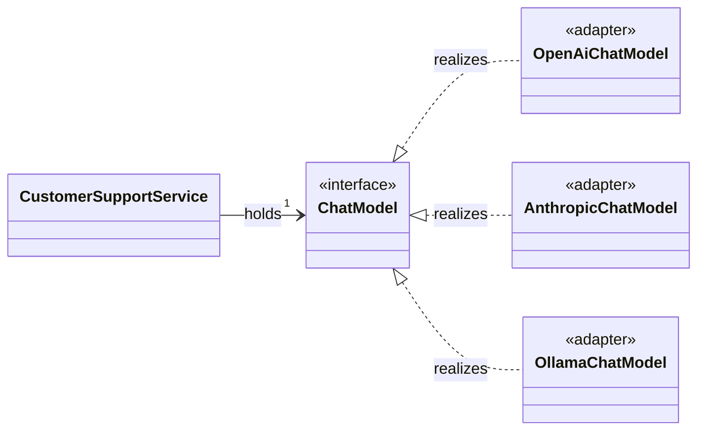

Provider trở thành một quyết định wiring/configuration thay vì lan khắp application code.

### 4.1. Vì sao đây là **Dependency Inversion Principle**?

Dependency Inversion Principle (DIP) nói rằng high-level policy không nên phụ
thuộc trực tiếp vào low-level detail; cả hai nên hướng dependency về abstraction
ổn định.

Nếu không có `ChatModel`, dependency direction là:

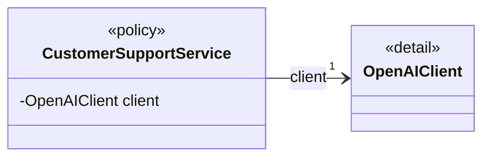

`CustomerSupportService` vừa chứa nghiệp vụ customer support, vừa bị khóa vào
chi tiết hạ tầng OpenAI.

Sau khi đưa `ChatModel` vào giữa:

```java
class CustomerSupportService {
    private final ChatModel chatModel;
}

final class OpenAiChatModel implements ChatModel {
    private final OpenAIClient openAiClient;
}
```

dependency được đảo về abstraction:

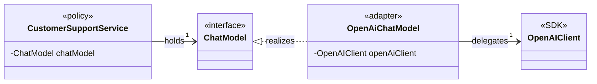

- High-level service chỉ biết capability `ChatModel`.
- Provider integration phải tuân theo contract `ChatModel`.
- OpenAI SDK bị đẩy ra sau provider implementation.

Đây được gọi là “inversion” vì application không còn tổ chức dependency quanh
API mà low-level provider cung cấp. Ngược lại, provider adapter phải thích nghi
với abstraction mà phần còn lại của hệ thống sử dụng.

Dependency Inversion không đồng nghĩa với Dependency Injection:

- **DIP** quyết định code nên phụ thuộc theo hướng nào.
- **Dependency Injection** là cơ chế đưa một implementation cụ thể, chẳng hạn
  `OpenAiChatModel`, vào constructor của `CustomerSupportService`.

Spring DI giúp wiring thiết kế này, nhưng chỉ dùng `@Autowired` hoặc constructor
injection không tự động làm code tuân theo DIP. Nếu constructor vẫn nhận
`OpenAIClient`, high-level service vẫn phụ thuộc low-level detail.

### 4.2. Vì sao đây là **Strategy pattern**?

Strategy pattern đóng gói một họ hành vi phía sau cùng một contract để context có
thể sử dụng hoặc thay thế hành vi mà không biết implementation bên trong.

Các participant trong trường hợp này là:

| Vai trò Strategy   | Thành phần trong Spring AI                                                                             |
| ------------------ | ------------------------------------------------------------------------------------------------------ |
| `Context`          | `CustomerSupportService`, hoặc ở cấp framework là `ChatClient`                                         |
| `Strategy`         | [`ChatModel`](../../../spring-ai-model/src/main/java/org/springframework/ai/chat/model/ChatModel.java) |
| `ConcreteStrategy` | `OpenAiChatModel`, `AnthropicChatModel`, `OllamaChatModel`, `GoogleGenAiChatModel`, ...                |
| Strategy selection | Spring bean configuration, auto-configuration, qualifier hoặc constructor wiring                       |

Từ góc nhìn của context, hành vi cần thực hiện là:

```java
ChatResponse response = chatModel.call(prompt);
```

Context không biết strategy sẽ:

- Tạo OpenAI `ChatCompletionCreateParams`.
- Tạo Anthropic message request.
- Gọi local Ollama HTTP API.
- Chuyển response hoặc streaming events theo cách nào.

Mỗi `ChatModel` implementation cung cấp một chiến lược khác nhau để hoàn thành
cùng capability “generate a chat response”. Vì vậy có thể thay strategy bằng
wiring/configuration mà không sửa thuật toán nghiệp vụ trong context.

Ở đây “strategy” không chỉ là một thuật toán tính toán trong memory. Nó là một
**integration strategy**: lựa chọn provider và cách thực hiện model invocation.

### 4.3. Vì sao đây là **Ports and Adapters**?

Ports and Adapters chia hệ thống thành:

- Phần bên trong mô tả capability nó cần thông qua một **port**.
- Các **adapter** nối port đó với công nghệ hoặc hệ thống bên ngoài.

Ánh xạ vào Spring AI:

| Vai trò                 | Thành phần                                                              |
| ----------------------- | ----------------------------------------------------------------------- |
| Phần sử dụng capability | `CustomerSupportService`, `ChatClient`, advisors và tool infrastructure |
| Outbound/driven port    | `ChatModel`                                                             |
| Provider adapters       | `OpenAiChatModel`, `AnthropicChatModel`, `OllamaChatModel`, ...         |
| External systems        | OpenAI SDK/API, Anthropic SDK/API, Ollama API, ...                      |

`ChatModel` là port vì nó mô tả operation mà phía trong cần:

```java
ChatResponse call(Prompt prompt);
```

Nó không chứa OpenAI endpoint, Anthropic request DTO hay Ollama response type.

Provider implementation là adapter vì nó dịch hai chiều:

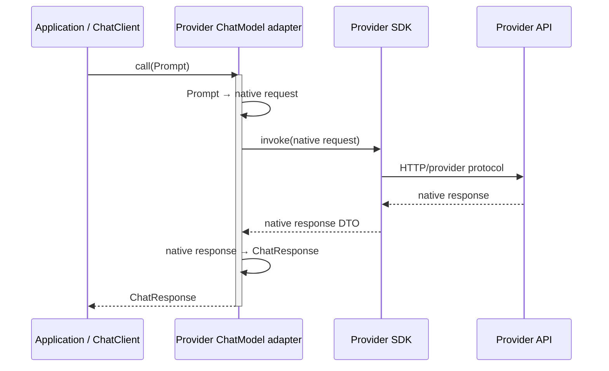

Nó được gọi là outbound hoặc driven port vì application chủ động gọi ra một hệ
thống bên ngoài để yêu cầu model thực hiện công việc.

Trong một application áp dụng Hexagonal Architecture nghiêm ngặt, port thường do
application sở hữu. Ở đây `ChatModel` được Spring AI cung cấp như một reusable
integration port. Vì vậy ta nên hiểu đây là **vai trò Ports and Adapters tại ranh
giới AI provider**, không nên kết luận rằng toàn bộ consuming application tự động
trở thành một hexagonal architecture.

### Ba góc nhìn khác nhau trên cùng một thiết kế

| Góc nhìn             | Câu hỏi nó trả lời                                                          |
| -------------------- | --------------------------------------------------------------------------- |
| Dependency Inversion | Dependency nên hướng về abstraction hay provider detail?                    |
| Strategy             | Làm thế nào thay hành vi gọi model mà context không đổi?                    |
| Ports and Adapters   | Ranh giới chuyển đổi giữa application model và external provider nằm ở đâu? |

Vì vậy, `OpenAiChatModel` đồng thời có thể là:

- Một `ConcreteStrategy` khi ta nói về khả năng thay provider behavior.
- Một provider `Adapter` khi ta nói về ranh giới chuyển đổi protocol.
- Một low-level implementation phụ thuộc vào `ChatModel` abstraction khi ta nói
  về Dependency Inversion.

Nhưng nguyên nhân sâu hơn pattern là:

> Provider là dependency có khả năng thay đổi, nên sự thay đổi đó phải được cô lập phía sau một contract ổn định.

</details>

---

<details>
<summary><strong>5. Yêu cầu số 2: portability không được làm mất cấu trúc của cuộc hội thoại</strong></summary>

Cách đơn giản nhất có vẻ là:

```java
interface ChatModel {
    String call(String prompt);
}
```

Nó rất portable, nhưng abstraction này quá nghèo.

Một AI interaction thực tế có thể chứa:

- System message.
- Nhiều user và assistant messages.
- Hình ảnh, audio hoặc document.
- Tool definitions.
- Tool calls.
- Tool results.
- Request options.
- Nhiều generated candidates.
- Token usage.
- Finish reason.
- Safety metadata.
- Provider response ID.

Nếu contract chỉ là `String → String`, toàn bộ thông tin đó sẽ phải:

- Bị loại bỏ; hoặc
- Nhét vào string bằng convention; hoặc
- Truyền qua các side channel; hoặc
- Buộc application quay lại dùng provider SDK.

Khi đó abstraction trở nên vô dụng ngay khi use case vượt quá demo “Hello AI”.

Vì vậy portability cần một **canonical data model đủ giàu**. Cụm này gồm hai ý
khác nhau: **canonical** và **đủ giàu**.

### 5.1. **Canonical data model đủ giàu** nghĩa là gì?

#### `Canonical` nghĩa là có một vocabulary chung

Mỗi provider có object model riêng. Ví dụ:

- OpenAI trả `ChatCompletion`, `Choice`, `ChatCompletionMessage` và
  `CompletionUsage`.
- Anthropic biểu diễn output bằng message content blocks, stop reason và usage
  types của Anthropic SDK.
- Ollama có `OllamaApi.ChatResponse` và message DTO riêng.

Nếu `ChatClient`, advisors, memory, tool infrastructure và application code đều
phải hiểu từng bộ DTO trên, mọi feature sẽ chứa các nhánh kiểu:

```java
if (providerIsOpenAi) {
    // đọc OpenAI Choice
}
else if (providerIsAnthropic) {
    // đọc Anthropic content block
}
else if (providerIsOllama) {
    // đọc Ollama message
}
```

`Canonical data model` tạo ra một representation trung gian thống nhất mà phần
còn lại của Spring AI cùng sử dụng:

- `Prompt` và `Message` cho input.
- `ChatOptions` cho phần options chung.
- `ChatResponse` và `Generation` cho output.
- `AssistantMessage` cho generated content và tool calls.
- `ChatResponseMetadata`/`ChatGenerationMetadata` cho metadata.

Mỗi provider adapter chỉ cần chuyển đổi giữa native model của provider và model
chung này:

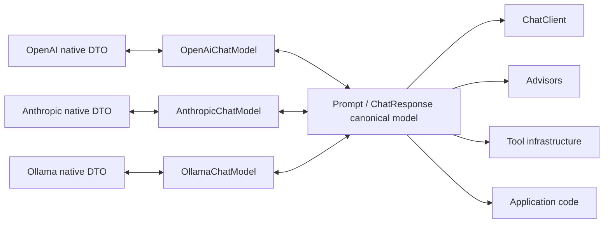

Có thể hiểu canonical model là **ngôn ngữ chung tại integration boundary**.
Application không nói bằng ngôn ngữ `ChatCompletion.Choice` của OpenAI hay
Anthropic content block; nó nói bằng `Prompt`, `Generation` và
`AssistantMessage`.

`Canonical` không có nghĩa dữ liệu đến từ một database, cũng không có nghĩa đây
là domain model nghiệp vụ của application. Nó chỉ là object model chung được
framework chọn để các provider và feature tích hợp với nhau.

#### `Đủ giàu` nghĩa là giữ lại semantic quan trọng

Một canonical model chỉ có:

```java
String input;
String output;
```

vẫn là canonical vì mọi provider có thể map vào nó, nhưng nó quá nghèo để dùng
cho application thực tế.

“Đủ giàu” nghĩa là model chung phải giữ được những khác biệt **có ý nghĩa đối
với application**, thay vì flatten tất cả thành text:

| Semantic cần giữ                             | Spring AI representation                                                                   |
| -------------------------------------------- | ------------------------------------------------------------------------------------------ |
| Ranh giới và role của từng message           | `List<Message>`, `SystemMessage`, `UserMessage`, `AssistantMessage`, `ToolResponseMessage` |
| Text và multimodal content                   | Message text cùng `Media`/`MediaContent`                                                   |
| Generation controls                          | `ChatOptions`                                                                              |
| Một hoặc nhiều kết quả                       | `ChatResponse.getResults(): List<Generation>`                                              |
| Generated text/media                         | `Generation.getOutput(): AssistantMessage`                                                 |
| Yêu cầu gọi tool                             | `AssistantMessage.ToolCall`                                                                |
| Token usage, model ID, rate limit            | `ChatResponseMetadata`                                                                     |
| Finish reason và metadata của từng candidate | `ChatGenerationMetadata`                                                                   |

Nhờ đó, advisor có thể bổ sung messages, tool infrastructure có thể đọc tool
calls, observability có thể đọc token usage và application có thể xử lý nhiều
generation mà không import provider DTO.

#### “Đủ giàu” không có nghĩa chứa mọi field của mọi provider

Nếu canonical model cố chứa hợp của toàn bộ provider fields, nó sẽ trở thành một
universal DTO khổng lồ và lại bị provider details chi phối.

Spring AI dùng ba nguyên tắc phân ranh giới. Có thể kiểm chứng từng nguyên tắc
ngay trong implementation của OpenAI và Anthropic.

##### 1. Semantic ổn định và phổ biến được đưa vào core model

Ví dụ rõ nhất là `model`, `maxTokens` và `temperature`. Cả ba được khai báo trên
interface chung [`ChatOptions`](../../../spring-ai-model/src/main/java/org/springframework/ai/chat/prompt/ChatOptions.java):

```java
import org.springframework.ai.chat.prompt.ChatOptions;

ChatOptions options = ChatOptions.builder()
    .model("provider-model-name")
    .maxTokens(1_000)
    .temperature(0.2)
    .build();
```

Application chỉ cần biết semantic chung: chọn model, giới hạn số token output và
điều chỉnh mức độ ngẫu nhiên. Khi request đi xuống provider adapter, cùng những
semantic đó được dịch sang native request tương ứng:

| Semantic trong core            | `OpenAiChatModel`                        | `AnthropicChatModel`                        |
| ------------------------------ | ---------------------------------------- | ------------------------------------------- |
| `ChatOptions.getModel()`       | Gọi OpenAI request builder `.model(...)` | Gọi Anthropic request builder `.model(...)` |
| `ChatOptions.getMaxTokens()`   | Gọi `.maxTokens(...)`                    | Gọi `.maxTokens(...)`                       |
| `ChatOptions.getTemperature()` | Gọi `.temperature(...)`                  | Gọi `.temperature(...)`                     |

Có thể thấy việc mapping này trong
[`OpenAiChatModel`](../../../models/spring-ai-openai/src/main/java/org/springframework/ai/openai/OpenAiChatModel.java)
và
[`AnthropicChatModel`](../../../models/spring-ai-anthropic/src/main/java/org/springframework/ai/anthropic/AnthropicChatModel.java).

Đây là lý do chúng xứng đáng nằm trong core: upper layer có thể đọc, ghi và
truyền các option đó bằng một contract có kiểu rõ ràng mà không cần import SDK
của OpenAI hay Anthropic.

Tuy nhiên, **semantic của option portable không đồng nghĩa mọi giá trị của nó
đều portable**. Field `model` là khái niệm chung, nhưng tên như `gpt-...` và
`claude-...` vẫn là giá trị riêng của từng provider. Khi đổi provider,
application có thể giữ cấu trúc `ChatOptions`, nhưng thường vẫn phải đổi giá trị
model trong configuration.

##### 2. Capability riêng được giữ trong provider-specific options/module

Hai provider có nhiều capability không thể biểu diễn trung thực bằng
`ChatOptions` chung:

| Provider  | Capability cụ thể                                       | Spring AI đặt ở đâu?                                                                               |
| --------- | ------------------------------------------------------- | -------------------------------------------------------------------------------------------------- |
| OpenAI    | Trả về log probability của token                        | `OpenAiChatOptions.logprobs` và `topLogprobs`                                                      |
| OpenAI    | Sinh audio cùng response                                | `OpenAiChatOptions.outputModalities` và `outputAudio`                                              |
| OpenAI    | Chọn mức reasoning bằng một giá trị như `"high"`        | `OpenAiChatOptions.reasoningEffort`                                                                |
| Anthropic | Extended thinking với token budget hoặc chế độ adaptive | `AnthropicChatOptions.thinking` và các builder method `thinkingEnabled(...)`, `thinkingAdaptive()` |
| Anthropic | Prompt caching                                          | `AnthropicChatOptions.cacheOptions`                                                                |
| Anthropic | Built-in web search và citations                        | `AnthropicChatOptions.webSearchTool` và `citationDocuments`                                        |

Vì vậy, khi application chọn sử dụng capability riêng, nó chủ động sử dụng
provider-specific type:

```java
import org.springframework.ai.anthropic.AnthropicChatOptions;
import org.springframework.ai.openai.OpenAiChatOptions;

OpenAiChatOptions openAiOptions = OpenAiChatOptions.builder()
    .logprobs(true)
    .topLogprobs(5)
    .reasoningEffort("high")
    .build();

AnthropicChatOptions anthropicOptions = AnthropicChatOptions.builder()
    .maxTokens(8_000)
    .thinkingEnabled(4_096)
    .build();
```

Các field và builder trên nằm trong
[`OpenAiChatOptions`](../../../models/spring-ai-openai/src/main/java/org/springframework/ai/openai/OpenAiChatOptions.java)
và
[`AnthropicChatOptions`](../../../models/spring-ai-anthropic/src/main/java/org/springframework/ai/anthropic/AnthropicChatOptions.java),
không nằm trong `ChatOptions`.

Trường hợp reasoning/thinking đặc biệt quan trọng. Nhìn ở mức business, cả hai
đều liên quan đến việc model “suy luận”. Nhưng contract native không tương đương:

- OpenAI biểu diễn lựa chọn này bằng `reasoningEffort`.
- Anthropic dùng `ThinkingConfigParam`, có token budget, adaptive mode và cách
  hiển thị thinking content.

Nếu core vội tạo một field chung như `ChatOptions.reasoning`, field đó sẽ hoặc
làm mất semantic của Anthropic, hoặc phải chứa một tập hợp option phụ thuộc
provider. Vì vậy, **tên khái niệm gần giống chưa đủ chứng minh semantic đã ổn
định và portable**.

##### 3. Metadata chưa đủ phổ quát đi qua key-value extension

[`ChatResponseMetadata`](../../../spring-ai-model/src/main/java/org/springframework/ai/chat/metadata/ChatResponseMetadata.java)
có các field có kiểu rõ ràng cho semantic chung như `id`, `model`, `usage` và
`rateLimit`. Sau khi điền phần chung đó, mỗi adapter có thể giữ thêm dữ liệu
native bằng `keyValue(...)`:

| Adapter   | Metadata được giữ bằng extension                      | Vì sao chưa trở thành core field?                                           |
| --------- | ----------------------------------------------------- | --------------------------------------------------------------------------- |
| OpenAI    | `"created"`                                           | Không phải mọi provider đều trả về cùng timestamp với cùng semantic         |
| OpenAI    | Các entry từ `ChatCompletion._additionalProperties()` | Đây là các field native bổ sung, Spring AI không thể biết trước tên và kiểu |
| Anthropic | `"anthropic-response"` chứa native `Message`          | Đây là escape hatch dành riêng cho Anthropic                                |
| Anthropic | `"citations"`, `"citationCount"`                      | Chỉ xuất hiện khi Anthropic trả về citation blocks                          |
| Anthropic | `"web-search-results"`                                | Gắn với built-in web search của Anthropic                                   |

Trong `OpenAiChatModel`, adapter tạo metadata chung rồi gọi
`keyValue("created", ...)`; nó còn duyệt `_additionalProperties()` để bảo toàn
các field OpenAI bổ sung. Trong `AnthropicChatModel`, adapter tạo cùng loại
`ChatResponseMetadata`, sau đó lưu native response, citations và web-search
results bằng các key riêng.

Giả sử core thêm field bắt buộc `List<Citation> citations` chỉ vì Anthropic có
citations. Mọi `ChatResponse` của OpenAI và các provider không hỗ trợ capability
này sẽ phải mang một field không có ý nghĩa. Ngược lại, nếu bỏ citations khi map
sang model chung, application cần chúng sẽ bị mất dữ liệu. Key-value metadata là
điểm cân bằng: **core model vẫn gọn và ổn định, nhưng provider adapter không phải
vứt bỏ dữ liệu native**.

Do đó, “đủ giàu” có nghĩa là **đủ để không làm mất những semantic chung mà các
feature phía trên cần**, chứ không phải đủ để thay thế hoàn toàn mọi native SDK
type.

Mô hình lớp canonical chính có thể hình dung như sau:

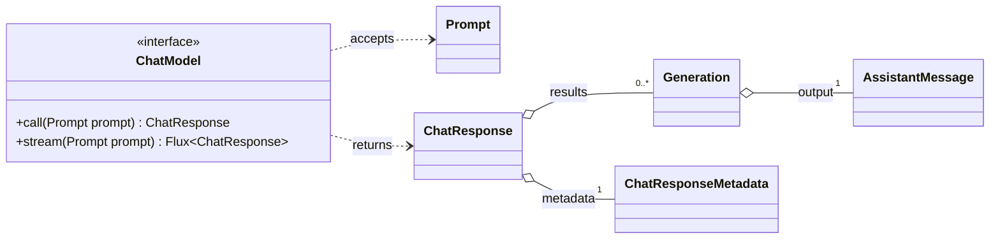

#### Cách đọc class diagram này

Class diagram trên mô tả **cấu trúc object model**, không mô tả thứ tự các method
được thực thi. Ta nên đọc nó từ trái sang phải như sau:

1. Application tạo một `Prompt` rồi truyền nó vào `ChatModel.call(prompt)` hoặc
   `ChatModel.stream(prompt)`.
2. Với `call`, `ChatModel` trả về một `ChatResponse`; với `stream`, nó trả về
   `Flux<ChatResponse>`.
3. Một `ChatResponse` chứa từ `0` đến nhiều `Generation` và đúng một
   `ChatResponseMetadata`.
4. Mỗi `Generation` chứa một `AssistantMessage` làm output.

Ý nghĩa cụ thể của từng quan hệ UML:

| Quan hệ trong sơ đồ                         | Cách đọc                                  | Ý nghĩa trong Spring AI                                                                                 |
| ------------------------------------------- | ----------------------------------------- | ------------------------------------------------------------------------------------------------------- |
| `ChatModel ..> Prompt : accepts`            | `ChatModel` phụ thuộc vào `Prompt`        | Cả `call(Prompt)` và `stream(Prompt)` đều nhận `Prompt` làm input                                       |
| `ChatModel ..> ChatResponse : returns`      | `ChatModel` phụ thuộc vào `ChatResponse`  | `call(...)` trả về một `ChatResponse`; `stream(...)` phát các `ChatResponse` qua `Flux`                 |
| `ChatResponse o-- "0..*" Generation`        | `ChatResponse` tập hợp nhiều `Generation` | Provider có thể trả về không có candidate hoặc nhiều candidate; `getResults()` trả về toàn bộ danh sách |
| `ChatResponse o-- "1" ChatResponseMetadata` | Mỗi response giữ một metadata object      | Metadata mô tả toàn bộ provider call, chẳng hạn model, token usage và rate limit                        |
| `Generation o-- "1" AssistantMessage`       | Mỗi candidate giữ một output message      | `Generation.getOutput()` trả về `AssistantMessage` chứa text, media hoặc tool calls                     |

Hai ký hiệu cần phân biệt:

- `..>` là **dependency**: class ở đầu mũi tên sử dụng class ở cuối mũi tên
  trong method signature.
- `o--` là **aggregation**: object bên trái tập hợp hoặc giữ reference đến object
  bên phải, nhưng object bên phải vẫn có thể được tạo và tồn tại độc lập.

Sơ đồ dùng aggregation thay vì composition `*--` vì các constructor của
`ChatResponse` và `Generation` nhận những object được tạo từ bên ngoài. Source
code không áp đặt rằng `Generation`, `ChatResponseMetadata` hay
`AssistantMessage` chỉ được thuộc về đúng một owner hoặc phải bị hủy cùng owner.

Số lượng đặt cạnh quan hệ gọi là **multiplicity**:

- `0..*` nghĩa là từ không có phần tử nào đến nhiều phần tử.
- `1` nghĩa là đúng một object.

#### Luồng chạy thực tế

Để hiểu “nó hoạt động như thế nào”, cần bổ sung một sequence diagram. Ví dụ dưới
đây dùng `OpenAiChatModel`, nhưng `AnthropicChatModel` cũng đi qua cùng contract
`ChatModel` và trả về cùng canonical model:

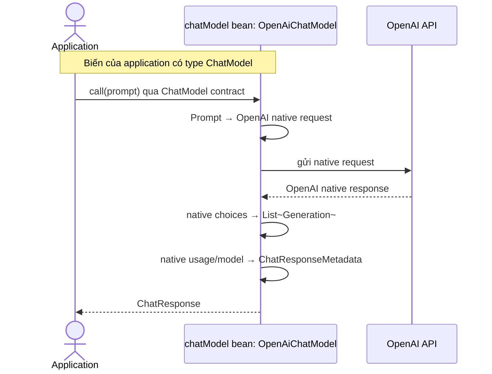

Luồng trên gồm bảy bước:

1. **Application chuẩn bị input.** `Prompt` chứa các `Message` của conversation
   và có thể chứa `ChatOptions` của riêng request đó.
2. **Application chỉ gọi abstraction.** Biến có type `ChatModel`; application
   không cần gọi OpenAI SDK trực tiếp.
3. **Java thực hiện dynamic dispatch.** Nếu Spring đã inject một
   `OpenAiChatModel`, lời gọi `chatModel.call(prompt)` chạy implementation của
   `OpenAiChatModel`. Nếu bean được thay bằng `AnthropicChatModel`, call site của
   application không đổi.
4. **Provider adapter dịch request.** Implementation đọc messages và options từ
   `Prompt`, sau đó tạo native request đúng định dạng của provider.
5. **Provider adapter gọi provider API.** Đây là phần phụ thuộc SDK,
   authentication, endpoint và wire format của từng provider.
6. **Provider adapter chuẩn hóa native response.** Mỗi candidate/choice được đổi
   thành một `Generation`; generated content trở thành `AssistantMessage`; dữ
   liệu chung của toàn request trở thành `ChatResponseMetadata`.
7. **Application nhận canonical response.** Nó có thể đọc kết quả mà không biết
   provider vừa trả về `choices`, content blocks hay một native response format
   nào khác.

#### Ví dụ đọc kết quả

```java
import org.springframework.ai.chat.messages.AssistantMessage;
import org.springframework.ai.chat.model.ChatModel;
import org.springframework.ai.chat.model.ChatResponse;
import org.springframework.ai.chat.model.Generation;
import org.springframework.ai.chat.prompt.Prompt;

Prompt prompt = new Prompt("Giải thích Dependency Inversion");

ChatResponse response = chatModel.call(prompt);
Generation firstGeneration = response.getResult();

if (firstGeneration != null) {
    AssistantMessage output = firstGeneration.getOutput();

    String text = output.getText();
    boolean requestedToolCall = output.hasToolCalls();
}

int totalTokens = response.getMetadata().getUsage().getTotalTokens();
```

Trong ví dụ này:

- `response.getResult()` là convenience method lấy `Generation` đầu tiên; nó trả
  về `null` nếu danh sách kết quả rỗng.
- `response.getResults()` được dùng khi cần xử lý toàn bộ generations.
- `generation.getOutput()` trả về `AssistantMessage`, không chỉ một `String`, vì
  output còn có thể chứa tool calls hoặc media.
- `response.getMetadata()` là metadata của **toàn provider call**. Ngoài ra, mỗi
  `Generation` còn có `ChatGenerationMetadata` riêng, chẳng hạn finish reason;
  chi tiết này được lược khỏi class diagram trên để sơ đồ cơ sở không quá tải.

`ChatModel` còn có convenience method `call(String)`. Source code của method này
thực hiện đúng chuỗi thao tác vừa mô tả: biến `String` thành `UserMessage`, đặt nó
vào `Prompt`, gọi `call(Prompt)`, lấy `Generation` đầu tiên rồi trả về text trong
`AssistantMessage`. Vì vậy `call(String)` chỉ là API rút gọn; `call(Prompt)` mới
là contract đầy đủ thể hiện thiết kế của framework.

Ở phần 1, điều quan trọng chưa phải tên các class. Điều quan trọng là quyết định:

> Spring AI chuẩn hóa semantic của một model interaction, không chỉ chuẩn hóa một method nhận và trả string.

Đây là lý do tài liệu nói `Prompt` và `ChatResponse` “unify the communication” đồng thời xử lý độ phức tạp của việc chuẩn bị request và parse response tại [`chatmodel.adoc`, dòng 11–12](../../../spring-ai-docs/src/main/antora/modules/ROOT/pages/api/chatmodel.adoc).

</details>

---

<details>
<summary><strong>6. Yêu cầu số 3: abstraction chung nhưng không được khóa mất tính năng riêng</strong></summary>

Đây là mâu thuẫn khó nhất: tăng **portability** thường giới hạn khả năng expose
**provider-specific capabilities**, còn sử dụng sâu capability riêng sẽ làm giảm
portability.

Nếu Spring AI chỉ expose những gì mọi provider đều hỗ trợ, API sẽ trở thành “lowest common denominator”.

Ví dụ giả định:

- Provider A hỗ trợ option X.
- Provider B hỗ trợ option Y.
- Provider C hỗ trợ cả X lẫn Z.
- Common interface chỉ có temperature.

Nếu Spring AI chỉ giữ temperature, developer phải bỏ framework mỗi khi cần X, Y hoặc Z.

Ngược lại, nếu đưa tất cả option của mọi provider vào một interface chung:

```java
interface ChatOptions {
    OpenAiSpecificX getX();
    AnthropicSpecificY getY();
    GoogleSpecificZ getZ();
}
```

thì abstraction chung đã bị provider làm ô nhiễm. Ta cũng tạo ra rất nhiều trạng thái không hợp lệ:

```java
AnthropicChatModel + OpenAiSpecificX
```

Spring AI lựa chọn một sự thỏa hiệp:

- Có model API chung.
- Có options chung cho capability portable.
- Có provider-specific options cho capability riêng.
- Có metadata chung nhưng vẫn có chỗ giữ metadata bổ sung.

Upgrade notes gọi đây là “portable options design pattern” và nói rõ mục tiêu là cung cấp **nhiều portability nhất có thể**, chứ không phải portability tuyệt đối. Xem [`upgrade-notes.adoc`, dòng 2619](../../../spring-ai-docs/src/main/antora/modules/ROOT/pages/upgrade-notes.adoc).

Từ “as much portability as possible” rất đáng chú ý. Nó thừa nhận abstraction có giới hạn.

### Trade-off dành cho application

Application có thể chọn:

```java
ChatOptions options; // portable hơn
```

hoặc:

```java
OpenAiChatOptions options; // nhiều capability hơn
```

Sử dụng provider-specific options không phải framework thất bại. Nó là một escape hatch có chủ đích.

</details>

---

<details>
<summary><strong>7. Yêu cầu số 4: hỗ trợ nhiều model type nhưng không gom chúng thành một API vô nghĩa</strong></summary>

Chat generation không phải loại AI operation duy nhất. Spring AI còn có:

- Embedding.
- Image generation.
- Speech-to-text.
- Text-to-speech.
- Moderation.

Một thiết kế cực đoan có thể tạo:

```java
interface AiClient {
    Object execute(Object request);
}
```

Nó tổng quát nhưng đánh mất type safety và semantic.

Một cực đoan khác là để mọi loại model hoàn toàn độc lập:

- Chat API không liên quan đến các model API khác.
- Embedding API tự định nghĩa toàn bộ request/response pattern.
- Image API lại tự định nghĩa một pattern khác.

Cách đó sẽ làm mất pattern chung cho:

- Request.
- Options.
- Response.
- Result.
- Metadata.
- Synchronous invocation.
- Streaming invocation.

Do đó Spring AI cần hai cấp:

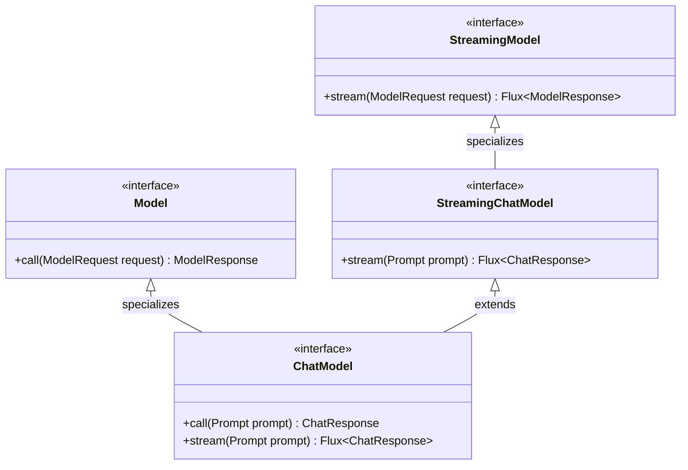

Điểm dễ bỏ sót trong sơ đồ này là `stream(Prompt)` xuất hiện ở cả
`StreamingChatModel` và `ChatModel`. Đây không chỉ là việc UML lặp lại một method
được kế thừa; source code thực sự khai báo method ở cả hai interface:

```java
// StreamingChatModel
Flux<ChatResponse> stream(Prompt prompt);

// ChatModel
default Flux<ChatResponse> stream(Prompt prompt) {
    throw new UnsupportedOperationException("streaming is not supported");
}
```

Hai declaration có cùng signature nhưng khác vai trò:

- `StreamingChatModel.stream(Prompt)` là contract streaming abstract.
- `ChatModel.stream(Prompt)` cung cấp default implementation “không hỗ trợ”. Nhờ
  đó một `ChatModel` chỉ hỗ trợ synchronous call vẫn có thể tồn tại mà không bắt
  buộc phải viết một streaming implementation giả.
- Provider có streaming thật sẽ override default method này và trả về
  `Flux<ChatResponse>` thực sự.

Vì vậy, `ChatModel extends StreamingChatModel` có nghĩa object luôn **có method
`stream` ở mức type system**; nó không bảo đảm mọi implementation đều **có
capability streaming ở runtime**. Nếu implementation không override, lời gọi sẽ
nhận `UnsupportedOperationException`.

Đây là lý do tài liệu nói Generic Model API được tạo để làm nền tảng cho mọi AI model và để provider mới tuân theo một pattern chung tại [`generic-model.adoc`, dòng 4–6](../../../spring-ai-docs/src/main/antora/modules/ROOT/pages/api/generic-model.adoc).

Ta chưa phân tích hierarchy ở đây—đó là phần 2. Hiện tại chỉ cần thấy yêu cầu:

> Chia sẻ cấu trúc chung, nhưng vẫn giữ type riêng cho từng loại model.

</details>

---

<details>
<summary><strong>8. Yêu cầu số 5: synchronous và streaming phải cùng một model semantic</strong></summary>

Có hai cách nhận kết quả: synchronous call chờ một response hoàn chỉnh, còn
streaming call trả về một publisher và phát các response chunk sau khi có
subscriber.

Nếu framework thiết kế chúng như hai thế giới không liên quan:

```java
OpenAiBlockingClient
OpenAiStreamingClient
```

application và các lớp phía trên phải xử lý riêng theo provider.

Spring AI giữ cùng `Prompt` và `ChatResponse` semantics cho cả hai nhánh:

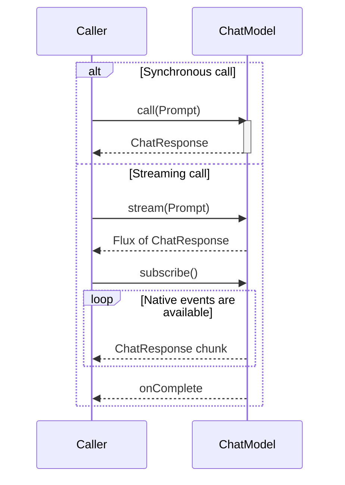

Như vậy:

- Input semantics vẫn giống nhau.
- Output semantics vẫn dùng type chung.
- Provider adapter chịu trách nhiệm chuyển native streaming events thành Spring AI response chunks.
- Các lớp bên trên có thể xây API call và stream dựa trên cùng một abstraction.

README liệt kê rõ portable API phải hỗ trợ cả synchronous và streaming tại [`README.md`, dòng 45–46](../../../README.md).

</details>

---

<details>
<summary><strong>9. Yêu cầu số 6: provider mới phải có một “contribution contract”</strong></summary>

Spring AI là framework mở. Vấn đề không chỉ là hỗ trợ các provider hiện có.

Nó còn cần trả lời:

> Khi thêm provider thứ N, contributor phải implement những gì và code đó phải nằm ở đâu?

Nếu không có contract chung, mỗi provider module sẽ tự phát minh:

- Client API.
- Request model.
- Response model.
- Options conventions.
- Streaming behavior.
- Metadata handling.

Khi đó Spring AI trở thành một collection các SDK wrapper không nhất quán.

Vì vậy `ChatModel` đồng thời là:

- Contract cho application sử dụng.
- Contract cho provider module implement.
- Tiêu chuẩn để Spring Boot auto-configuration wiring.
- Điểm chung để các capability phía trên tích hợp.

Tài liệu dự án gọi các abstraction này là nền tảng có nhiều implementation, cho phép thay component với ít thay đổi code tại [`index.adoc`, dòng 15–16](../../../spring-ai-docs/src/main/antora/modules/ROOT/pages/index.adoc).

</details>

---

<details>
<summary><strong>10. Yêu cầu số 7: cross-cutting concerns phải có điểm bám chung</strong></summary>

### Cross-cutting concern là gì?

Phần nghiệp vụ chính của một chat model là:

```text
Prompt → model inference → ChatResponse
```

Nhưng một enterprise application còn muốn **mọi** model call:

- Được đo thời gian và đếm token.
- Xuất trace để biết request đang chậm hoặc lỗi ở đâu.
- Ghi log theo một policy chung.
- Retry khi gặp lỗi tạm thời nếu operation phù hợp để retry.
- Đi qua advisor như memory, RAG hoặc guardrail.
- Có thể được thay bằng mock/fake trong test.
- Được tạo và inject bằng Spring configuration.

Những hành vi này không phải là nhiệm vụ “sinh câu trả lời” của riêng OpenAI hay
Anthropic. Chúng **cắt ngang** nhiều provider và nhiều use case, nên được gọi là
cross-cutting concerns.

Ví dụ, metrics không chỉ cần cho `CustomerSupportService`; nó còn cần cho
summarization, document extraction và mọi service khác gọi model. Tương tự,
tracing không phải capability của một model cụ thể mà là nhu cầu vận hành của
toàn application.

### Vấn đề nếu không có boundary chung

Giả sử application gọi thẳng hai native SDK:

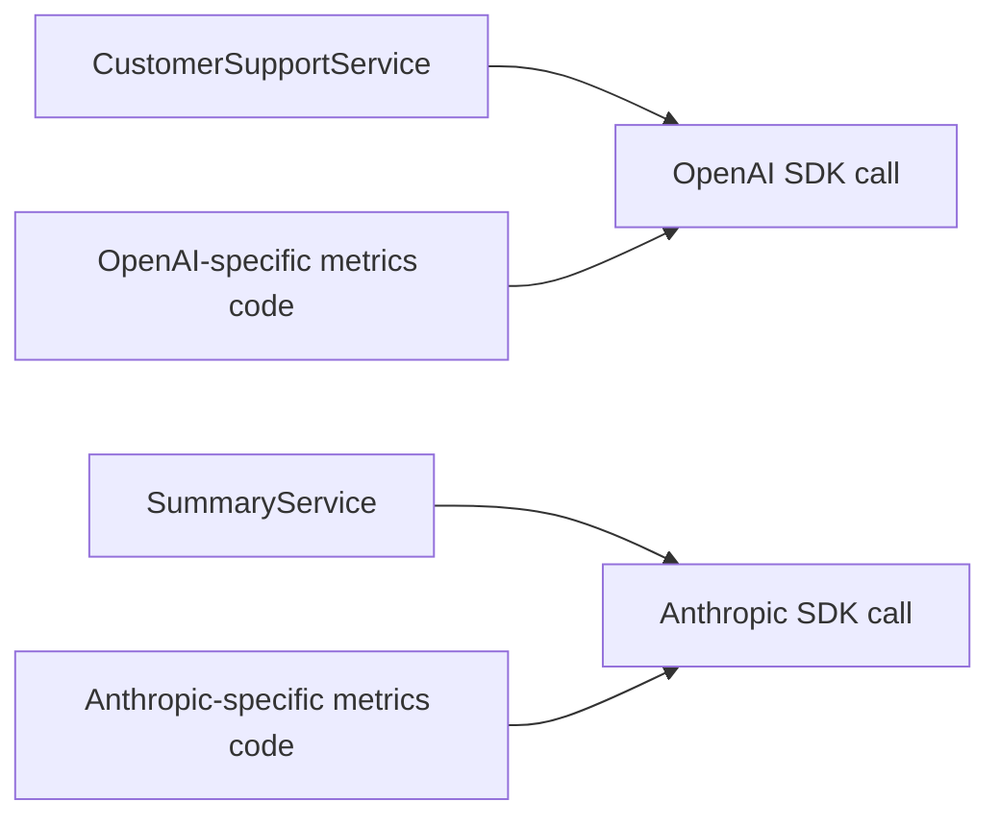

Để đếm token, code OpenAI phải biết token usage nằm ở đâu trong OpenAI response;
code Anthropic lại phải hiểu Anthropic usage object. Logging cũng phải biết native
message format của từng SDK. Test double phải mock những client và DTO khác nhau.

Khi thêm provider thứ ba, ta không chỉ viết thêm request/response adapter. Ta còn
có nguy cơ viết lại metrics, tracing, logging, error mapping và test setup cho
provider đó.

Vấn đề kiến trúc ở đây là:

> Các concern dùng chung không có một vị trí ổn định để quan sát hoặc bao quanh một model operation.

### “Điểm bám chung” cụ thể là gì?

`ChatModel` tạo ra một **model-operation boundary** có hình dạng ổn định:

```java
ChatResponse call(Prompt prompt);

Flux<ChatResponse> stream(Prompt prompt);
```

Tại boundary này, framework luôn biết:

1. Operation bắt đầu khi `call` hoặc `stream` được gọi.
2. Input có canonical type là `Prompt`.
3. Operation đang được xử lý bởi provider nào.
4. Output có canonical type là `ChatResponse`.
5. Operation kết thúc thành công hay ném lỗi.

Đó chính là những dữ liệu một cross-cutting concern thường cần. Nó không phải
hiểu `ChatCompletionCreateParams`, OpenAI `Choice` hay Anthropic content block.

Có thể hình dung các concern cùng bám vào một boundary như sau:

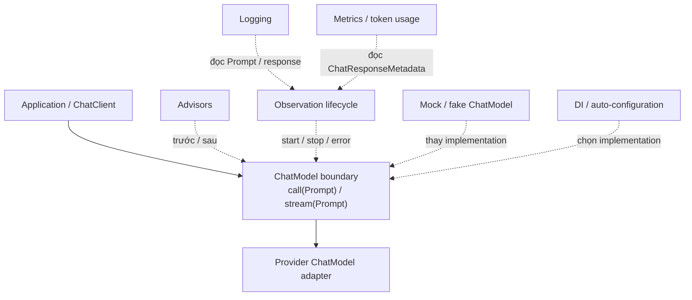

Đây là conceptual attachment-point diagram, không phải UML class diagram. Các
concern không nhất thiết implement `ChatModel` hay giữ một field kiểu
`ChatModel`. “Bám vào” có nghĩa chúng có một operation lifecycle và một bộ type
ổn định để intercept, observe, decorate hoặc thay thế.

### Ví dụ thực tế: observability của một OpenAI call

Trong
[`OpenAiChatModel`](../../../models/spring-ai-openai/src/main/java/org/springframework/ai/openai/OpenAiChatModel.java),
`internalCall(...)` thực hiện đại khái theo luồng sau:

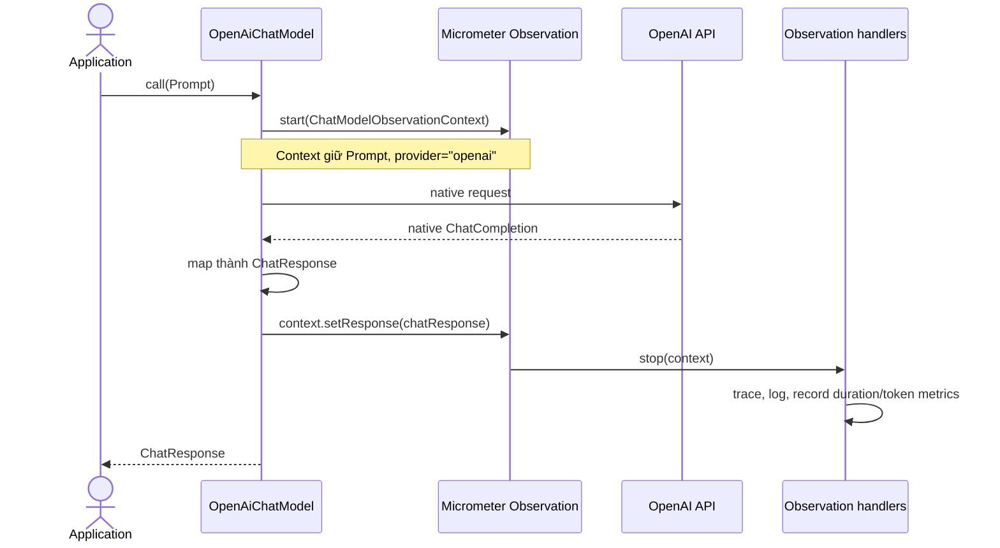

Luồng source code tương ứng:

1. `OpenAiChatModel.call(Prompt)` nhận canonical request.
2. Model tạo
   [`ChatModelObservationContext`](../../../spring-ai-model/src/main/java/org/springframework/ai/chat/observation/ChatModelObservationContext.java)
   với `Prompt` và provider `openai`.
3. Native API call được thực thi bên trong một Micrometer observation.
4. OpenAI response được map thành canonical `ChatResponse`.
5. Model gọi `observationContext.setResponse(chatResponse)` trước khi observation
   kết thúc.
6. Các observation handler có thể đọc cùng context mà không phụ thuộc OpenAI
   SDK.

Ví dụ,
[`ChatModelMeterObservationHandler`](../../../spring-ai-model/src/main/java/org/springframework/ai/chat/observation/ChatModelMeterObservationHandler.java)
đọc:

```java
context.getResponse().getMetadata().getUsage()
```

rồi tạo metrics cho input, output và total tokens. Handler này làm việc với
`ChatResponseMetadata` và `Usage` của Spring AI; nó không cần biết OpenAI gọi
field là gì hoặc Anthropic biểu diễn usage ra sao. Trách nhiệm chuẩn hóa native
usage thuộc về từng provider adapter.

Tương tự,
[`ChatModelPromptContentObservationHandler`](../../../spring-ai-model/src/main/java/org/springframework/ai/chat/observation/ChatModelPromptContentObservationHandler.java)
có thể đọc messages từ `Prompt` để logging. Cùng một observation context phục vụ
được nhiều concern vì input và output đã có canonical type.

### Mỗi concern bám vào boundary theo một cách khác nhau

| Concern                | Điểm bám trong thiết kế                                                   | Lợi ích của contract chung                                                                                              |
| ---------------------- | ------------------------------------------------------------------------- | ----------------------------------------------------------------------------------------------------------------------- |
| Metrics và token usage | Observation handler đọc `ChatResponse.getMetadata().getUsage()`           | Không phải parse native usage DTO của từng provider                                                                     |
| Tracing                | Observation bao quanh một logical `call`/`stream` operation               | Trace có vocabulary chung như operation type, provider và model                                                         |
| Logging                | Handler đọc canonical `Prompt` hoặc `ChatResponse`                        | Một logging policy có thể dùng cho nhiều provider                                                                       |
| Advisors               | `ChatClient` dựng advisor chain trước khi đi đến model call               | Memory, RAG hoặc guardrail không phải tích hợp lại với từng SDK                                                         |
| Testing                | Test thay concrete provider bean bằng một `ChatModel` fake/mock           | Business test không cần API key, network hoặc native provider DTO                                                       |
| Dependency injection   | Service phụ thuộc `ChatModel`; auto-configuration cung cấp implementation | Đổi provider chủ yếu là đổi dependency, properties và wiring                                                            |
| Retry                  | Provider integration/transport áp dụng retry quanh native invocation      | Có một logical model operation để cấu hình và quan sát retry, nhưng policy vẫn có thể khác theo provider và sync/stream |

Retry cần được hiểu cẩn thận: có boundary chung **không có nghĩa** Spring AI nên
đặt một retry implementation duy nhất trong `ChatModel` interface. Provider có
error code, rate-limit rule và streaming behavior khác nhau. Retry có thể nằm ở
provider client hoặc provider model, trong khi observation vẫn coi toàn bộ quá
trình là một logical model operation.

### Vì sao testing cũng là một cross-cutting concern?

Nếu service phụ thuộc `ChatModel`, test có thể thay provider thật bằng một
implementation cố định:

```java
import org.springframework.ai.chat.model.ChatModel;
import org.springframework.ai.chat.model.ChatResponse;

ChatResponse expectedResponse = createExpectedResponse();
ChatModel fakeModel = prompt -> expectedResponse;
```

Fake trên không cần biết OpenAI client, Anthropic authentication hay HTTP. Mọi
service phụ thuộc `ChatModel` đều có thể sử dụng cùng kiểu test seam. Đây cũng là
một “điểm bám”: test thay implementation tại chính port mà production wiring sử
dụng.

### Điều requirement này không nói

Requirement không nói rằng:

- `ChatModel` interface phải tự implement logging, retry, metrics và tracing.
- Mọi provider bắt buộc dùng một retry policy giống nhau.
- Mọi concern phải được cài bằng cùng một design pattern.

Nó nói rằng framework cần một boundary đủ ổn định để các cơ chế khác nhau có thể
được xây **một cách nhất quán** quanh model operation. `ChatModel`, `Prompt`,
`ChatResponse`, metadata và observation context cùng nhau tạo nên boundary đó.

Chuỗi suy luận là:

```text
Nhiều model call cần cùng concern
→ cần nhận diện cùng một logical operation
→ operation cần input/output và lifecycle ổn định
→ ChatModel.call/stream với Prompt/ChatResponse trở thành điểm bám chung
```

</details>

---

<details>
<summary><strong>11. Những phương án Spring AI đã không chọn</strong></summary>

### Một HTTP wrapper chung

Không đủ vì khác biệt nằm ở semantic và DTO, không chỉ HTTP transport.

### `String call(String)`

Dễ dùng nhưng làm mất conversation, tool calls, multimodality và metadata.

Spring AI vẫn có convenience method dạng string, nhưng đó không phải contract đầy đủ.

### Universal provider DTO

Sẽ phình to theo mọi provider và sinh ra nhiều tổ hợp option không hợp lệ.

### Chỉ hỗ trợ common denominator

Portable nhưng không dùng được capability nổi bật của provider.

### Mỗi provider có API riêng hoàn toàn

Giữ đầy đủ capability nhưng mất portability, consistency và khả năng xây các lớp chung phía trên.

### Dồn mọi thứ vào `ChatClient`

Sẽ trộn hai trách nhiệm:

- Tích hợp với model/provider.
- Cung cấp fluent API và orchestration cho application.

Vì thế `ChatModel` và `ChatClient` cần tồn tại ở hai tầng khác nhau.

</details>

---

<details>
<summary><strong>12. Portability thực sự có nghĩa gì?</strong></summary>

Ta nên tránh hiểu “portable” quá mức.

Có ba cấp portability:

| Cấp                    | Ý nghĩa                                         | Spring AI có thể cung cấp? |
| ---------------------- | ----------------------------------------------- | -------------------------- |
| Source portability     | Application vẫn gọi cùng một Java interface     | Có                         |
| Wiring portability     | Đổi implementation qua dependency/configuration | Phần lớn có                |
| Behavioral portability | Model mới trả kết quả tương đương model cũ      | Không thể đảm bảo          |

Hai model khác nhau vẫn có thể:

- Hiểu prompt khác nhau.
- Hỗ trợ message role khác nhau.
- Có chất lượng tool calling khác nhau.
- Diễn giải temperature khác nhau.
- Trả finish reason khác nhau.
- Có giới hạn context khác nhau.

Vì vậy:

> Spring AI cung cấp portability cho integration contract, không cung cấp equivalence cho model behavior.

“Đổi provider với minimal code changes” không có nghĩa “đổi provider mà hệ thống vẫn hành xử y hệt”.

</details>

---

<details>
<summary><strong>13. Tóm lại: chuỗi suy luận dẫn đến <code>ChatModel</code></strong></summary>

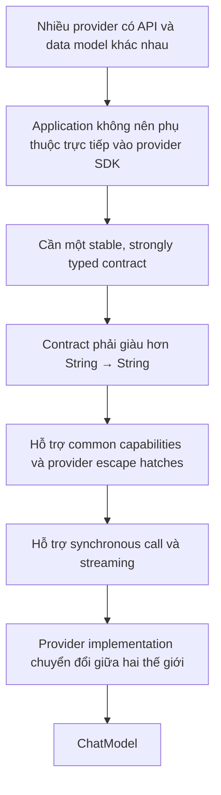

Luận điểm cốt lõi của phần 1 là:

> `ChatModel` tồn tại vì “provider integration” là phần biến động, còn “application cần gọi một chat model” là nhu cầu tương đối ổn định.

</details>
