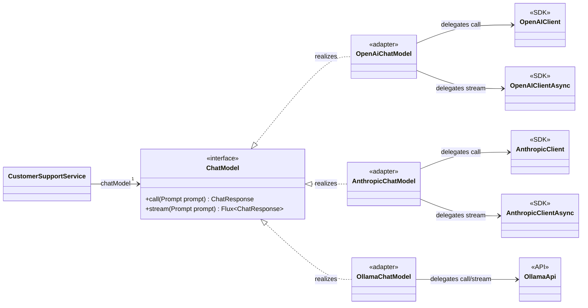

# Phần 1 — Bài toán kiến trúc dẫn đến `ChatModel`

Điểm xuất phát không phải là interface Java. Điểm xuất phát là **sự biến động của hệ sinh thái AI provider**.

> Spring AI không cố gắng abstraction hóa “trí thông minh” của model. Nó abstraction hóa việc application giao tiếp với model.

Đây là phân biệt rất quan trọng.

<details open>
<summary><strong>1. Mục tiêu chính thức của Spring AI</strong></summary>

README của dự án nêu ba nguyên tắc:

- **Portability**: code nghiệp vụ tương tác với AI thông qua abstraction chung của
  Spring AI, thay vì phụ thuộc trực tiếp vào SDK và kiểu dữ liệu của một provider.
  Nhờ đó, application có thể chuyển từ OpenAI sang Anthropic, Ollama hoặc một
  provider khác với ít thay đổi code nhất có thể.
- **Modular design**: phần API chung và phần tích hợp từng provider được chia thành
  các module có trách nhiệm riêng. Application chỉ cần đưa những module phù hợp
  vào dependency graph của mình.
- **Strongly typed data structures và APIs**: request, response, message, options
  và metadata được biểu diễn bằng Java types thay vì dùng `String`, `Map` hoặc
  JSON không có contract ở mọi nơi.

### `Portability` cụ thể có nghĩa là gì?

Trong ngữ cảnh Spring AI, `portability` có thể hiểu là **khả năng mang phần lớn
application code từ provider này sang provider khác mà không phải viết lại phần
nghiệp vụ**.

Nếu application phụ thuộc trực tiếp vào OpenAI SDK:

```java
class CustomerSupportService {
    private final OpenAIClient client;
}
```

thì `CustomerSupportService` chỉ hoạt động với OpenAI. Đổi sang Anthropic đồng
nghĩa với việc sửa dependency, request types, response types và logic gọi SDK
ngay trong service.

Nếu application phụ thuộc vào abstraction chung:

```java
class CustomerSupportService {
    private final ChatModel chatModel;
}
```

thì service chỉ tuyên bố rằng nó cần khả năng gọi một chat model. OpenAI,
Anthropic hay Ollama là implementation được nối vào phía sau `ChatModel`. Khi
đổi provider, phần thường phải thay là dependency, configuration và bean wiring;
logic chính của `CustomerSupportService` có thể được giữ lại.

Ta có thể hình dung thiết kế OOP bằng UML class diagram:



Ý nghĩa các quan hệ UML:

- `CustomerSupportService --> ChatModel` là navigable association:
  `CustomerSupportService` giữ một reference kiểu `ChatModel`.
- `ChatModel <|.. OpenAiChatModel` là realization: class
  `OpenAiChatModel` implement interface `ChatModel`. Hai adapter còn lại có cùng
  quan hệ.
- `OpenAiChatModel --> OpenAIClient` là association/delegation: adapter chuyển
  request của Spring AI sang lời gọi của provider client. Các provider khác có
  cấu trúc tương tự.

Điểm quan trọng của sơ đồ là `CustomerSupportService` chỉ nhìn thấy
`ChatModel`. Nó không có association trực tiếp đến bất kỳ provider client nào.

Như vậy, thứ được làm cho portable chủ yếu là **integration contract của
application**:

- Cách application gửi một model request.
- Cách application nhận model response.
- Cách biểu diễn những capability chung như messages, generation options và
  usage metadata.
- Cách application phụ thuộc vào model thông qua Spring dependency injection.

`Portability` không có nghĩa là mọi provider có tính năng giống nhau hoặc sẽ trả
về câu trả lời giống nhau. Nó cũng không đảm bảo việc đổi provider luôn chỉ cần
thay một dòng configuration. Nếu application sử dụng capability riêng của
OpenAI, phần code đó vẫn phụ thuộc OpenAI và có thể phải thay khi chuyển provider.

Do đó, cách hiểu chính xác là:

> Spring AI làm cho code tích hợp với model có khả năng chuyển đổi provider với
> ít thay đổi nhất có thể; nó không làm cho các model trở nên tương đương về tính
> năng và hành vi.

Phần 12 sẽ phân biệt kỹ hơn ba cấp độ: source portability, wiring portability và
behavioral portability.

Xem [`README.md`, dòng 3–5](../../../README.md).

Tài liệu `ChatModel` diễn đạt mục tiêu cụ thể hơn:

> Cho phép tương tác với nhiều AI model thông qua một interface đơn giản, portable, và đổi model với ít thay đổi code.

Xem [`chatmodel.adoc`, dòng 8–12](../../../spring-ai-docs/src/main/antora/modules/ROOT/pages/api/chatmodel.adoc).

Đây chưa phải một PRD hoàn chỉnh. Nhưng từ mục tiêu này và source code hiện tại, ta có thể tái dựng các architectural requirements.

</details>

---

<details>
<summary><strong>2. Hãy hình dung Spring AI chưa tồn tại</strong></summary>

Giả sử application gọi trực tiếp OpenAI SDK:

```java
class CustomerSupportService {

    private final OpenAIClient openAIClient;

    String answer(String question) {
        ChatCompletionCreateParams request =
                ChatCompletionCreateParams.builder()
                    .model("gpt-...")
                    .addUserMessage(question)
                    .temperature(0.2)
                    .build();

        ChatCompletion response =
                openAIClient.chat().completions().create(request);

        return response.choices().getFirst().message().content();
    }
}
```

Class này không chỉ phụ thuộc OpenAI về mặt kết nối. Nó phụ thuộc toàn bộ vocabulary của OpenAI:

- `OpenAIClient`.
- OpenAI request builder.
- Tên và kiểu của model options.
- Cấu trúc `choices`.
- Cách biểu diễn message.
- Cách đọc token usage.
- Cách biểu diễn tool call.
- Streaming event của OpenAI.
- Exception và retry semantics của OpenAI.

Bây giờ chuyển sang Anthropic. Ta không chỉ thay URL và API key. Ta phải thay:

- SDK classes.
- Request DTO.
- Response DTO.
- Message conversion.
- Options.
- Tool definition và tool result representation.
- Streaming protocol.
- Usage metadata.
- Error handling.

Vì thế đây không phải bài toán:

```text
HTTP client A → HTTP client B
```

Mà là:

```text
Protocol và data model A → protocol và data model B
```

Khác biệt có tính **semantic**, không chỉ có tính transport.

</details>

---

<details>
<summary><strong>3. Điều gì ổn định và điều gì thường thay đổi?</strong></summary>

Một abstraction tốt thường được đặt quanh “trục biến động”.

### Phần tương đối ổn định trong application

Application muốn làm những việc như:

- Gửi một conversation cho model.
- Đưa system instructions.
- Yêu cầu model tạo một hoặc nhiều câu trả lời.
- Cấu hình temperature, model hoặc giới hạn token.
- Nhận generated content.
- Biết model có yêu cầu gọi tool hay không.
- Đọc token usage và finish reason.
- Gọi đồng bộ hoặc nhận kết quả dạng stream.

Đây là ngôn ngữ của bài toán AI application.

### Phần thay đổi theo provider

- SDK và request/response classes.
- Authentication và endpoint.
- Role/message format.
- Tên options và phạm vi giá trị.
- Multimodal content format.
- Tool schema.
- Streaming event format.
- Error codes và rate-limit metadata.
- Những capability đặc biệt chỉ một số provider có.
- Quy tắc hợp lệ của từng model.

Đây là ngôn ngữ của infrastructure/provider.

Ranh giới kiến trúc cần ngăn nhóm thứ hai lan vào nhóm thứ nhất.

</details>

---

<details>
<summary><strong>4. Yêu cầu số 1: application phải có một contract ổn định</strong></summary>

Application không nên phụ thuộc trực tiếp vào `OpenAIClient`:

```java
class CustomerSupportService {
    private final OpenAIClient client;
}
```

Nó nên phụ thuộc vào capability mà nó cần:

```java
class CustomerSupportService {
    private final ChatModel chatModel;
}
```

Khi đó dependency nói lên nhu cầu nghiệp vụ:

> Service này cần khả năng gọi một chat model.

Nó không nói:

> Service này cần hạ tầng OpenAI.

Đây là giá trị lớn nhất của `ChatModel`.

Nó tạo ra một **stable port**:

```text
CustomerSupportService
          │
          ▼
       ChatModel
          ▲
          │
 ┌────────┼─────────┐
 │        │         │
OpenAI  Anthropic  Ollama
```

Provider trở thành một quyết định wiring/configuration thay vì lan khắp application code.

### Pattern liên quan

Ta có thể gọi đây là:

- Dependency Inversion.
- Strategy.
- Ports and Adapters.

Nhưng nguyên nhân sâu hơn pattern là:

> Provider là dependency có khả năng thay đổi, nên sự thay đổi đó phải được cô lập phía sau một contract ổn định.

</details>

---

<details>
<summary><strong>5. Yêu cầu số 2: portability không được làm mất cấu trúc của cuộc hội thoại</strong></summary>

Cách đơn giản nhất có vẻ là:

```java
interface ChatModel {
    String call(String prompt);
}
```

Nó rất portable, nhưng abstraction này quá nghèo.

Một AI interaction thực tế có thể chứa:

- System message.
- Nhiều user và assistant messages.
- Hình ảnh, audio hoặc document.
- Tool definitions.
- Tool calls.
- Tool results.
- Request options.
- Nhiều generated candidates.
- Token usage.
- Finish reason.
- Safety metadata.
- Provider response ID.

Nếu contract chỉ là `String → String`, toàn bộ thông tin đó sẽ phải:

- Bị loại bỏ; hoặc
- Nhét vào string bằng convention; hoặc
- Truyền qua các side channel; hoặc
- Buộc application quay lại dùng provider SDK.

Khi đó abstraction trở nên vô dụng ngay khi use case vượt quá demo “Hello AI”.

Vì vậy portability phải được xây trên một **canonical data model đủ giàu**, đại khái:

```text
Prompt/conversation
        ↓
    ChatModel
        ↓
Generations + metadata
```

Ở phần 1, điều quan trọng chưa phải tên các class. Điều quan trọng là quyết định:

> Spring AI chuẩn hóa semantic của một model interaction, không chỉ chuẩn hóa một method nhận và trả string.

Đây là lý do tài liệu nói `Prompt` và `ChatResponse` “unify the communication” đồng thời xử lý độ phức tạp của việc chuẩn bị request và parse response tại [`chatmodel.adoc`, dòng 11–12](../../../spring-ai-docs/src/main/antora/modules/ROOT/pages/api/chatmodel.adoc).

</details>

---

<details>
<summary><strong>6. Yêu cầu số 3: abstraction chung nhưng không được khóa mất tính năng riêng</strong></summary>

Đây là mâu thuẫn khó nhất:

```text
Portability ←──────────────→ Provider capabilities
```

Nếu Spring AI chỉ expose những gì mọi provider đều hỗ trợ, API sẽ trở thành “lowest common denominator”.

Ví dụ giả định:

- Provider A hỗ trợ option X.
- Provider B hỗ trợ option Y.
- Provider C hỗ trợ cả X lẫn Z.
- Common interface chỉ có temperature.

Nếu Spring AI chỉ giữ temperature, developer phải bỏ framework mỗi khi cần X, Y hoặc Z.

Ngược lại, nếu đưa tất cả option của mọi provider vào một interface chung:

```java
interface ChatOptions {
    OpenAiSpecificX getX();
    AnthropicSpecificY getY();
    GoogleSpecificZ getZ();
}
```

thì abstraction chung đã bị provider làm ô nhiễm. Ta cũng tạo ra rất nhiều trạng thái không hợp lệ:

```java
AnthropicChatModel + OpenAiSpecificX
```

Spring AI lựa chọn một sự thỏa hiệp:

- Có model API chung.
- Có options chung cho capability portable.
- Có provider-specific options cho capability riêng.
- Có metadata chung nhưng vẫn có chỗ giữ metadata bổ sung.

Upgrade notes gọi đây là “portable options design pattern” và nói rõ mục tiêu là cung cấp **nhiều portability nhất có thể**, chứ không phải portability tuyệt đối. Xem [`upgrade-notes.adoc`, dòng 2619](../../../spring-ai-docs/src/main/antora/modules/ROOT/pages/upgrade-notes.adoc).

Từ “as much portability as possible” rất đáng chú ý. Nó thừa nhận abstraction có giới hạn.

### Trade-off dành cho application

Application có thể chọn:

```java
ChatOptions options; // portable hơn
```

hoặc:

```java
OpenAiChatOptions options; // nhiều capability hơn
```

Sử dụng provider-specific options không phải framework thất bại. Nó là một escape hatch có chủ đích.

</details>

---

<details>
<summary><strong>7. Yêu cầu số 4: hỗ trợ nhiều model type nhưng không gom chúng thành một API vô nghĩa</strong></summary>

Chat generation không phải loại AI operation duy nhất. Spring AI còn có:

- Embedding.
- Image generation.
- Speech-to-text.
- Text-to-speech.
- Moderation.

Một thiết kế cực đoan có thể tạo:

```java
interface AiClient {
    Object execute(Object request);
}
```

Nó tổng quát nhưng đánh mất type safety và semantic.

Một cực đoan khác là để mọi loại model hoàn toàn độc lập:

```text
Chat API       — không liên quan gì
Embedding API  — không liên quan gì
Image API      — không liên quan gì
```

Cách đó sẽ làm mất pattern chung cho:

- Request.
- Options.
- Response.
- Result.
- Metadata.
- Synchronous invocation.
- Streaming invocation.

Do đó Spring AI cần hai cấp:

```text
Generic model invocation concepts
                ↓
Chat-specific model semantics
```

Đây là lý do tài liệu nói Generic Model API được tạo để làm nền tảng cho mọi AI model và để provider mới tuân theo một pattern chung tại [`generic-model.adoc`, dòng 4–6](../../../spring-ai-docs/src/main/antora/modules/ROOT/pages/api/generic-model.adoc).

Ta chưa phân tích hierarchy ở đây—đó là phần 2. Hiện tại chỉ cần thấy yêu cầu:

> Chia sẻ cấu trúc chung, nhưng vẫn giữ type riêng cho từng loại model.

</details>

---

<details>
<summary><strong>8. Yêu cầu số 5: synchronous và streaming phải cùng một model semantic</strong></summary>

Có hai cách nhận kết quả:

```text
Request → chờ → response hoàn chỉnh
```

và:

```text
Request → chunk → chunk → chunk → hoàn tất
```

Nếu framework thiết kế chúng như hai thế giới không liên quan:

```java
OpenAiBlockingClient
OpenAiStreamingClient
```

application và các lớp phía trên phải xử lý riêng theo provider.

Spring AI muốn cùng một interaction model:

```text
Prompt → ChatResponse
Prompt → stream of ChatResponse
```

Như vậy:

- Input semantics vẫn giống nhau.
- Output semantics vẫn dùng type chung.
- Provider adapter chịu trách nhiệm chuyển native streaming events thành Spring AI response chunks.
- Các lớp bên trên có thể xây API call và stream dựa trên cùng một abstraction.

README liệt kê rõ portable API phải hỗ trợ cả synchronous và streaming tại [`README.md`, dòng 45–46](../../../README.md).

</details>

---

<details>
<summary><strong>9. Yêu cầu số 6: provider mới phải có một “contribution contract”</strong></summary>

Spring AI là framework mở. Vấn đề không chỉ là hỗ trợ các provider hiện có.

Nó còn cần trả lời:

> Khi thêm provider thứ N, contributor phải implement những gì và code đó phải nằm ở đâu?

Nếu không có contract chung, mỗi provider module sẽ tự phát minh:

- Client API.
- Request model.
- Response model.
- Options conventions.
- Streaming behavior.
- Metadata handling.

Khi đó Spring AI trở thành một collection các SDK wrapper không nhất quán.

Vì vậy `ChatModel` đồng thời là:

- Contract cho application sử dụng.
- Contract cho provider module implement.
- Tiêu chuẩn để Spring Boot auto-configuration wiring.
- Điểm chung để các capability phía trên tích hợp.

Tài liệu dự án gọi các abstraction này là nền tảng có nhiều implementation, cho phép thay component với ít thay đổi code tại [`index.adoc`, dòng 15–16](../../../spring-ai-docs/src/main/antora/modules/ROOT/pages/index.adoc).

</details>

---

<details>
<summary><strong>10. Yêu cầu số 7: cross-cutting concerns phải có điểm bám chung</strong></summary>

Enterprise application còn cần:

- Retry.
- Metrics.
- Tracing.
- Token usage.
- Logging.
- Testing.
- Mock/fake model.
- Spring dependency injection.
- Auto-configuration.

Nếu application gọi trực tiếp từng SDK, mỗi provider cần cách tích hợp riêng cho những vấn đề trên.

Một contract chung tạo ra điểm bám:

```text
              retry
                │
metrics ─── ChatModel ─── testing
                │
          observations
```

Điều này không có nghĩa mọi cross-cutting concern đều được implement ngay trong interface. Ý nghĩa là framework có một model-operation boundary thống nhất để áp dụng chúng.

</details>

---

<details>
<summary><strong>11. Những phương án Spring AI đã không chọn</strong></summary>

### Một HTTP wrapper chung

Không đủ vì khác biệt nằm ở semantic và DTO, không chỉ HTTP transport.

### `String call(String)`

Dễ dùng nhưng làm mất conversation, tool calls, multimodality và metadata.

Spring AI vẫn có convenience method dạng string, nhưng đó không phải contract đầy đủ.

### Universal provider DTO

Sẽ phình to theo mọi provider và sinh ra nhiều tổ hợp option không hợp lệ.

### Chỉ hỗ trợ common denominator

Portable nhưng không dùng được capability nổi bật của provider.

### Mỗi provider có API riêng hoàn toàn

Giữ đầy đủ capability nhưng mất portability, consistency và khả năng xây các lớp chung phía trên.

### Dồn mọi thứ vào `ChatClient`

Sẽ trộn hai trách nhiệm:

- Tích hợp với model/provider.
- Cung cấp fluent API và orchestration cho application.

Vì thế `ChatModel` và `ChatClient` cần tồn tại ở hai tầng khác nhau.

</details>

---

<details>
<summary><strong>12. Portability thực sự có nghĩa gì?</strong></summary>

Ta nên tránh hiểu “portable” quá mức.

Có ba cấp portability:

| Cấp | Ý nghĩa | Spring AI có thể cung cấp? |
|---|---|---|
| Source portability | Application vẫn gọi cùng một Java interface | Có |
| Wiring portability | Đổi implementation qua dependency/configuration | Phần lớn có |
| Behavioral portability | Model mới trả kết quả tương đương model cũ | Không thể đảm bảo |

Hai model khác nhau vẫn có thể:

- Hiểu prompt khác nhau.
- Hỗ trợ message role khác nhau.
- Có chất lượng tool calling khác nhau.
- Diễn giải temperature khác nhau.
- Trả finish reason khác nhau.
- Có giới hạn context khác nhau.

Vì vậy:

> Spring AI cung cấp portability cho integration contract, không cung cấp equivalence cho model behavior.

“Đổi provider với minimal code changes” không có nghĩa “đổi provider mà hệ thống vẫn hành xử y hệt”.

</details>

---

<details>
<summary><strong>13. Tóm lại: chuỗi suy luận dẫn đến <code>ChatModel</code></strong></summary>

```text
Nhiều provider có API và data model khác nhau
                    ↓
Application không nên phụ thuộc trực tiếp vào provider SDK
                    ↓
Cần một stable, strongly typed contract
                    ↓
Contract phải đủ giàu hơn String → String
                    ↓
Phải hỗ trợ common capabilities và provider escape hatches
                    ↓
Phải hỗ trợ call và stream
                    ↓
Provider implementation chuyển đổi giữa hai thế giới
                    ↓
                  ChatModel
```

Luận điểm cốt lõi của phần 1 là:

> `ChatModel` tồn tại vì “provider integration” là phần biến động, còn “application cần gọi một chat model” là nhu cầu tương đối ổn định.

</details>

---

<details>
<summary><strong>Câu hỏi thảo luận</strong></summary>

Giả sử bạn tự thiết kế framework trước khi biết Spring AI. Có hai lựa chọn:

```java
interface ChatModel {
    String call(String input);
}
```

và:

```java
interface ChatModel {
    ChatResponse call(Prompt input);
}
```

Theo bạn, ba loại thông tin quan trọng nhất bị mất trong thiết kế `String → String` là gì? Từ câu trả lời đó, ta sẽ kiểm tra xem ranh giới mà Spring AI chọn có hợp lý hay đang over-engineering.

</details>
