# Phần 2 — Generic Model API và vị trí của `ChatModel`

Tài liệu trước: [Phần 1 — Bài toán kiến trúc dẫn đến `ChatModel`](./01-architectural-motivation.md).

Phần 1 đã trả lời câu hỏi: **những yêu cầu kiến trúc nào khiến Spring AI cần
`ChatModel`?**

Phần 2 đi xuống một tầng trong source code để trả lời:

> Vì sao `ChatModel` không đứng một mình, mà lại được đặt trong một Generic Model API gồm `Model`, `ModelRequest`, `ModelResponse`, `ModelResult` và các metadata contract?

Mục tiêu không phải chỉ nhớ class hierarchy. Ta cần hiểu trách nhiệm của từng
tầng, giới hạn của Java generics và vị trí runtime thực sự của provider adapter.

<details open>
<summary><strong>1. Bản đồ tư duy của Phần 2</strong></summary>

Tài liệu chính thức nói Generic Model API được tạo ra để:

- Làm nền tảng cho tất cả các loại AI model.
- Giúp contributor thêm hỗ trợ model mới theo một pattern chung.

Xem
[`generic-model.adoc`](../../../spring-ai-docs/src/main/antora/modules/ROOT/pages/api/generic-model.adoc).

Từ “generic” ở đây có hai lớp nghĩa:

1. API dùng **Java generics** như `Model<TReq, TRes>` để giữ type safety.
2. API mô tả một **structural pattern chung** cho nhiều loại model interaction.

Nó không có nghĩa Spring AI tạo một API nghiệp vụ mơ hồ có thể dùng thay thế
cho mọi loại model.

Ta sẽ xây mental model theo ba tầng:

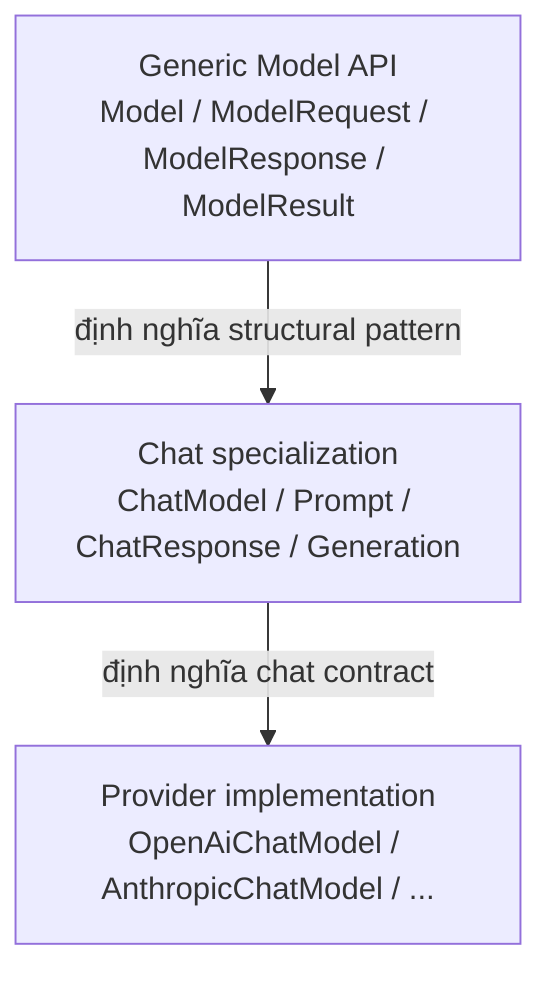

Mỗi tầng trả lời một câu hỏi khác nhau:

| Tầng | Câu hỏi nó trả lời |
|---|---|
| Generic Model API | Một model interaction nói chung có request, response, results và metadata như thế nào? |
| Chat specialization | Với chat, request/output cụ thể là gì và API chat cung cấp capability nào? |
| Provider implementation | Làm sao chuyển canonical chat model sang native SDK của OpenAI, Anthropic hoặc provider khác? |

Điểm quan trọng nhất của Phần 2:

> `Model` cung cấp bộ khung type; `ChatModel` cung cấp semantic của chat; provider adapter cung cấp hành vi runtime.

</details>

---

<details>
<summary><strong>2. Yêu cầu dẫn đến Generic Model API</strong></summary>

Spring AI không chỉ có chat. Framework còn tích hợp nhiều loại operation:

| Operation | Input có ý nghĩa gì? | Output có ý nghĩa gì? |
|---|---|---|
| Chat | Conversation messages và chat options | Assistant messages, tool calls, finish reason |
| Embedding | Text hoặc documents cần vector hóa | Các vector `float[]` |
| Image generation | Image instructions và generation options | URL hoặc image data |
| Moderation | Nội dung cần kiểm duyệt | Categories, scores và trạng thái flagged |
| Speech-to-text | Audio resource và transcription options | Transcribed text |
| Text-to-speech | Text và voice options | Audio bytes |

Semantic khác nhau, nhưng hình dạng xử lý có một phần ổn định:

```text
request
  ├── required instructions/input
  └── optional options

model operation

response
  ├── zero or more results
  │     ├── output
  │     └── result-level metadata
  └── response-level metadata
```

Nếu mỗi model type tự phát minh hoàn toàn request/response pattern, framework sẽ
khó xây:

- Convention chung cho provider contributor.
- Observability context dùng cho nhiều model type.
- Auto-configuration có cấu trúc nhất quán.
- Test utilities và vocabulary chung.
- Cách đọc response nhất quán giữa chat, embedding, image và audio.

Nhưng nếu framework ép mọi model vào một interface như:

```java
Object call(Object input);
```

thì Java compiler không còn bảo vệ gì:

- Chat request có thể bị gửi nhầm cho image model.
- Caller phải cast response.
- Options và metadata trở thành `Map<String, Object>`.
- API không thể diễn đạt semantic riêng của từng model type.

Spring AI chọn điểm cân bằng:

```text
Một structural skeleton chung
+ specialized types cho từng model family
+ provider implementations phía sau specialized contract
```

Chuỗi requirement là:

```text
Có nhiều loại AI operation
→ chúng khác semantic nhưng lặp lại request/response shape
→ cần tái sử dụng shape mà không xóa type information
→ dùng bounded Java generics làm generic foundation
→ tạo specialized API như ChatModel, EmbeddingModel và ImageModel
```

</details>

---

<details>
<summary><strong>3. <code>Model&lt;TReq, TRes&gt;</code>: contract đồng bộ tối thiểu</strong></summary>

Source hiện tại của
[`Model`](../../../spring-ai-model/src/main/java/org/springframework/ai/model/Model.java)
rất nhỏ:

```java
public interface Model<
        TReq extends ModelRequest<?>,
        TRes extends ModelResponse<?>> {

    TRes call(TReq request);
}
```

Sự đơn giản này có chủ đích. `Model` chỉ phát biểu:

> Một synchronous model operation nhận một model request có kiểu rõ ràng và trả về một model response có kiểu rõ ràng.

### Đọc từng type parameter

#### `TReq extends ModelRequest<?>`

`TReq` không thể là một type tùy ý như `String`. Nó phải là một subtype của
`ModelRequest<?>`.

Dấu `?` nghĩa là generic layer chấp nhận request có bất kỳ instruction type nào:

- `Prompt` dùng `List<Message>`.
- `EmbeddingRequest` dùng `List<String>`.
- `ImagePrompt` dùng `List<ImageMessage>`.
- `ModerationPrompt` dùng `ModerationMessage`.

`Model` không cần biết instruction type cụ thể; specialized API sẽ khóa type đó.

#### `TRes extends ModelResponse<?>`

Tương tự, response phải tuân theo `ModelResponse`, nhưng generic layer không cần
biết result cụ thể là:

- `Generation` của chat.
- `Embedding` của embedding.
- `ImageGeneration` của image.
- `Speech` của text-to-speech.

#### `TRes call(TReq request)`

Hai type parameter xuất hiện lại trong method signature. Khi subtype chọn
`TReq` và `TRes`, compiler khóa input/output của `call` theo lựa chọn đó.

Ví dụ `EmbeddingModel` khai báo:

```java
public interface EmbeddingModel
        extends Model<EmbeddingRequest, EmbeddingResponse> {

    EmbeddingResponse call(EmbeddingRequest request);
}
```

Sau specialization, caller không thể truyền `Prompt` vào `EmbeddingModel.call`.

### Generic bounds bảo đảm điều gì?

Chúng bảo đảm request và response có đúng **shape category**:

```java
import org.springframework.ai.chat.model.ChatResponse;
import org.springframework.ai.chat.prompt.Prompt;
import org.springframework.ai.model.Model;

interface ValidShape extends Model<Prompt, ChatResponse> {
}
```

Đoạn sau không hợp lệ vì `String` không implement `ModelRequest` hoặc
`ModelResponse`:

```java
// Không compile
interface InvalidShape extends Model<String, String> {
}
```

### Generic bounds chưa bảo đảm điều gì?

Hai bounds độc lập với nhau. Java type system không biết `Prompt` bắt buộc phải đi
cùng `ChatResponse`:

```java
import org.springframework.ai.chat.prompt.Prompt;
import org.springframework.ai.embedding.EmbeddingResponse;
import org.springframework.ai.model.Model;

// Có thể compile nhưng vô nghĩa về domain.
interface SemanticallyWrongModel
        extends Model<Prompt, EmbeddingResponse> {
}
```

Đây là bằng chứng quan trọng cho vị trí của `ChatModel`. Generic API chỉ bảo vệ
structural constraints; `ChatModel` mới khóa **cặp domain hợp lệ**:

```java
Model<Prompt, ChatResponse>
```

### `Model` không phải runtime dispatcher

Khi gọi:

```java
ChatResponse response = chatModel.call(prompt);
```

không có một object `Model` trung gian nhận request rồi chuyển tiếp. Java dynamic
dispatch gọi thẳng implementation runtime, ví dụ `OpenAiChatModel.call`.

`Model` cũng không phải Template Method vì nó không chứa algorithm skeleton.
Nó là một generic contract dùng để thống nhất type shape.

</details>

---

<details>
<summary><strong>4. Vì sao có <code>StreamingModel</code> riêng?</strong></summary>

Source của
[`StreamingModel`](../../../spring-ai-model/src/main/java/org/springframework/ai/model/StreamingModel.java):

```java
public interface StreamingModel<
        TReq extends ModelRequest<?>,
        TResChunk extends ModelResponse<?>> {

    Flux<TResChunk> stream(TReq request);
}
```

`Model` và `StreamingModel` là hai capability contract song song:

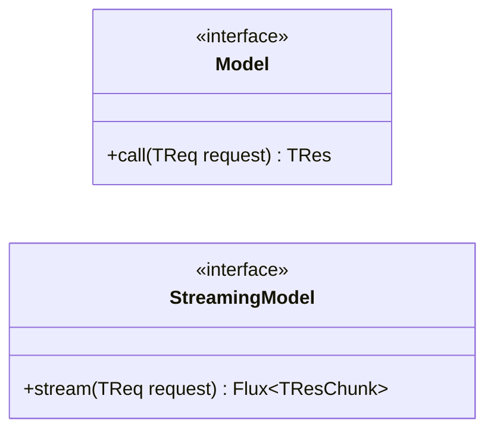

Không có quan hệ kế thừa trực tiếp giữa hai interface generic này. Lý do:

- Một model type có thể chỉ hỗ trợ synchronous invocation.
- Một model type có thể có streaming contract riêng.
- Blocking return và reactive publisher có lifecycle khác nhau.
- Không nên buộc mọi `Model` phải phụ thuộc vào streaming behavior nếu không cần.

### Vì sao tên là `TResChunk`?

Mỗi phần tử do `Flux` phát ra là một response chunk. Với chat:

```java
Flux<ChatResponse>
```

Điều này không có nghĩa mỗi phần tử luôn tương ứng đúng một token. Provider có
thể phát text delta, tool-call delta, metadata hoặc một tổ hợp dữ liệu khác. Spring
AI chuẩn hóa mỗi event thành một `ChatResponse` chunk.

### Vì sao không trả thẳng `Flux<String>`?

Nếu generic streaming contract chỉ trả string, framework sẽ mất:

- Tool calls.
- Finish reason.
- Usage metadata.
- Multimodal output.
- Provider extension metadata.

`StreamingChatModel` có convenience overload trả `Flux<String>`, nhưng full
contract vẫn là `Flux<ChatResponse>`.

### Chat kết hợp hai capability như thế nào?

```java
public interface StreamingChatModel
        extends StreamingModel<Prompt, ChatResponse> {
}

public interface ChatModel
        extends Model<Prompt, ChatResponse>, StreamingChatModel {
}
```

Vì vậy `ChatModel` ghép synchronous model contract và chat streaming contract.
Phần default behavior đặc biệt của `stream` sẽ được phân tích ở mục 9.

</details>

---

<details>
<summary><strong>5. <code>ModelRequest&lt;T&gt;</code> và vai trò của options</strong></summary>

Source của
[`ModelRequest`](../../../spring-ai-model/src/main/java/org/springframework/ai/model/ModelRequest.java):

```java
public interface ModelRequest<T> {

    T getInstructions();

    @Nullable
    ModelOptions getOptions();
}
```

Một request được chia thành hai loại dữ liệu có tốc độ thay đổi khác nhau:

1. **Instructions/input**: model cần xử lý cái gì.
2. **Options**: model nên xử lý bằng configuration nào.

### `instructions` không đồng nghĩa với text prompt

Tên `getInstructions()` là vocabulary generic. Type `T` mới quyết định ý nghĩa:

| Request | `T` | `getInstructions()` trả về |
|---|---|---|
| `Prompt` | `List<Message>` | Conversation messages |
| `EmbeddingRequest` | `List<String>` | Các text cần embedding |
| `ImagePrompt` | `List<ImageMessage>` | Image generation instructions |
| `ModerationPrompt` | `ModerationMessage` | Nội dung cần kiểm duyệt |

Nếu generic API dùng `String getPrompt()`, nó sẽ phù hợp với ví dụ chat đơn giản
nhưng không biểu diễn batch embedding, audio resource hoặc structured messages.

### `ModelOptions` là marker interface

[`ModelOptions`](../../../spring-ai-model/src/main/java/org/springframework/ai/model/ModelOptions.java)
không khai báo method:

```java
public interface ModelOptions {
}
```

Marker interface này không nói mọi model đều có `temperature`, `dimensions` hay
`voice`. Những option đó không phổ quát.

Nó chỉ tạo một category chung:

```text
Đây là options điều khiển một model interaction.
```

Specialized option interfaces mới định nghĩa vocabulary cụ thể:

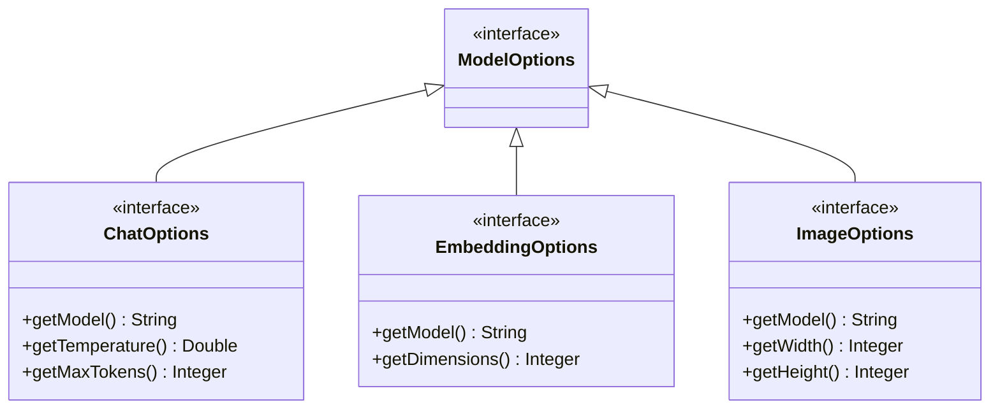

### Covariant return type ở specialized request

Generic method trả `ModelOptions`, nhưng `Prompt` override bằng type cụ thể hơn:

```java
@Override
public @Nullable ChatOptions getOptions() {
    return this.chatOptions;
}
```

Đây là covariant return type của Java. Caller biết object là `Prompt` sẽ nhận
`ChatOptions` mà không cần cast từ `ModelOptions`.

### Vì sao options nằm trong request?

Model thường có default options ở bean level, nhưng một invocation có thể cần
override:

```java
import java.util.List;

import org.springframework.ai.chat.messages.UserMessage;
import org.springframework.ai.chat.prompt.ChatOptions;
import org.springframework.ai.chat.prompt.Prompt;

ChatOptions requestOptions = ChatOptions.builder()
    .temperature(0.1)
    .maxTokens(500)
    .build();

Prompt prompt = new Prompt(
    List.of(new UserMessage("Tóm tắt tài liệu này")),
    requestOptions
);
```

Đặt options trong request khiến `Prompt` trở thành object gốc của một cụm object
mô tả tương đối đầy đủ model invocation. Cụm object này có thể được truyền qua
advisors, logging/observation context và provider adapter.

#### “Value graph” nghĩa là gì?

`Value graph` trong ngữ cảnh này là cách gọi **một mạng các object chủ yếu dùng
để mang dữ liệu, được nối với nhau bằng object references**. Đây không phải tên
một class hoặc một API chính thức của Spring AI, cũng không phải keyword của
Java.

Trong ví dụ trên, graph có dạng:

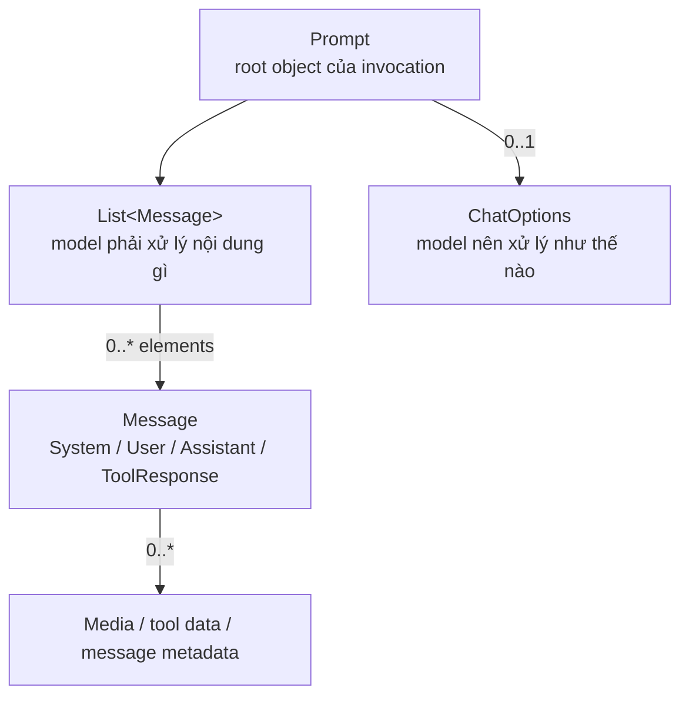

Gọi là **graph** vì dữ liệu không nằm trong một object phẳng. `Prompt` giữ
reference đến danh sách `Message` và `ChatOptions`; từng `Message` lại có thể giữ
media, tool-related data hoặc metadata khác.

Gọi là **value** để nhấn mạnh các object này chủ yếu mô tả giá trị của một lần
gọi model:

- Conversation nào được gửi đi.
- Options nào áp dụng cho lần gọi đó.
- Media hoặc metadata nào đi kèm.

Chúng không phải các service thực thi provider call, không quản lý connection và
không phải provider client. Tuy nhiên, “value” ở đây là cách mô tả vai trò kiến
trúc; nó **không khẳng định toàn bộ object graph được Java bảo đảm deep
immutable**.

Nếu options không nằm trong request, dữ liệu của một invocation có thể bị tách
thành nhiều tham số song song:

```java
call(messages, temperature, maxTokens, model, stopSequences, ...);
```

Khi options nằm trong `Prompt`, các tầng chỉ cần truyền một root object:

```text
Prompt
  ├── messages
  └── options
```

Vì vậy, câu “truyền cả value graph qua pipeline” có nghĩa đơn giản là:

> Truyền một object gốc cùng toàn bộ các object dữ liệu mà nó tham chiếu, để mỗi tầng nhìn thấy cùng một mô tả nhất quán của model invocation.

</details>

---

<details>
<summary><strong>6. Phân biệt <code>ModelResponse</code>, <code>ModelResult</code> và output</strong></summary>

Đây là phần dễ nhầm nhất của Generic Model API.

Source của
[`ModelResponse`](../../../spring-ai-model/src/main/java/org/springframework/ai/model/ModelResponse.java):

```java
public interface ModelResponse<T extends ModelResult<?>> {

    @Nullable T getResult();

    List<T> getResults();

    ResponseMetadata getMetadata();
}
```

Source của
[`ModelResult`](../../../spring-ai-model/src/main/java/org/springframework/ai/model/ModelResult.java):

```java
public interface ModelResult<T> {

    T getOutput();

    ResultMetadata getMetadata();
}
```

Ta có ba lớp bọc:

```text
ModelResponse
  └── ModelResult
        └── output
```

### `ModelResponse`: toàn bộ response của một invocation

Response chứa:

- Danh sách tất cả results.
- Convenience access đến result đầu tiên.
- Metadata áp dụng cho toàn invocation.

Trong chat, `ChatResponse` có thể chứa nhiều `Generation`. Trong image
generation, `ImageResponse` có thể chứa nhiều `ImageGeneration`. Trong batch
embedding, `EmbeddingResponse` chứa nhiều `Embedding` tương ứng nhiều input.

### `ModelResult`: một phần tử trong response

Mỗi result chứa:

- Output có type riêng.
- Metadata gắn với chính result đó.

Ví dụ:

| Model family | Response | Result | Output |
|---|---|---|---|
| Chat | `ChatResponse` | `Generation` | `AssistantMessage` |
| Embedding | `EmbeddingResponse` | `Embedding` | `float[]` |
| Image | `ImageResponse` | `ImageGeneration` | `Image` |
| Text-to-speech | `TextToSpeechResponse` | `Speech` | `byte[]` |

### Vì sao không trả thẳng output?

Nếu `ChatModel.call` trả thẳng `AssistantMessage`, framework mất khả năng biểu
diễn:

- Nhiều candidate.
- Response-level token usage.
- Model ID và rate limit.
- Finish reason riêng của từng candidate.
- Provider metadata bổ sung.

Envelope không phải boilerplate vô ích; nó giữ semantic của model interaction.

### `getResult()` không phải toàn bộ response

Trong `ChatResponse`, `getResult()` trả result đầu tiên hoặc `null` nếu danh sách
rỗng. Nó là convenience method cho use case phổ biến.

Khi correctness phụ thuộc tất cả candidate hoặc tất cả embedding, phải dùng:

```java
response.getResults();
```

Không nên đọc `getResult()` rồi suy luận provider chỉ trả được một result.

</details>

---

<details>
<summary><strong>7. Vì sao metadata có hai cấp?</strong></summary>

Generic API tách:

- `ResponseMetadata`: metadata của toàn request/response exchange.
- `ResultMetadata`: metadata của một result cụ thể.

### Response-level metadata

Với chat, [`ChatResponseMetadata`](../../../spring-ai-model/src/main/java/org/springframework/ai/chat/metadata/ChatResponseMetadata.java)
có thể chứa:

- Response ID.
- Model ID.
- Token usage của toàn call.
- Rate-limit information.
- Prompt metadata.
- Provider-specific key-value extensions.

Những dữ liệu này không nên bị copy vào mọi candidate.

### Result-level metadata

Với chat,
[`ChatGenerationMetadata`](../../../spring-ai-model/src/main/java/org/springframework/ai/chat/metadata/ChatGenerationMetadata.java)
gắn với từng `Generation` và biểu diễn:

- Finish reason của candidate đó.
- Content filters của candidate đó.
- Key-value metadata riêng của result.

Nếu response có ba candidates, chúng có thể kết thúc vì các reason khác nhau.
Finish reason vì vậy thuộc result level, không phải response level.

### Câu hỏi để chọn đúng cấp

| Câu hỏi | Metadata level |
|---|---|
| Provider đã dùng model nào cho call này? | Response |
| Tổng số token của call là bao nhiêu? | Response |
| Candidate thứ hai dừng vì lý do gì? | Result |
| Candidate nào bị content filter? | Result |

### Vì sao `ResultMetadata` gần như rỗng?

[`ResultMetadata`](../../../spring-ai-model/src/main/java/org/springframework/ai/model/ResultMetadata.java)
là generic marker contract. Không có một field cụ thể nào đủ phổ quát cho mọi
result của chat, image, embedding, moderation và audio.

Specialized metadata mới thêm semantic phù hợp. Đây là cùng chiến lược đã thấy
ở `ModelOptions`:

```text
Generic layer tạo category ổn định.
Specialized layer thêm vocabulary có ý nghĩa.
```

### Vì sao `ResponseMetadata` có key-value API?

`ResponseMetadata` định nghĩa các operation như `get`, `containsKey`,
`getOrDefault` và `entrySet`. Generic layer cần một extension channel để giữ dữ
liệu không đủ phổ quát cho typed fields.

Chat layer vẫn có typed fields cho semantic ổn định, rồi dùng map cho phần mở
rộng. Đây chính là ranh giới “canonical model đủ giàu nhưng không trở thành
universal DTO” đã phân tích ở Phần 1.

</details>

---

<details>
<summary><strong>8. UML đầy đủ của Generic Model API</strong></summary>

Sơ đồ source-level rút gọn:

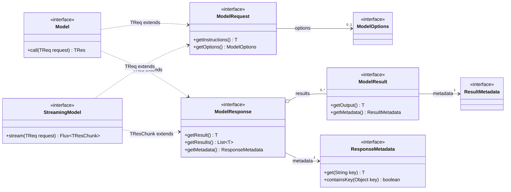

### Cách đọc

1. `Model` và `StreamingModel` là operation contracts.
2. Cả hai chỉ chấp nhận subtype của `ModelRequest`.
3. Cả hai chỉ trả subtype của `ModelResponse`.
4. Request có instructions và có thể có options.
5. Response tập hợp nhiều results và có response metadata.
6. Mỗi result có output và result metadata.

### Sơ đồ không nói điều gì?

Nó không nói:

- Request cụ thể chứa chat messages hay image instructions.
- Output là text, vector, image hay audio.
- Provider nào thực thi operation.
- Native SDK request/response trông như thế nào.
- Cặp request/response nào hợp lệ về domain.

Các câu hỏi đó được trả lời ở specialized API và provider implementation.

</details>

---

<details>
<summary><strong>9. Chat specialization: thay các type variable bằng type cụ thể</strong></summary>

Chat layer áp các type substitution sau:

```text
TReq       = Prompt
TRes       = ChatResponse
Result     = Generation
Output     = AssistantMessage
Options    = ChatOptions
ResMeta    = ChatResponseMetadata
ResultMeta = ChatGenerationMetadata
```

Trong source:

```java
public class Prompt
        implements ModelRequest<List<Message>> {
}

public class ChatResponse
        implements ModelResponse<Generation> {
}

public class Generation
        implements ModelResult<AssistantMessage> {
}

public interface ChatOptions
        extends ModelOptions {
}

public interface ChatModel
        extends Model<Prompt, ChatResponse>, StreamingChatModel {
}

public interface StreamingChatModel
        extends StreamingModel<Prompt, ChatResponse> {
}
```

UML của sự specialization:

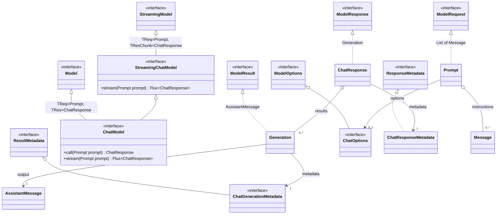

### Tại sao `ChatModel` không chỉ là type alias?

Java không có semantic type alias cho interface hierarchy này. Quan trọng hơn,
`ChatModel` bổ sung vocabulary và behavior dành cho chat:

- `call(String)`.
- `call(Message...)`.
- `getOptions()` trả `ChatOptions`.
- Chat-specific streaming contract.
- Stable injection point cho provider chat implementations.

Vì vậy `ChatModel` vừa cố định generic types, vừa định nghĩa một port có semantic
chat.

### Hai trục specialization

Chat specialization diễn ra đồng thời trên hai trục:

1. **Operation specialization**: `Model` → `ChatModel`.
2. **Data specialization**: generic request/response/result → chat data model.

Chỉ specialize operation mà vẫn dùng `ModelRequest<?>` sẽ khiến caller mất type
information. Chỉ tạo `Prompt`/`ChatResponse` mà không có `ChatModel` lại thiếu
stable operation contract. Hai trục cần đi cùng nhau.

</details>

---

<details>
<summary><strong>10. Đọc chính xác interface <code>ChatModel</code></strong></summary>

Source hiện tại của
[`ChatModel`](../../../spring-ai-model/src/main/java/org/springframework/ai/chat/model/ChatModel.java)
có thể rút gọn như sau:

```java
public interface ChatModel
        extends Model<Prompt, ChatResponse>, StreamingChatModel {

    default @Nullable String call(String message) { /* ... */ }

    default @Nullable String call(Message... messages) { /* ... */ }

    @Override
    ChatResponse call(Prompt prompt);

    default ChatOptions getOptions() { /* ... */ }

    default Flux<ChatResponse> stream(Prompt prompt) {
        throw new UnsupportedOperationException("streaming is not supported");
    }
}
```

### Phân loại các method

| Method | Vai trò | Provider bắt buộc override? |
|---|---|---|
| `call(Prompt)` | Full synchronous chat contract | Có |
| `call(String)` | Convenience, tự tạo `UserMessage` và `Prompt` | Không |
| `call(Message...)` | Convenience cho danh sách messages | Không |
| `getOptions()` | Truy cập model options; default trả empty common options | Không, nhưng provider có thể override |
| `stream(Prompt)` | Full streaming signature với default unsupported | Chỉ override nếu cung cấp streaming thật |

### `call(String)` làm gì?

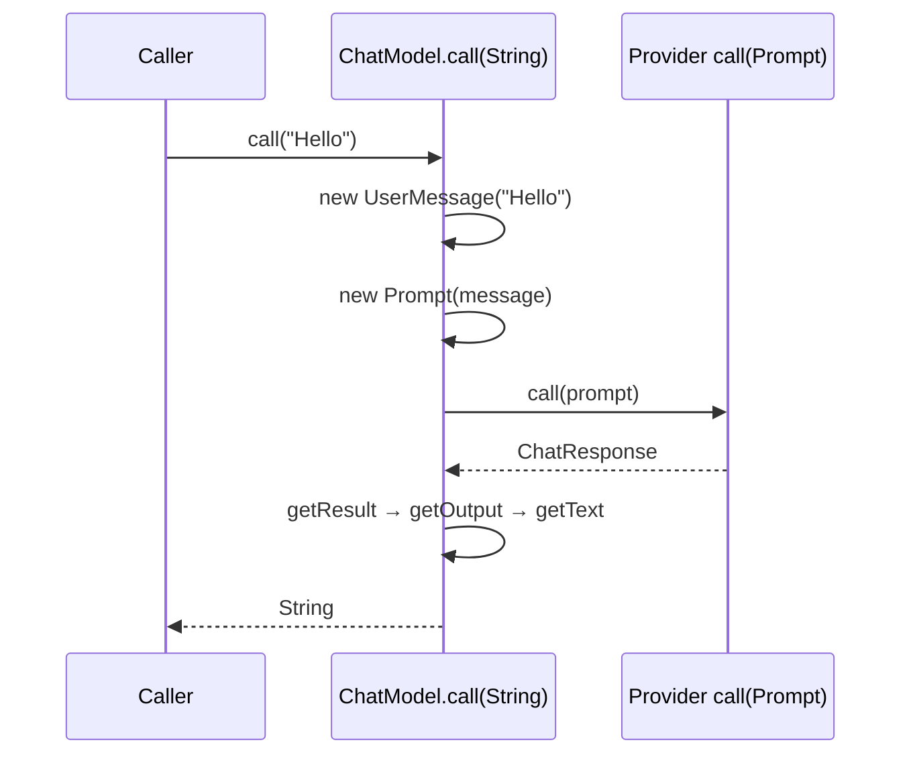

Convenience method cố ý làm phẳng rich response thành text. Nó phù hợp cho use
case đơn giản, nhưng caller sẽ không trực tiếp nhận:

- Các generations còn lại.
- Tool calls.
- Response metadata.
- Generation metadata.
- Multimodal content.

Full architectural contract vẫn là `call(Prompt) -> ChatResponse`.

### Vì sao `ChatModel` có thể dùng làm lambda trong test?

Sau khi tính các default method, chỉ `call(Prompt)` còn abstract. Vì vậy có thể
tạo fake ngắn gọn:

```java
import org.springframework.ai.chat.model.ChatModel;
import org.springframework.ai.chat.model.ChatResponse;

ChatResponse fixedResponse = createFixedResponse();
ChatModel fake = prompt -> fixedResponse;
```

### Điểm căng trong streaming design

[`StreamingChatModel`](../../../spring-ai-model/src/main/java/org/springframework/ai/chat/model/StreamingChatModel.java)
khai báo abstract:

```java
Flux<ChatResponse> stream(Prompt prompt);
```

Nhưng `ChatModel` redeclare nó thành default method ném
`UnsupportedOperationException`.

Hệ quả:

- Mọi `ChatModel` có method `stream` ở compile time.
- Không phải mọi implementation bảo đảm streaming ở runtime.
- Provider hỗ trợ streaming phải override.
- Type availability và runtime capability không hoàn toàn giống nhau.

Đây là một trade-off thực tế: provider chỉ hỗ trợ sync vẫn implement được
`ChatModel`, nhưng caller không thể chỉ nhìn type `ChatModel` để kết luận stream
chắc chắn hoạt động. Nếu đọc theo Liskov Substitution thật nghiêm, đây là một điểm
căng đáng ghi nhớ trong thiết kế hiện tại.

</details>

---

<details>
<summary><strong>11. Runtime flow: generic interfaces không tự thực thi gì</strong></summary>

Giả sử Spring inject `OpenAiChatModel` vào một field có type `ChatModel`:

```java
import org.springframework.ai.chat.model.ChatModel;
import org.springframework.ai.chat.model.ChatResponse;
import org.springframework.ai.chat.prompt.Prompt;

final class SupportService {

    private final ChatModel chatModel;

    SupportService(ChatModel chatModel) {
        this.chatModel = chatModel;
    }

    ChatResponse answer(Prompt prompt) {
        return this.chatModel.call(prompt);
    }
}
```

Runtime flow:

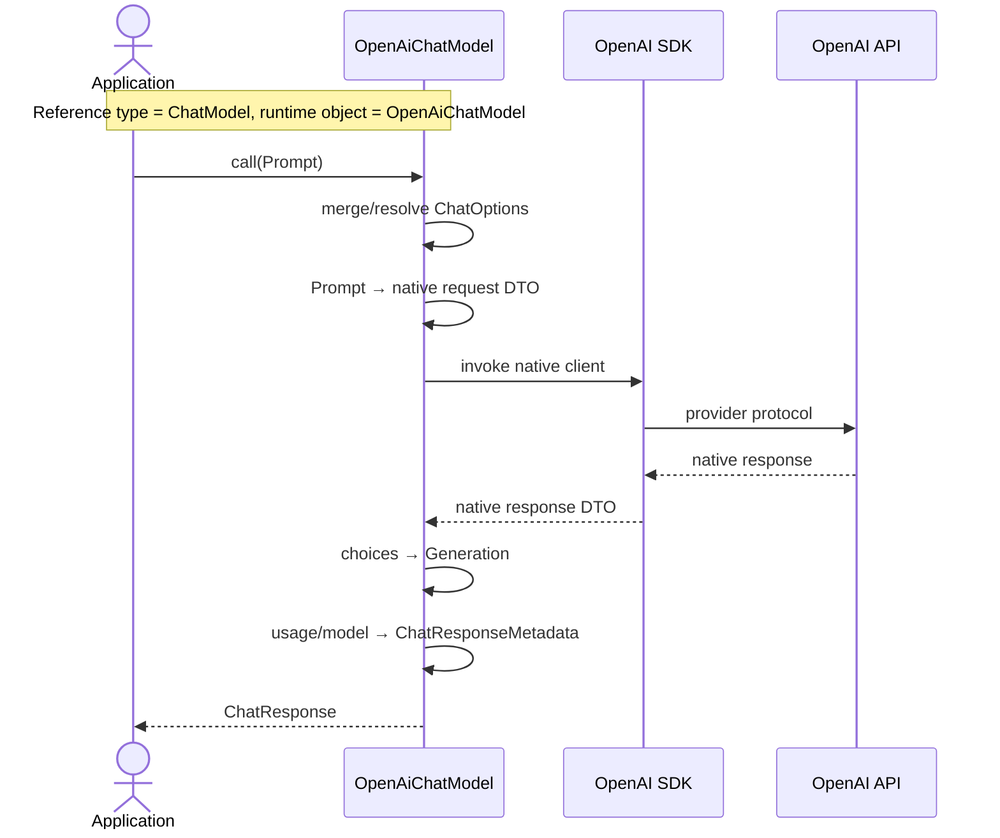

Trong
[`OpenAiChatModel`](../../../models/spring-ai-openai/src/main/java/org/springframework/ai/openai/OpenAiChatModel.java),
`call(Prompt)` đi vào provider implementation, build native request, gọi OpenAI
client, rồi map native choices thành `Generation` và `ChatResponse`.

Không có runtime call qua các object sau:

```text
Model → ModelRequest → ModelResponse
```

Chúng là types mô tả contract, không phải pipeline components.

### Vai trò của Java generics tại runtime

Java generics chủ yếu cung cấp compile-time type safety và bị type erasure phần
lớn ở runtime. Việc chuyển OpenAI DTO sang `ChatResponse` không tự xảy ra vì
`Model<Prompt, ChatResponse>`.

Provider adapter vẫn phải viết mapping code thủ công:

```text
canonical request ↔ provider-native request
provider-native response ↔ canonical response
```

Generic API bảo đảm adapter xuất hiện với đúng public shape; nó không sinh adapter
logic.

### Nơi xảy ra dynamic dispatch

Call site compile theo `ChatModel.call(Prompt)`. JVM chọn method implementation
dựa trên runtime object:

```text
OpenAiChatModel      → OpenAI mapping và client
AnthropicChatModel   → Anthropic mapping và client
OllamaChatModel      → Ollama mapping và client
```

Đây là cách generic foundation, chat port và Strategy/Ports-and-Adapters của
Phần 1 nối với nhau.

</details>

---

<details>
<summary><strong>12. Vị trí của <code>ChatModel</code> trong toàn kiến trúc</strong></summary>

`ChatModel` nằm giữa high-level chat orchestration và low-level provider
integration:

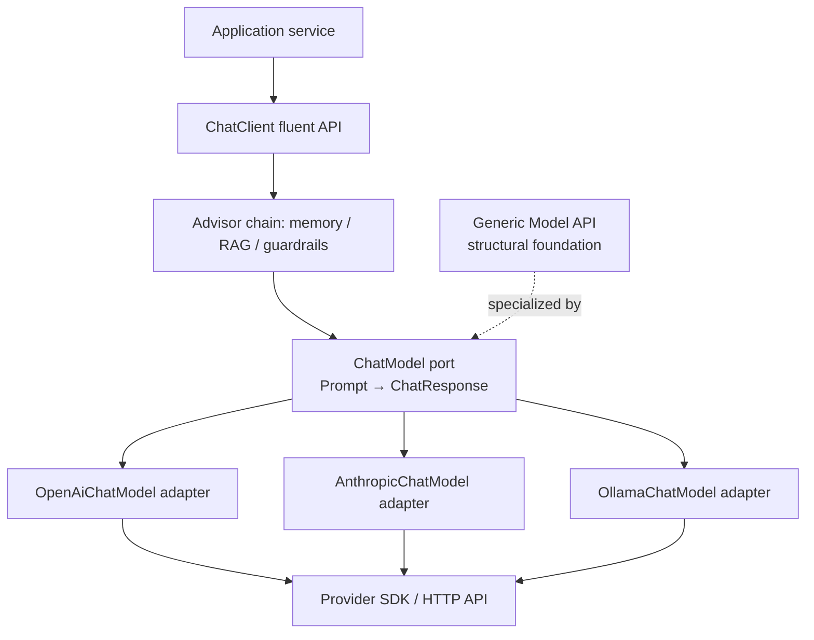

Mũi tên từ `ChatModel` đến các adapter trong flowchart diễn tả lựa chọn runtime;
trong UML dependency source code, các adapter mới là classes realize interface
`ChatModel`.

### So sánh ba API thường bị nhầm

| Thành phần | Audience chính | Trách nhiệm |
|---|---|---|
| `Model<TReq,TRes>` | Framework author, model-family designer | Structural contract chung cho model invocation |
| `ChatModel` | Provider contributor và caller cần low-level chat API | Stable chat port dùng `Prompt`/`ChatResponse` |
| `ChatClient` | Application developer | Fluent API, prompt construction và advisor orchestration |

### `ChatModel` không phải high-level application facade

Application có thể gọi `ChatModel` trực tiếp, nhưng `ChatClient` thường tiện hơn
cho application flow. Dù vậy `ChatClient` vẫn cần một lower-level model port để:

- Không phụ thuộc provider SDK.
- Chạy advisor chain trước khi invoke model.
- Giữ một canonical request/response boundary.

`ChatModel` vì vậy không bị `ChatClient` thay thế. Hai type ở hai abstraction
level khác nhau.

### Generic API nằm “dưới” theo nghĩa nào?

“Dưới” ở đây là **type foundation**, không phải một runtime service thấp hơn.

```text
ChatModel is-a Model<Prompt, ChatResponse>
```

Nhưng lúc chạy không có bước gọi `Model` trước rồi mới gọi `ChatModel`.

### Module boundary

Generic types và chat model types nằm trong `spring-ai-model`. Provider
implementations nằm trong các provider modules như `spring-ai-openai` và
`spring-ai-anthropic`. `ChatClient` nằm ở chat-client module.

Sự tách module phản ánh dependency direction:

```text
provider module → common model contracts
chat client     → ChatModel contract
common model    ↛ provider SDK
```

</details>

---

<details>
<summary><strong>13. <code>ChatModel</code> là một specialization ngang hàng, không phải “model mẹ”</strong></summary>

Generic Model API có nhiều specialized siblings:

| Specialized model | Generic substitution | Result/output tiêu biểu |
|---|---|---|
| `ChatModel` | `Model<Prompt, ChatResponse>` | `Generation → AssistantMessage` |
| [`EmbeddingModel`](../../../spring-ai-model/src/main/java/org/springframework/ai/embedding/EmbeddingModel.java) | `Model<EmbeddingRequest, EmbeddingResponse>` | `Embedding → float[]` |
| [`ImageModel`](../../../spring-ai-model/src/main/java/org/springframework/ai/image/ImageModel.java) | `Model<ImagePrompt, ImageResponse>` | `ImageGeneration → Image` |
| [`ModerationModel`](../../../spring-ai-model/src/main/java/org/springframework/ai/moderation/ModerationModel.java) | `Model<ModerationPrompt, ModerationResponse>` | Moderation result/categories |
| [`TranscriptionModel`](../../../spring-ai-model/src/main/java/org/springframework/ai/audio/transcription/TranscriptionModel.java) | `Model<AudioTranscriptionPrompt, AudioTranscriptionResponse>` | `AudioTranscription → String` |
| [`TextToSpeechModel`](../../../spring-ai-model/src/main/java/org/springframework/ai/audio/tts/TextToSpeechModel.java) | `Model<TextToSpeechPrompt, TextToSpeechResponse>` | `Speech → byte[]` |

UML rút gọn:

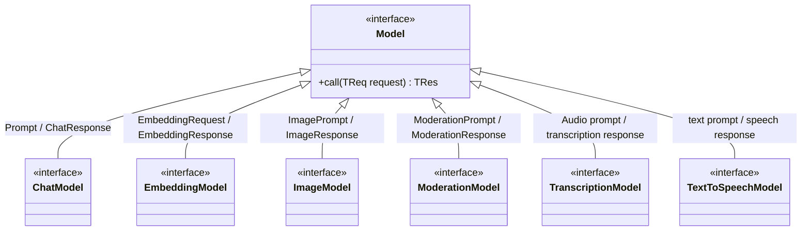

`ChatModel` không phải parent của `EmbeddingModel` hoặc `ImageModel`. Nó là một
specialization ngang hàng cho chat semantics.

### Có nên inject `Model<?, ?>` vào application service?

Thông thường là không. Type đó quá yếu:

- Caller không biết request type nào hợp lệ.
- Caller không biết response type cụ thể.
- Không truy cập được convenience methods và semantic riêng.
- Cuối cùng phải dùng casts hoặc `instanceof`.

Generic base có giá trị lớn nhất khi:

- Thiết kế model-family contract mới.
- Xây infrastructure thực sự chỉ cần structural shape.
- Tạo vocabulary và pattern nhất quán cho framework contributors.

Application nên phụ thuộc specialized abstraction sát capability nó cần, ví dụ
`ChatModel` hoặc `EmbeddingModel`.

Đây là Interface Segregation ở cấp model family: chia contract theo capability
thay vì tạo một `AiModel` khổng lồ có `chat`, `embed`, `generateImage`,
`transcribe` và `moderate`.

</details>

---

<details>
<summary><strong>14. Những design decision quan trọng và trade-off</strong></summary>

### Vì sao dùng interface thay vì abstract base class?

Provider implementations có dependency và lifecycle rất khác nhau:

- Provider SDK khác nhau.
- Sync/async clients khác nhau.
- Authentication và configuration khác nhau.
- Một số class còn implement Spring lifecycle interfaces.

Interface áp đặt contract mà không chiếm mất single class inheritance của Java.
Nó cũng cho phép fake/lambda implementation đơn giản.

### Vì sao không dùng `Model<TInput, TOutput>` trực tiếp?

Ví dụ cực giản:

```java
interface SimpleModel<I, O> {
    O call(I input);
}
```

API này type-safe nhưng quá nghèo. Nó không chuẩn hóa:

- Per-request options.
- Multiple results.
- Response metadata.
- Result metadata.
- Cách model families tổ chức envelope.

Spring AI generic hóa **request/response envelopes**, không chỉ raw input/output.

### Vì sao không đưa mọi behavior vào `Model`?

Nếu `Model` có tất cả method:

```java
chat(...)
embed(...)
generateImage(...)
transcribe(...)
stream(...)
```

thì phần lớn implementations không thể hỗ trợ phần lớn methods. Interface sẽ có
nhiều operation không liên quan và nhiều default method ném exception.

Generic Model API chỉ giữ shape chung; specialized interfaces giữ behavior riêng.

### Đây có phải Template Method pattern không?

Không. `Model.call` không cung cấp một algorithm gồm các bước cố định để subclass
override. Provider model tự tổ chức mapping, observation, tool execution và SDK
call.

Các pattern/vocabulary phù hợp hơn là:

- **Generic abstraction** cho type-safe structural reuse.
- **Strategy/Port** tại `ChatModel`.
- **Adapter** tại `OpenAiChatModel`, `AnthropicChatModel`, ...
- **Interface Segregation** giữa chat, embedding, image và audio model families.

### Lợi ích

- Consistent source structure giữa model families.
- Type-safe request/response pairing ở specialized interface.
- Common vocabulary cho request, result và metadata.
- Provider contributor có contribution pattern rõ.
- Infrastructure có điểm bám mà không cần hiểu native SDK.

### Chi phí

- Nhiều lớp bọc: response, result, output và hai cấp metadata.
- Cần hiểu Java generics và covariant returns.
- Một số generic marker interfaces trông rất “mỏng” khi đọc riêng lẻ.
- Generic base không thể tự bảo đảm semantic pairing.
- Streaming capability của `ChatModel` có default unsupported nên type contract
  và runtime capability có độ lệch.

Một abstraction mỏng không nhất thiết vô ích. Giá trị của `Model` không nằm ở số
dòng code mà ở việc nó đặt ra grammar chung cho cả họ model APIs.

</details>

---

<details>
<summary><strong>15. Các ngộ nhận cần tránh</strong></summary>

### “`Model` là đại diện cho tên LLM như GPT hay Claude”

Không. `Model<TReq,TRes>` là operation contract. Tên model cụ thể như
`gpt-...` hoặc `claude-...` thường là option/configuration value.

### “`ModelResult` chính là toàn bộ provider response”

Không. Một `ModelResponse` chứa nhiều `ModelResult`; provider response-level
metadata nằm ngoài từng result.

### “`getResult()` luôn non-null”

Không. Contract hiện tại đánh dấu nullable. `ChatResponse` trả `null` khi results
rỗng.

### “Một `ChatResponse` chỉ chứa một câu trả lời”

Không. `getResult()` chỉ là shortcut lấy phần tử đầu; `getResults()` mới là toàn
bộ danh sách.

### “`Flux<ChatResponse>` nghĩa là mỗi chunk đúng một token”

Không. Chunk boundary phụ thuộc provider và conversion logic. Một chunk có thể
chứa text delta, tool-call information hoặc metadata.

### “Implement `Model<Prompt, ChatResponse>` là tương đương `ChatModel`”

Không hoàn toàn. Nó có đúng base shape nhưng không mang specialized chat methods,
chat streaming contract hoặc vai trò stable bean type mà framework dùng.

### “Generics tự chuyển native DTO thành canonical DTO”

Không. Provider adapter phải thực hiện conversion. Generics chỉ kiểm tra public
type contract tại compile time.

### “Generic Model API cho phép thay chat bằng embedding model”

Không. Chúng cùng structural family nhưng semantic và specialized types khác
nhau. Generic foundation tạo consistency, không tạo behavioral interchangeability.

</details>

---

<details>
<summary><strong>16. Cách đọc source sau Phần 2</strong></summary>

Nên đọc theo thứ tự sau thay vì bắt đầu từ provider implementation dài hàng
nghìn dòng:

1. [`Model.java`](../../../spring-ai-model/src/main/java/org/springframework/ai/model/Model.java)
2. [`StreamingModel.java`](../../../spring-ai-model/src/main/java/org/springframework/ai/model/StreamingModel.java)
3. [`ModelRequest.java`](../../../spring-ai-model/src/main/java/org/springframework/ai/model/ModelRequest.java)
4. [`ModelResponse.java`](../../../spring-ai-model/src/main/java/org/springframework/ai/model/ModelResponse.java)
5. [`ModelResult.java`](../../../spring-ai-model/src/main/java/org/springframework/ai/model/ModelResult.java)
6. [`Prompt.java`](../../../spring-ai-model/src/main/java/org/springframework/ai/chat/prompt/Prompt.java)
7. [`ChatResponse.java`](../../../spring-ai-model/src/main/java/org/springframework/ai/chat/model/ChatResponse.java)
8. [`Generation.java`](../../../spring-ai-model/src/main/java/org/springframework/ai/chat/model/Generation.java)
9. [`StreamingChatModel.java`](../../../spring-ai-model/src/main/java/org/springframework/ai/chat/model/StreamingChatModel.java)
10. [`ChatModel.java`](../../../spring-ai-model/src/main/java/org/springframework/ai/chat/model/ChatModel.java)
11. Sau cùng mới theo `call(Prompt)` vào một provider như
    [`OpenAiChatModel`](../../../models/spring-ai-openai/src/main/java/org/springframework/ai/openai/OpenAiChatModel.java).

Ở mỗi file, đặt ba câu hỏi:

1. Type này specialize generic type parameter nào?
2. Nó thêm semantic gì mà generic parent không có?
3. Nó chỉ định nghĩa contract hay thật sự thực thi runtime behavior?

Ba câu hỏi này giúp tránh nhầm interface hierarchy với runtime call stack.

</details>

---

<details>
<summary><strong>17. Tóm tắt chuỗi suy luận</strong></summary>

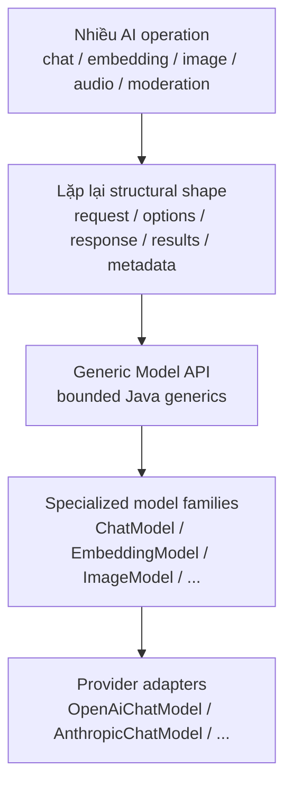

Tóm lại:

1. `Model<TReq,TRes>` định nghĩa synchronous request/response shape.
2. `StreamingModel<TReq,TResChunk>` định nghĩa streaming shape riêng.
3. `ModelRequest<T>` tách required input khỏi optional options.
4. `ModelResponse<R>` tách toàn response khỏi từng result.
5. `ModelResult<O>` tách output khỏi result metadata.
6. Generic bounds bảo đảm structural category, không bảo đảm semantic pairing.
7. `ChatModel` khóa cặp `Prompt`/`ChatResponse` và thêm chat vocabulary.
8. `Generation` khóa output thành `AssistantMessage`.
9. Provider adapter mới là nơi runtime mapping và SDK invocation xảy ra.
10. `ChatModel` nằm dưới `ChatClient`, trên provider SDK, và ngang hàng với các
    specialized model contracts khác.

Kết luận cô đọng:

> Generic Model API là grammar chung; `ChatModel` là một câu có semantic chat được viết bằng grammar đó; provider adapter là code thực thi câu ấy.

</details>

---

<details>
<summary><strong>Câu hỏi thảo luận</strong></summary>

## 1. Vì sao `Model<Prompt, EmbeddingResponse>` vẫn compile?

### Trả lời ngắn

Vì hai generic bounds của `Model` được kiểm tra **độc lập**:

```java
public interface Model<
        TReq extends ModelRequest<?>,
        TRes extends ModelResponse<?>> {

    TRes call(TReq request);
}
```

Compiler chỉ hỏi:

1. `Prompt` có phải subtype của `ModelRequest<?>` không? Có.
2. `EmbeddingResponse` có phải subtype của `ModelResponse<?>` không? Có.

Không có constraint nào trong declaration nói:

```text
Nếu request là Prompt thì response bắt buộc phải là ChatResponse.
```

Vì vậy declaration sau hợp lệ về Java type system:

```java
import org.springframework.ai.chat.prompt.Prompt;
import org.springframework.ai.embedding.EmbeddingResponse;
import org.springframework.ai.model.Model;

interface StructurallyValidButSemanticallyWrong
        extends Model<Prompt, EmbeddingResponse> {

    @Override
    EmbeddingResponse call(Prompt prompt);
}
```

### Compiler đã bảo vệ được gì?

Compiler bảo vệ **structural categories**:

- Request phải có shape của `ModelRequest`.
- Response phải có shape của `ModelResponse`.
- Method phải nhận đúng `Prompt` và trả đúng `EmbeddingResponse` như interface đã
  chọn.

Ví dụ implementation không thể trả `ChatResponse` nếu method đã hứa trả
`EmbeddingResponse`.

### Compiler chưa bảo vệ được gì?

Compiler không hiểu domain rule:

```text
Prompt thuộc chat domain
EmbeddingResponse thuộc embedding domain
Hai type này không tạo thành một operation có ý nghĩa.
```

Java generics chỉ biết inheritance relationships đã được khai báo. Nó không tự
suy ra semantic pairing dựa trên tên package hoặc tên class.

Ta có thể hình dung hai bounds như hai cổng kiểm tra riêng:

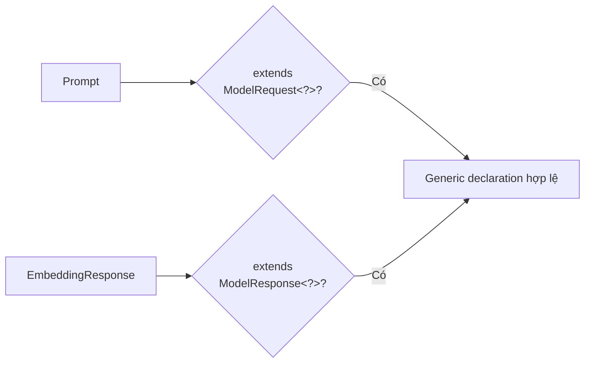

Không có mũi tên kiểm tra compatibility giữa `Prompt` và `EmbeddingResponse`.

### `ChatModel` giải quyết giới hạn này như thế nào?

[`ChatModel`](../../../spring-ai-model/src/main/java/org/springframework/ai/chat/model/ChatModel.java)
khóa cặp type có ý nghĩa:

```java
public interface ChatModel
        extends Model<Prompt, ChatResponse>, StreamingChatModel {
}
```

Application phụ thuộc `ChatModel` sẽ luôn thấy:

```java
ChatResponse call(Prompt prompt);
```

Specialized interface biến một domain rule thành một type contract cụ thể.

### Điều câu hỏi này dạy về generic bounds

Bounded generics rất tốt để giới hạn **họ type hợp lệ**, nhưng không nhất thiết
biểu diễn được mọi quan hệ semantic giữa các type parameters.

Kết luận:

> Generic Model API bảo đảm request/response có đúng structural grammar; specialized API như `ChatModel` mới bảo đảm cặp request/response đúng domain semantic.

---

## 2. Vì sao `ChatResponse` chứa `List<Generation>` thay vì trả thẳng `AssistantMessage`?

### Trả lời ngắn

Vì một model invocation có thể tạo từ không có kết quả đến nhiều candidate, và
mỗi candidate cần output cùng metadata riêng. `AssistantMessage` chỉ là output
của **một** candidate; nó không đại diện cho toàn provider response.

Source của
[`ChatResponse`](../../../spring-ai-model/src/main/java/org/springframework/ai/chat/model/ChatResponse.java)
giữ:

```java
private final List<Generation> generations;
private final ChatResponseMetadata chatResponseMetadata;
```

Trong khi
[`Generation`](../../../spring-ai-model/src/main/java/org/springframework/ai/chat/model/Generation.java)
giữ:

```java
private final AssistantMessage assistantMessage;
private ChatGenerationMetadata chatGenerationMetadata;
```

Object graph là:

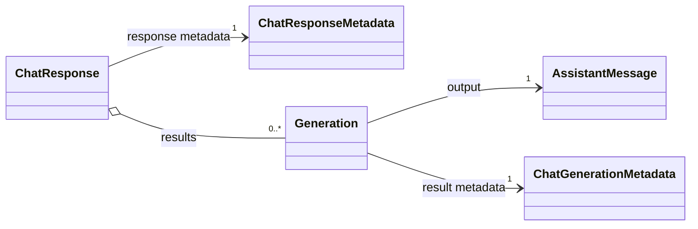

### Lý do 1: provider có thể trả nhiều candidates

Một request có thể yêu cầu hoặc nhận nhiều generated alternatives. Nếu
`ChatModel.call` trả thẳng `AssistantMessage`, API phải:

- Bỏ các candidates còn lại.
- Tự ý chọn một candidate mà caller không biết.
- Hoặc đổi return type thành `List<AssistantMessage>`.

`List<Generation>` bảo toàn cardinality và thứ tự của results. Caller có thể
chọn candidate đầu tiên hoặc tự áp dụng selection policy.

### Lý do 2: một candidate không chỉ có output

Mỗi candidate có ít nhất hai nhóm thông tin:

```text
Generation
  ├── AssistantMessage         nội dung model sinh ra
  └── ChatGenerationMetadata   model dừng vì sao, content filter nào áp dụng
```

Nếu response chỉ chứa `List<AssistantMessage>`, finish reason riêng của từng
candidate không có vị trí tự nhiên.

### Lý do 3: metadata toàn call không thuộc candidate nào

Token usage, response ID, model ID và rate-limit information thường mô tả toàn
provider invocation:

```text
ChatResponseMetadata
```

Nếu trả thẳng `AssistantMessage`, ta phải:

- Vứt bỏ response metadata.
- Nhét metadata toàn call vào một message bất kỳ.
- Hoặc tạo một wrapper khác—mà wrapper đó cuối cùng lại chính là vai trò của
  `ChatResponse`.

### Lý do 4: zero-result state cần được biểu diễn

`ChatResponse.getResult()` trả candidate đầu tiên hoặc `null` nếu danh sách rỗng.
Điều này cho phép canonical model biểu diễn provider response không có candidate
mà không phải tạo một `AssistantMessage` giả.

### `getResult()` dùng để làm gì?

Spring AI vẫn cung cấp convenience access:

```java
Generation first = response.getResult();
```

Nó giúp use case phổ biến không phải viết:

```java
Generation first = response.getResults().get(0);
```

Nhưng `getResult()` không thay đổi sự thật rằng full response có cardinality
`0..*`.

### So sánh hai thiết kế

| Thiết kế | Giữ nhiều candidate | Giữ metadata từng candidate | Giữ metadata toàn call |
|---|---:|---:|---:|
| Trả `AssistantMessage` | Không | Không có vị trí riêng | Không có vị trí riêng |
| Trả `List<AssistantMessage>` | Có | Không có vị trí riêng | Không có vị trí riêng |
| Trả `ChatResponse` | Có | Có, qua `Generation` | Có, qua `ChatResponseMetadata` |

Kết luận:

> `AssistantMessage` trả lời “candidate này sinh nội dung gì?”, còn `ChatResponse` trả lời “toàn bộ model invocation đã trả những candidates và metadata nào?”.

---

## 3. Metadata field nên nằm ở response level hay result level?

### Tiêu chí chính: phạm vi áp dụng

Đặt field ở object nhỏ nhất mà field đó áp dụng đầy đủ và tự nhiên:

- Nếu field mô tả **toàn invocation**, đặt ở response level.
- Nếu field có thể khác nhau giữa các candidates/results, đặt ở result level.

### Bốn câu hỏi để quyết định

#### 1. Nếu có N results, field có cùng một giá trị cho tất cả không?

Nếu có, nó thường thuộc response level.

Ví dụ:

- Provider response ID.
- Model ID xử lý request.
- Tổng token usage.
- Rate-limit state của API call.

#### 2. Field có thể khác giữa candidate thứ nhất và candidate thứ hai không?

Nếu có, nó thuộc result level.

Ví dụ:

- Finish reason.
- Content filters.
- Candidate index hoặc provider metadata riêng của candidate.

#### 3. Field được tạo một lần cho request hay được tạo trong lúc map từng result?

Đây là dấu hiệu về ownership:

- Usage thường được đọc một lần từ native response → response metadata.
- Finish reason thường được đọc từ từng native choice → generation metadata.

#### 4. Caller sẽ hỏi field đó từ ngữ cảnh nào?

So sánh:

```text
“Call này dùng bao nhiêu token?”          → response metadata
“Candidate này dừng vì lý do gì?”         → result metadata
```

### Bảng áp dụng cho chat

| Field | Level phù hợp | Lý do |
|---|---|---|
| Response ID | Response | Nhận diện toàn native response |
| Model ID | Response | Provider dùng model cho toàn request |
| Total token usage | Response | Tổng chi phí/tài nguyên của call |
| Rate limit | Response | Trạng thái API quota sau call |
| Finish reason | Result | Mỗi candidate có thể kết thúc khác nhau |
| Content filter | Result | Có thể chỉ áp dụng cho một candidate |
| Candidate index | Result | Nhận diện vị trí của candidate trong results |

### Tool call thuộc metadata level nào?

Tool call thường không chỉ là metadata. Nó là một phần của generated output và
được đặt trong `AssistantMessage`:

```text
Generation
  ├── AssistantMessage
  │     └── tool calls
  └── ChatGenerationMetadata
        └── finish reason / filters
```

Tiêu chí ở đây là semantic: tool call là điều model yêu cầu application thực
hiện, nên nó thuộc content/output contract chứ không chỉ là thông tin mô tả output.

### Provider-specific field thì sao?

Trước tiên vẫn chọn đúng scope:

- Native field mô tả toàn response → response metadata extension.
- Native field mô tả một choice → generation metadata extension.

Sau đó mới quyết định nó đủ phổ quát để thành typed field hay nên đi qua
key-value metadata.

Không nên giải quyết sự không chắc chắn bằng cách copy cùng field vào cả hai cấp,
vì sẽ tạo hai nguồn sự thật có thể mâu thuẫn.

Kết luận:

> Response metadata mô tả exchange; result metadata mô tả một generated alternative. Scope và cardinality quyết định ownership của field.

---

## 4. Default `ChatModel.stream` đem lại lợi ích và rủi ro gì?

Source hiện tại:

```java
default Flux<ChatResponse> stream(Prompt prompt) {
    throw new UnsupportedOperationException("streaming is not supported");
}
```

Trong khi
[`StreamingChatModel`](../../../spring-ai-model/src/main/java/org/springframework/ai/chat/model/StreamingChatModel.java)
khai báo:

```java
Flux<ChatResponse> stream(Prompt prompt);
```

### Lợi ích 1: implementation chỉ hỗ trợ sync vẫn tạo được `ChatModel`

Nếu `ChatModel` không cung cấp default `stream`, mọi implementation sẽ phải viết
streaming method, kể cả khi provider hoặc fake model chỉ hỗ trợ blocking call.

Default unsupported cho phép implementation tối thiểu chỉ viết:

```java
ChatResponse call(Prompt prompt);
```

Đây cũng là lý do test có thể tạo fake bằng lambda:

```java
import org.springframework.ai.chat.model.ChatModel;
import org.springframework.ai.chat.model.ChatResponse;

ChatResponse fixedResponse = createFixedResponse();
ChatModel fake = prompt -> fixedResponse;
```

### Lợi ích 2: một bean type chung cho sync và streaming

Application và `ChatClient` có thể giữ một `ChatModel` reference cho cả hai API
shapes. Provider có streaming thật—như các implementation OpenAI, Anthropic hoặc
Google—override `stream(Prompt)`.

Điều này làm public API gọn và wiring đơn giản hơn.

### Lợi ích 3: evolution compatibility

Về mặt thiết kế interface, thêm một abstract method vào interface buộc tất cả
implementations hiện hữu phải sửa. Default method cung cấp một fallback và giảm
chi phí evolution.

Đây là lợi ích chung của Java default methods; không nên hiểu là bằng chứng duy
nhất về lịch sử cụ thể mà Spring AI đã chọn design này.

### Rủi ro: type nói “có method”, runtime nói “có thể không hỗ trợ”

Vì `ChatModel extends StreamingChatModel`, đoạn code sau compile:

```java
import reactor.core.publisher.Flux;

import org.springframework.ai.chat.model.ChatResponse;
import org.springframework.ai.chat.model.StreamingChatModel;
import org.springframework.ai.chat.prompt.Prompt;

static Flux<ChatResponse> streamAnswer(StreamingChatModel model, Prompt prompt) {
    return model.stream(prompt);
}
```

Một `ChatModel` dùng default implementation có thể được truyền vào method này,
nhưng lời gọi sẽ ném exception.

### Đây là substitutability tension như thế nào?

Liskov Substitution Principle yêu cầu subtype có thể thay parent type mà không
phá expectation hợp lý của caller.

Caller nhận `StreamingChatModel` có expectation tự nhiên:

```text
Object này hỗ trợ stream(Prompt).
```

Nhưng một `ChatModel` không override stream chỉ đáp ứng method signature, không
đáp ứng behavior expectation. Nó fail muộn ở runtime thay vì bị ngăn ở compile
time.

Vì vậy đây là một **LSP tension**, dù Java type system vẫn hoàn toàn hợp lệ.

### Hệ quả thực tế

- Caller không thể suy luận streaming capability chỉ từ type `ChatModel`.
- Test cần chạy streaming path với implementation thực tế.
- Configuration sai có thể chỉ lộ ra khi method được gọi.
- Generic code nhận `StreamingChatModel` có thể gặp implementation unsupported.

### Các thiết kế thay thế

#### Phương án A: tách capability hoàn toàn

```java
interface ChatModel extends Model<Prompt, ChatResponse> {
}

interface StreamingChatModel extends StreamingModel<Prompt, ChatResponse> {
}
```

Provider hỗ trợ cả hai sẽ implement cả hai interface. Type system biểu diễn
capability chính xác hơn, nhưng wiring/caller phải quản lý hai contract.

#### Phương án B: capability query

```java
boolean supportsStreaming();
```

Caller có thể kiểm tra trước, nhưng tạo protocol “check rồi call”, có nguy cơ bị
bỏ qua và không mạnh bằng type separation.

#### Phương án C: giữ default như hiện tại

API và wiring đơn giản hơn, đổi lại capability failure xảy ra ở runtime.

Kết luận:

> Default unsupported tối ưu cho implementability và API unification; cái giá là type `ChatModel` không chứng minh streaming capability và tạo tension với behavioral substitutability.

---

## 5. Vì sao application nên inject `ChatModel` thay vì `Model<?, ?>`?

### Trả lời ngắn

`ChatModel` diễn đạt đúng capability application cần và giữ cặp type
`Prompt → ChatResponse`. `Model<?, ?>` nói “một model nào đó với request/response
không biết”, nên vừa mất semantic vừa khó gọi một cách type-safe.

### Wildcard capture khiến `call` gần như không dùng được

Xét method:

```java
import org.springframework.ai.chat.prompt.Prompt;
import org.springframework.ai.model.Model;

static void invokeUnknownModel(Model<?, ?> model, Prompt prompt) {
    // Không compile:
    // model.call(prompt);
}
```

Tại sao compiler từ chối?

`?` thứ nhất có nghĩa là một request type cụ thể nhưng caller **không biết type
đó là gì**. Runtime object có thể là:

```text
Model<Prompt, ChatResponse>
Model<ImagePrompt, ImageResponse>
Model<EmbeddingRequest, EmbeddingResponse>
```

Nếu compiler cho truyền `Prompt`, object thực tế có thể là `ImageModel`. Vì vậy
wildcard bảo vệ caller bằng cách không cho call với một request cụ thể.

### `ChatModel` khôi phục exact types

```java
import org.springframework.ai.chat.model.ChatModel;
import org.springframework.ai.chat.model.ChatResponse;
import org.springframework.ai.chat.prompt.Prompt;

static ChatResponse invokeChat(ChatModel model, Prompt prompt) {
    return model.call(prompt);
}
```

Compiler biết chính xác:

```text
input  = Prompt
output = ChatResponse
```

Không cần cast và không thể truyền nhầm `ImagePrompt`.

### Dependency cũng diễn đạt intent nghiệp vụ

Constructor sau nói rõ service cần chat capability:

```java
final class CustomerSupportService {

    private final ChatModel chatModel;

    CustomerSupportService(ChatModel chatModel) {
        this.chatModel = chatModel;
    }
}
```

Nếu field là `Model<?, ?>`, reader chỉ biết service cần “một AI model nào đó”.
Type không diễn đạt được ubiquitous language của module.

### `ChatModel` còn cung cấp chat-specific API

Ngoài exact generic pairing, nó có:

- `call(String)`.
- `call(Message...)`.
- `getOptions()` trả `ChatOptions`.
- `stream(Prompt)` và chat streaming conveniences.

`Model<?, ?>` chỉ expose generic `call` contract, mà wildcard còn khiến call khó
sử dụng.

### Spring DI cũng cần một bean type đủ cụ thể

Một application có thể đồng thời có:

- `ChatModel`.
- `EmbeddingModel`.
- `ImageModel`.

Inject generic `Model<?, ?>` không thể hiện model family nào được yêu cầu và có
thể tạo nhiều bean candidates. Specialized type giúp container và con người cùng
hiểu dependency.

### Khi nào `Model<?, ?>` vẫn hữu ích?

Nó có thể hữu ích cho infrastructure không cần invoke model, chẳng hạn:

- Inventory liệt kê các model beans.
- Diagnostics đọc class name.
- Registry giữ heterogeneous model references.

Nếu generic infrastructure thực sự muốn invoke, nó nên giữ type parameters được
couple trong method:

```java
import org.springframework.ai.model.Model;
import org.springframework.ai.model.ModelRequest;
import org.springframework.ai.model.ModelResponse;

static <Q extends ModelRequest<?>, S extends ModelResponse<?>>
        S invoke(Model<Q, S> model, Q request) {

    return model.call(request);
}
```

Ở đây compiler biết `request` có cùng `Q` với request type mà `model` chấp nhận.
Nó không bị mất thành hai wildcards vô danh.

Kết luận:

> Inject abstraction không có nghĩa chọn abstraction chung chung nhất; nên chọn abstraction hẹp nhất vẫn mô tả đầy đủ capability mà consumer cần. Với chat application, đó là `ChatModel`.

---

## 6. Generic Model API tái sử dụng behavior hay type shape?

### Trả lời ngắn

Ở core contract, nó chủ yếu tái sử dụng **type shape và vocabulary**, không tái
sử dụng algorithm thực thi model. Nhưng type shape chung tạo điều kiện để các
tầng khác tái sử dụng behavior.

### Tầng 1: Generic contracts tái sử dụng structural shape

Các interface cốt lõi rất mỏng:

```text
Model                 call(request)
StreamingModel        stream(request)
ModelRequest          instructions + options
ModelResponse         results + response metadata
ModelResult           output + result metadata
ModelOptions          marker
ResultMetadata        marker
```

`Model.call` không chứa implementation. Nó không:

- Merge options.
- Gọi provider SDK.
- Retry.
- Map native DTO.
- Thực thi tool.
- Ghi metrics.

Vì vậy Generic Model API không phải Template Method và không tái sử dụng model
invocation algorithm.

### Tầng 2: Specialized interfaces có một ít reusable behavior

`ChatModel` thêm default convenience methods như:

```java
call(String)
call(Message...)
getOptions()
```

`StreamingChatModel` thêm convenience mapping từ `Flux<ChatResponse>` sang
`Flux<String>`.

Đây là behavior reuse, nhưng nó nằm ở **chat specialization**, không phải phần
generic foundation tối thiểu.

Một số generic supporting types cũng có utility behavior, ví dụ default
`ResponseMetadata.getOrDefault(...)` hoặc base implementation quản lý metadata
map. Vì vậy nói “toàn bộ generic layer hoàn toàn không có behavior” cũng quá cực
đoan.

### Tầng 3: Provider implementations sở hữu model execution behavior

Các classes như `OpenAiChatModel` và `AnthropicChatModel` thực hiện:

```text
Prompt
→ provider-native request
→ SDK/API invocation
→ provider-native response
→ ChatResponse
```

Behavior này không được implement một lần trong `Model` rồi kế thừa. Mỗi adapter
phải thích nghi với provider protocol và capability riêng.

### Tầng 4: common shape cho phép infrastructure reuse behavior

Vì mọi response có `getResults()` và `getMetadata()`, infrastructure có thể viết
behavior chung:

- Observation handlers đọc request/response theo vocabulary ổn định.
- Metrics đọc usage metadata.
- Logging đọc instructions.
- Test utilities tạo generic response assertions.

Mối quan hệ nhân quả là:

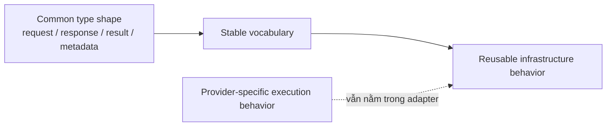

Type shape không phải behavior, nhưng nó là điều kiện để behavior bên ngoài
generic contracts không phải viết lại cho từng provider/model family.

### Bảng phân trách nhiệm

| Tầng | Thứ được tái sử dụng | Ví dụ |
|---|---|---|
| Generic Model API | Type shape và vocabulary | `ModelRequest`, `ModelResponse`, `ModelResult` |
| Specialized API | Domain-specific defaults/conveniences | `ChatModel.call(String)` |
| Infrastructure | Cross-cutting behavior dựa trên common shape | Metrics, observation, logging |
| Provider adapter | Native execution behavior | Request mapping, SDK call, response mapping |

### Kết luận

Không nên trả lời đơn giản:

```text
“Chỉ tái sử dụng type, không tái sử dụng behavior.”
```

Câu trả lời chính xác hơn là:

> Generic Model API trực tiếp tái sử dụng structural type shape; specialized/default utilities tái sử dụng một phần behavior; và common shape đó gián tiếp mở khóa reusable infrastructure behavior, trong khi core provider execution vẫn thuộc từng adapter.

</details>
