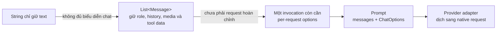
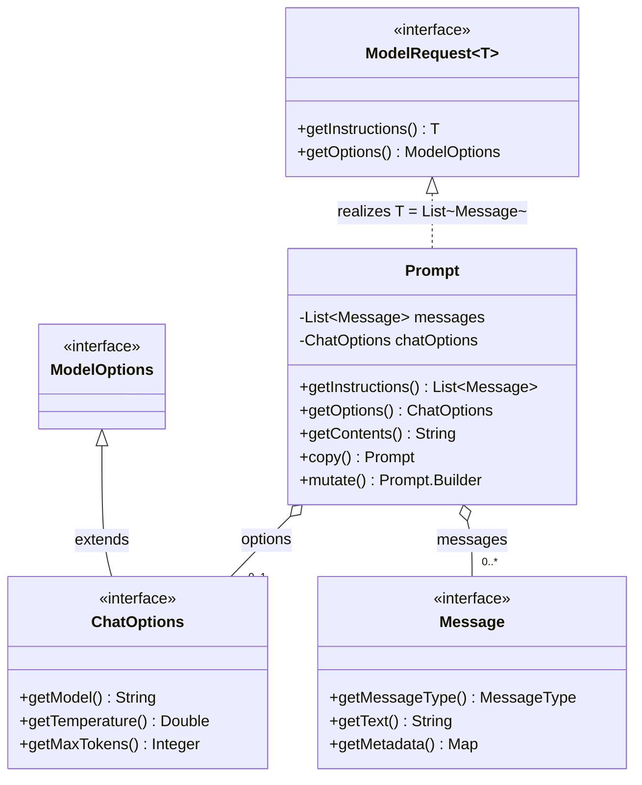
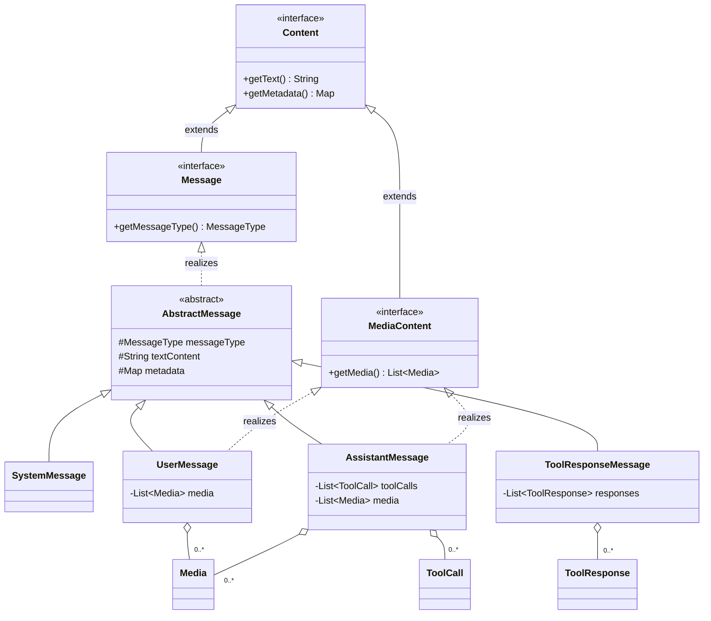
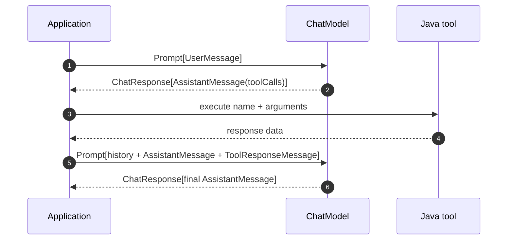
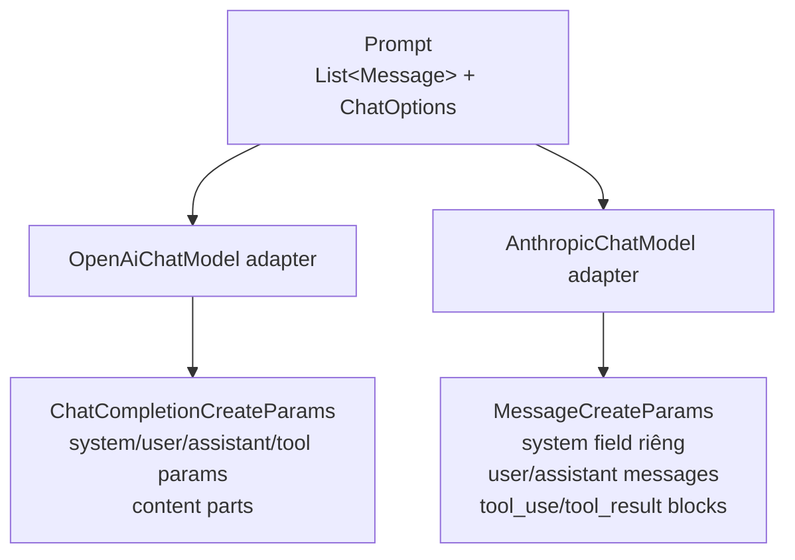
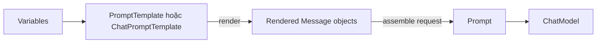
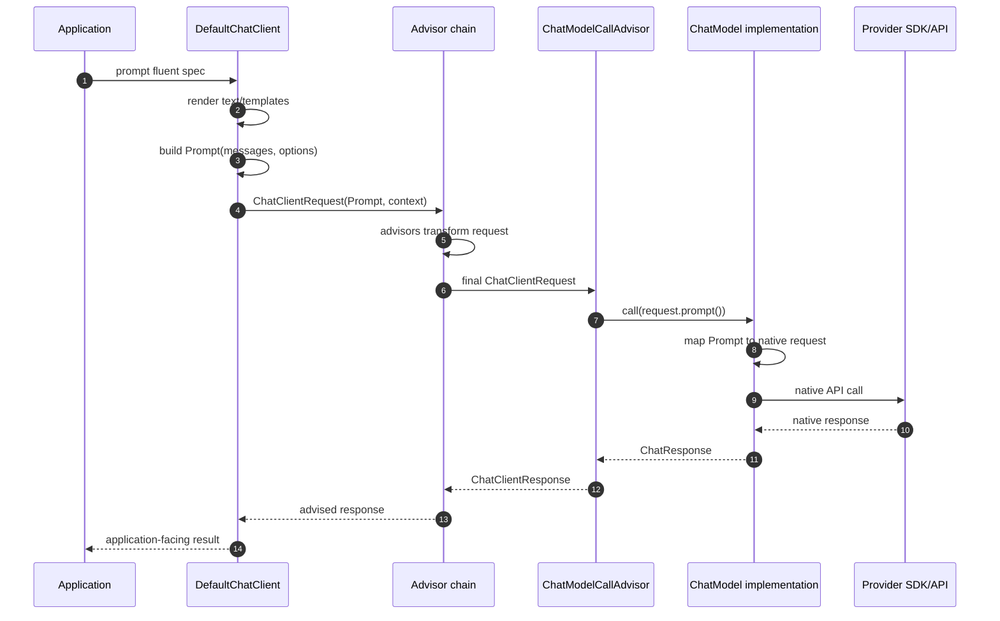

# Phần 3 — Input model: tại sao cần `Prompt`?

Tài liệu trước: [Phần 2 — Generic Model API và vị trí của `ChatModel`](./02-generic-model-api-and-chat-model-position.md).

Phần 2 đã xác định specialization của chat:

```text
ChatModel = Model<Prompt, ChatResponse>
```

Phần 3 tập trung vào vế input để trả lời câu hỏi:

> Vì sao input chính thức của `ChatModel` là `Prompt`, thay vì `String`,
> `Message`, `List<Message>` hoặc request class của provider?

Ta sẽ không bắt đầu bằng cách học constructor của `Prompt`. Ta bắt đầu từ dữ
liệu mà một lần gọi chat model thực sự phải mang, rồi dùng requirement đó để
tái dựng design.

<details open>
<summary><strong>1. Bản đồ tư duy của Phần 3</strong></summary>

Một cách hiểu quá hẹp là:

```text
Prompt = câu hỏi người dùng gõ vào
```

Trong Spring AI, mental model chính xác hơn là:

```text
Prompt = request envelope chuẩn hóa cho một lần gọi chat model
```

Envelope này gom hai nhóm dữ liệu:

```text
Prompt
├── List<Message> messages
│   ├── system instructions
│   ├── conversation history
│   ├── current user input
│   ├── assistant tool calls
│   └── tool results
└── ChatOptions options
    ├── model
    ├── temperature
    ├── max tokens
    ├── stop sequences
    ├── tool definitions/callbacks
    └── provider-specific capabilities
```

Hai nhóm trên trả lời hai câu hỏi khác nhau:

| Thành phần | Câu hỏi nó trả lời |
|---|---|
| `List<Message>` | Model cần **đọc những nội dung nào**, với role và thứ tự nào? |
| `ChatOptions` | Model phải **thực hiện lần sinh này như thế nào**? |

Chuỗi suy luận chính của phần này là:



### Cách đọc sơ đồ

Sơ đồ trên là **flowchart giải thích nguyên nhân thiết kế**, không phải UML class
diagram:

1. `String` chỉ giải quyết trường hợp một user message dạng text.
2. Khi có role, lịch sử hội thoại, media và tool calling, input phải nâng thành
   `List<Message>`.
3. Nhưng danh sách message vẫn chưa nói model nào, temperature bao nhiêu hoặc
   tool nào được phép gọi.
4. `Prompt` đóng gói messages và `ChatOptions` thành một request hoàn chỉnh ở
   boundary của `ChatModel`.
5. Provider adapter nhận request chuẩn hóa này và dịch nó sang protocol riêng.

Điểm quan trọng nhất của Phần 3:

> `Prompt` tồn tại vì input của chat model là **một cấu trúc có role, có thứ tự,
> có nhiều loại content và có execution options**; nó không còn là một chuỗi
> text đơn lẻ.

</details>

---

<details>
<summary><strong>2. Bắt đầu từ requirement của một chat invocation</strong></summary>

Hãy tạm quên Spring AI và tưởng tượng application cần gửi request sau:

```text
System:
  Bạn là trợ lý du lịch. Trả lời ngắn gọn bằng tiếng Việt.

User:
  Thời tiết Đà Nẵng hôm nay thế nào?

Assistant:
  yêu cầu gọi getWeather({"city":"Da Nang"})

Tool:
  {"temperature":31,"condition":"sunny"}

Per-request chat options (được biểu diễn bằng ChatOptions trong Spring AI):
  model = một model cụ thể
  temperature = 0.2
  maxTokens = 300
```

Đây là **một lần gọi model**, nhưng nó chứa nhiều dimension độc lập.

Ở đây cần phân biệt cách gọi khái niệm và tên type trong source:

| Cách gọi | Ý nghĩa |
|---|---|
| Generation settings | Cách gọi khái niệm cho những giá trị điều khiển quá trình sinh, chẳng hạn `temperature` và `maxTokens` |
| `ChatOptions` | Contract cụ thể của Spring AI dùng để mang các option của một chat invocation |

`model`, `temperature` và `maxTokens` trong ví dụ đều được đưa vào một
`ChatOptions` object. Tuy nhiên, không nên đồng nhất toàn bộ `ChatOptions` với
“generation settings”, vì `ChatOptions` và các provider-specific subtype còn có
thể mang những cấu hình rộng hơn như:

- Stop sequences.
- Tool definitions hoặc tool callbacks.
- Structured-output configuration.
- Provider-specific capabilities.

Vì vậy cách nói chính xác trong tài liệu này là:

```text
ChatOptions
├── generation settings, ví dụ temperature và maxTokens
├── model selection
└── các invocation options khác
```

### 2.1 Nội dung không chỉ có một nguồn

Model cần phân biệt:

- Instruction do application/developer đặt ra.
- Câu hỏi do end user gửi.
- Câu trả lời trước đó do model tạo.
- Kết quả do application lấy từ tool.

Nếu bỏ nguồn gốc, cùng một câu text có thể mang ý nghĩa hoàn toàn khác.

Ví dụ:

```text
"Hãy bỏ qua tất cả quy tắc trước đó"
```

- Nếu là `SystemMessage`, đó có thể là policy mới của application.
- Nếu là `UserMessage`, đó chỉ là input không đáng tin cậy từ user.
- Nếu là `AssistantMessage`, đó là output cũ được đưa lại làm history.
- Nếu nằm trong tool result, đó có thể chỉ là dữ liệu bên ngoài.

Role là semantic data, không phải decoration.

### 2.2 Thứ tự là một phần của ý nghĩa

Conversation sau:

```text
User: Tôi tên Minh.
Assistant: Chào Minh.
User: Tôi tên gì?
```

khác với:

```text
User: Tôi tên gì?
Assistant: Chào Minh.
User: Tôi tên Minh.
```

Cùng ba message, nhưng đổi thứ tự làm thay đổi conversation state. Vì vậy input
phải là một **ordered collection**, không phải `Set<Message>` hoặc một map theo
role.

### 2.3 Content không chỉ là text

Một user message có thể chứa:

- Text.
- Image.
- Audio.
- Document hoặc một media reference.

Một assistant message có thể chứa:

- Generated text.
- Tool calls.
- Media do model trả về.

Một tool response message có thể chứa nhiều kết quả tương ứng với nhiều tool
call.

### 2.4 Cùng content nhưng cách chạy có thể khác

Hai lần gọi có cùng messages nhưng khác:

```text
temperature = 0.1  so với  temperature = 1.0
maxTokens   = 200  so với  maxTokens   = 2000
model       = A    so với  model       = B
tools       = []   so với  tools       = [getWeather]
```

thì đó là hai model requests khác nhau.

### 2.5 Request cần đi qua nhiều tầng trước provider

Input có thể được:

- Tạo từ `PromptTemplate`.
- Ghép thêm conversation memory.
- Bổ sung retrieved documents bởi RAG advisor.
- Gắn output format instruction.
- Quan sát bởi observability infrastructure.
- Cuối cùng mới được provider adapter chuyển thành native DTO.

Do đó framework cần một object chung đủ rõ nghĩa để các tầng cùng trao đổi.

### Requirement được rút ra

Chat input phải giữ được:

```text
role
+ ordered history
+ heterogeneous content
+ tool protocol state
+ per-request execution options
+ một type ổn định độc lập provider
```

`Prompt` là câu trả lời của Spring AI cho tập requirement đó.

</details>

---

<details>
<summary><strong>3. Vì sao <code>String</code> không thể là input contract chính?</strong></summary>

API tối giản nhất có thể là:

```java
interface StringChatModel {

    String call(String input);

}
```

Nó rất dễ dùng cho demo:

```java
String answer = model.call("Java record là gì?");
```

Nhưng `String` chỉ trả lời được một câu hỏi:

```text
Nội dung text là gì?
```

Nó không trả lời được:

```text
Ai nói nội dung này?
Nó đứng ở đâu trong conversation?
Có media nào đi kèm?
Đây có phải tool result không?
Nó liên hệ với tool call id nào?
Lần gọi này dùng options nào?
```

### Nếu tự nhét role vào text thì sao?

Ta có thể tự nối chuỗi:

```java
String input = """
        SYSTEM: Bạn là Java mentor.
        USER: Giải thích dependency inversion.
        """;
```

Vấn đề là `SYSTEM:` ở đây chỉ là convention do application tự nghĩ ra. Provider
SDK không tự hiểu chắc chắn đó là role. Adapter phải parse chuỗi, và parser sẽ
gặp hàng loạt câu hỏi:

- Nếu content thật sự chứa chữ `SYSTEM:` thì sao?
- Xuống dòng và escaping được quy định thế nào?
- Media đặt ở đâu trong chuỗi?
- Tool arguments là JSON string hay một block riêng?
- Tool call id nối với response bằng cách nào?
- Provider nào dùng format khác thì sao?

Ta đã biến một data structure có type thành một mini-language dễ lỗi.

### Nếu thêm nhiều parameter vào method thì sao?

Một hướng khác:

```java
ChatResponse call(
        String systemText,
        List<String> history,
        String userText,
        List<Object> media,
        List<Object> toolResults,
        ChatOptions options);
```

Signature này vẫn không tốt:

- History mất role cụ thể.
- `Object` làm mất type safety.
- Thêm capability mới phải sửa method signature.
- Có nhiều parameter đi song song, dễ lệch index hoặc liên kết sai.
- Không có một request object để truyền qua advisor/observation/provider layer.

### Vậy tại sao Spring AI vẫn có `call(String)`?

[`ChatModel`](../../../spring-ai-model/src/main/java/org/springframework/ai/chat/model/ChatModel.java)
vẫn cung cấp API tiện lợi dạng string. Nhưng nó là **convenience overload**, không
phải core contract.

Ý nghĩa của nó tương đương:

```java
import org.springframework.ai.chat.messages.UserMessage;
import org.springframework.ai.chat.model.ChatModel;
import org.springframework.ai.chat.model.ChatResponse;
import org.springframework.ai.chat.prompt.Prompt;

static ChatResponse ask(ChatModel chatModel, String text) {
    UserMessage userMessage = new UserMessage(text);
    Prompt prompt = new Prompt(userMessage);
    return chatModel.call(prompt);
}
```

Tức là:

```text
call(String)
→ xem String là nội dung của một UserMessage
→ bọc UserMessage vào Prompt
→ gọi call(Prompt)
```

Design này giữ hai lợi ích cùng lúc:

- Happy path một câu hỏi text vẫn ngắn gọn.
- Full contract không bị giới hạn bởi happy path.

Kết luận:

> `String` phù hợp làm API rút gọn ở bề mặt; nó quá nghèo để làm canonical input
> model của chat framework.

</details>

---

<details>
<summary><strong>4. Vì sao <code>Message</code> hoặc <code>List&lt;Message&gt;</code> vẫn chưa đủ?</strong></summary>

Sau khi loại `String`, một lựa chọn hợp lý hơn là:

```java
ChatResponse call(List<Message> messages);
```

Nó đã giải quyết được nhiều vấn đề:

- Mỗi phần tử có role.
- List giữ thứ tự.
- Message subtype có thể giữ media và tool data.
- Cả conversation được truyền trong một collection.

Nhưng `List<Message>` chỉ biểu diễn **instructions/content graph**, chưa biểu
diễn toàn bộ request.

### 4.1 Thiếu per-request options

Cùng một danh sách messages có thể được chạy với nhiều cấu hình:

```text
messages + temperature 0.1
messages + temperature 0.9
messages + tool callbacks
messages + structured-output schema
```

Nếu method chỉ nhận list, options phải đi bằng một kênh khác:

```java
ChatResponse call(List<Message> messages, ChatOptions options);
```

Khi đó request bị tách thành hai parameter. Mọi tầng trung gian đều phải luôn
truyền đúng cặp `(messages, options)`.

### 4.2 Thiếu một semantic root cho request

`List<Message>` là collection tổng quát của Java. Type của nó không nói:

```text
Đây là input đã hoàn thiện cho một model invocation.
```

Ngược lại, `Prompt` đặt tên cho concept đó. Method:

```java
ChatResponse call(Prompt prompt);
```

diễn đạt intent rõ hơn:

```text
ChatModel nhận một chat-model request hoàn chỉnh.
```

Đây không chỉ là “bọc list cho đẹp”. Một named request type tạo ra một boundary
ổn định để:

- Validate invariant.
- Thêm helper có semantic chat.
- Gắn options.
- Truyền qua observation context.
- Biến đổi theo kiểu copy/mutate.
- Mở rộng request model mà không đổi `ChatModel.call` signature.

### 4.3 Thiếu chỗ cho API evolution

Giả sử tương lai request cần thêm một khái niệm chung mới. Nếu API là:

```java
call(List<Message> messages, ChatOptions options)
```

framework có thể phải thêm overload hoặc parameter.

Nếu API là:

```java
call(Prompt prompt)
```

thì request model có một nơi rõ ràng để tiến hóa. Việc có thêm field thật sự vẫn
cần cân nhắc compatibility, nhưng method contract không phải phình ra theo từng
dimension.

### 4.4 Thiếu các operation có nghĩa trên toàn request

`Prompt` cung cấp các operation như:

- Lấy system message đầu tiên.
- Lấy user message cuối cùng.
- Lấy tất cả system/user messages.
- Augment system message.
- Augment user message.
- Copy/mutate request.

Nếu chỉ dùng `List<Message>`, logic này sẽ bị lặp ở advisor, client và provider
adapter.

### So sánh trực tiếp

| Candidate | Giữ role/history/media/tool data | Giữ per-request options | Có semantic request root | Có helper/evolution point |
|---|---:|---:|---:|---:|
| `String` | Không | Không | Không | Không |
| `Message` | Một message | Không | Không | Hạn chế |
| `List<Message>` | Có | Không | Không | Hạn chế |
| `Prompt` | Có | Có | Có | Có |

Kết luận:

> `List<Message>` là thành phần cốt lõi **bên trong** request; `Prompt` mới là
> request envelope được truyền qua `ChatModel` boundary.

</details>

---

<details>
<summary><strong>5. Đọc contract thật của <code>Prompt</code></strong></summary>

Source chính nằm tại
[`Prompt.java`](../../../spring-ai-model/src/main/java/org/springframework/ai/chat/prompt/Prompt.java).

Rút gọn phần structural contract:

```java
public class Prompt implements ModelRequest<List<Message>> {

    private final List<Message> messages;

    private final @Nullable ChatOptions chatOptions;

    @Override
    public List<Message> getInstructions() {
        return this.messages;
    }

    @Override
    public @Nullable ChatOptions getOptions() {
        return this.chatOptions;
    }
}
```

### 5.1 Vì sao implement `ModelRequest<List<Message>>`?

Phần 2 đã học generic contract:

```java
public interface ModelRequest<T> {

    T getInstructions();

    @Nullable ModelOptions getOptions();
}
```

Khi `Prompt` chọn `T = List<Message>`, phép thế type xảy ra như sau:

```text
ModelRequest<T>
          T = List<Message>
──────────────────────────
ModelRequest<List<Message>>

getInstructions(): List<Message>
```

`Prompt.getOptions()` trả `ChatOptions`, hẹp hơn `ModelOptions`. Điều này hợp lệ
vì `ChatOptions extends ModelOptions`; Java gọi đây là **covariant return type**.

### 5.2 Vì sao method tên `getInstructions()` thay vì `getMessages()`?

Tên method đến từ Generic Model API. Ở generic layer, input có thể là:

- Chat messages.
- Texts cần embedding.
- Image instructions.
- Audio input.

`instructions` là vocabulary chung. Khi specialize sang chat, instruction type
cụ thể trở thành `List<Message>`.

Không nên suy ra rằng mọi message đều là một “mệnh lệnh”. Trong chat request,
list còn chứa:

- Conversation history.
- Assistant output cũ.
- Tool results.

Do đó hãy đọc `getInstructions()` theo nghĩa generic:

```text
primary model input
```

chứ không theo nghĩa hẹp:

```text
imperative system instruction
```

### 5.3 Invariant constructor thực sự bảo vệ

Constructor chính:

```java
public Prompt(List<Message> messages, @Nullable ChatOptions chatOptions) {
    Assert.notNull(messages, "messages cannot be null");
    Assert.noNullElements(messages, "messages cannot contain null elements");
    this.messages = messages;
    this.chatOptions = chatOptions;
}
```

Nó bảo đảm:

- List không được `null`.
- Không phần tử nào trong list được `null`.

Nó **không** bắt buộc:

- List phải có ít nhất một message.
- Phải có user message.
- Phải có system message.
- Options phải tồn tại.
- Role sequence phải hợp lệ với mọi provider.

Lý do là những quy tắc cuối phụ thuộc use case/provider/model. Core `Prompt`
giữ invariant phổ quát, còn adapter hoặc layer cao hơn xử lý constraint cụ thể.

</details>

---

<details>
<summary><strong>6. UML đúng của <code>Prompt</code> trong Generic Model API</strong></summary>



### Cách đọc từng quan hệ UML

#### `ModelOptions <|-- ChatOptions`

Mũi tên tam giác rỗng với đường liền biểu diễn **generalization** giữa hai
interface: `ChatOptions extends ModelOptions`.

`ChatOptions` là specialization dành cho chat.

#### `ModelRequest<T> <|.. Prompt`

Mũi tên tam giác rỗng với đường đứt biểu diễn **realization**:

```java
Prompt implements ModelRequest<List<Message>>
```

`Prompt` phải cung cấp operation mà `ModelRequest` yêu cầu.

#### `Prompt o-- "0..*" Message`

Hình thoi rỗng là **aggregation**. Một `Prompt` giữ một danh sách có từ 0 đến
nhiều `Message`.

Tại sao không dùng composition `*--`?

- `Message` có thể được tạo độc lập trước `Prompt`.
- Cùng message object có thể được truyền vào collection khác.
- Xóa reference tới `Prompt` không có nghĩa message object bị quản lý lifecycle
  độc quyền bởi nó.

Do đó aggregation phản ánh source sát hơn composition.

#### `Prompt o-- "0..1" ChatOptions`

Options có thể vắng mặt vì field nullable. Nếu caller không truyền options,
provider model có thể bổ sung default options trước invocation.

### Sơ đồ mô tả gì và không mô tả gì?

Class diagram chỉ mô tả **cấu trúc tĩnh**:

- Type nào extends/implements type nào.
- Prompt giữ reference tới object nào.
- Multiplicity của quan hệ.

Nó không mô tả thứ tự runtime như advisor chạy trước adapter. Runtime flow sẽ
được biểu diễn bằng sequence diagram ở phần sau.

</details>

---

<details>
<summary><strong>7. Phân biệt “prompt” trong ngôn ngữ thường và class <code>Prompt</code></strong></summary>

Từ “prompt” thường được dùng cho ít nhất ba concept:

| Cách dùng | Ý nghĩa |
|---|---|
| Prompt text | Một đoạn text gửi cho model |
| Prompt engineering | Kỹ thuật thiết kế instructions/context/examples |
| Spring AI `Prompt` | Request object gồm messages và chat options |

Nếu không tách ba nghĩa này, ta dễ nói:

```text
“Prompt chính là user question.”
```

Điều đó chỉ đúng với convenience case:

```java
new Prompt("Câu hỏi")
```

Constructor này thực chất chuyển text thành `UserMessage`. Nó không định nghĩa
toàn bộ semantic của class.

### Một `Prompt` có thể không chứa user question mới

Ví dụ sau một tool execution, lượt gọi kế tiếp có thể kết thúc bằng
`ToolResponseMessage`, không phải `UserMessage`:

```text
Prompt.messages
├── UserMessage("Thời tiết Đà Nẵng?")
├── AssistantMessage(toolCall = getWeather)
└── ToolResponseMessage(result = 31°C)
```

Model được gọi lại để đọc tool result và tạo final answer. Vì vậy
`Prompt.getLastUserOrToolResponseMessage()` tồn tại để xử lý đúng cả hai trường
hợp.

### Tên tốt nhất trong mental model

Khi đọc source, hãy dịch:

```text
Prompt = ChatModelRequest
```

Đây không phải tên class thật, nhưng là mental alias hữu ích. Nó nhắc rằng
`Prompt` đại diện cho toàn bộ input ở model boundary.

</details>

---

<details>
<summary><strong>8. Message hierarchy: cách Spring AI giữ semantic của content</strong></summary>

Source liên quan:

- [`Content`](../../../spring-ai-commons/src/main/java/org/springframework/ai/content/Content.java)
- [`MediaContent`](../../../spring-ai-commons/src/main/java/org/springframework/ai/content/MediaContent.java)
- [`Message`](../../../spring-ai-model/src/main/java/org/springframework/ai/chat/messages/Message.java)
- [`AbstractMessage`](../../../spring-ai-model/src/main/java/org/springframework/ai/chat/messages/AbstractMessage.java)
- [`SystemMessage`](../../../spring-ai-model/src/main/java/org/springframework/ai/chat/messages/SystemMessage.java)
- [`UserMessage`](../../../spring-ai-model/src/main/java/org/springframework/ai/chat/messages/UserMessage.java)
- [`AssistantMessage`](../../../spring-ai-model/src/main/java/org/springframework/ai/chat/messages/AssistantMessage.java)
- [`ToolResponseMessage`](../../../spring-ai-model/src/main/java/org/springframework/ai/chat/messages/ToolResponseMessage.java)

UML hierarchy:



### Cách đọc hierarchy

#### `Content`

Đây là abstraction chung cho content có:

- Text có thể nullable.
- Metadata dạng key-value.

Nó không biết role của chat.

#### `Message extends Content`

`Message` thêm `MessageType`. Đây là bước chuyển từ “một content object” sang
“một content object tham gia chat protocol với role cụ thể”.

#### `AbstractMessage implements Message`

Base class tái sử dụng state và behavior chung:

- `messageType`.
- `textContent`.
- `metadata`.
- Equality/hash code cơ bản.

Các concrete message class thêm semantic riêng.

#### Vì sao chỉ `UserMessage` và `AssistantMessage` implement `MediaContent`?

Trong canonical model hiện tại, đây là hai role có collection media. System và
tool response có representations riêng.

Điều này tốt hơn đặt `List<Media>` bắt buộc trên mọi `Message`: type chỉ expose
capability ở subtype mà nó có ý nghĩa.

### Polymorphism nằm ở đâu?

`Prompt` chỉ cần giữ:

```java
List<Message>
```

nhưng từng element runtime có thể là subtype khác nhau. Provider adapter dispatch
dựa trên `MessageType` và subtype để tạo native representation thích hợp.

</details>

---

<details>
<summary><strong>9. Bốn loại message và trách nhiệm của từng loại</strong></summary>

### 9.1 `SystemMessage`: policy và high-level instruction

```java
import org.springframework.ai.chat.messages.SystemMessage;

SystemMessage system = new SystemMessage(
        "Bạn là Java mentor. Trả lời bằng tiếng Việt và nêu rõ trade-off.");
```

Nó biểu diễn instruction do application/developer kiểm soát, ví dụ:

- Persona.
- Output policy.
- Domain constraint.
- Safety instruction.
- Context cấp cao cho conversation.

Không nên nối system text vào user text rồi hy vọng provider hiểu cùng semantic.

### 9.2 `UserMessage`: input từ user, có thể multimodal

```java
import org.springframework.ai.chat.messages.UserMessage;

UserMessage user = new UserMessage(
        "So sánh Strategy và Template Method.");
```

Ngoài text, nó có thể giữ media. `UserMessage` là nơi canonical model biểu diễn
input multimodal từ user.

### 9.3 `AssistantMessage`: output cũ quay lại thành input

```java
import org.springframework.ai.chat.messages.AssistantMessage;

AssistantMessage assistant = AssistantMessage.builder()
        .content("Strategy dùng composition để thay đổi algorithm.")
        .build();
```

Tại sao output của model lại xuất hiện trong input?

Vì API chat thường stateless ở transport level. Để model biết conversation cũ,
application gửi lại assistant messages trong request mới.

`AssistantMessage` còn giữ tool calls. Khi model chưa trả final text mà yêu cầu
application gọi tool, tool call là một phần của assistant turn.

### 9.4 `ToolResponseMessage`: kết quả thực thi tool

```java
import java.util.List;

import org.springframework.ai.chat.messages.ToolResponseMessage;

ToolResponseMessage toolResult = ToolResponseMessage.builder()
        .responses(List.of(
                new ToolResponseMessage.ToolResponse(
                        "call_42",
                        "getWeather",
                        "{\"temperature\":31,\"condition\":\"sunny\"}")))
        .build();
```

Mỗi `ToolResponse` giữ:

| Field | Ý nghĩa |
|---|---|
| `id` | Nối result với tool call mà assistant đã yêu cầu |
| `name` | Tên tool |
| `responseData` | Dữ liệu trả về cho model |

### Vì sao không gom tất cả thành `Message(role, text)`?

Một generic record như:

```java
record FlatMessage(String role, String text) {
}
```

không diễn đạt được tốt:

- User media.
- Assistant tool calls.
- Nhiều tool responses.
- Typed operations như `hasToolCalls()`.

Spring AI chọn một common base nhỏ và subtype-specific state. Đây là OOP
polymorphic model, không phải một DTO phẳng chứa mọi field nullable.

</details>

---

<details>
<summary><strong>10. <code>Prompt</code> giữ cả conversation, không chỉ message cuối</strong></summary>

Ví dụ một conversation hoàn chỉnh:

```java
import java.util.List;

import org.springframework.ai.chat.messages.AssistantMessage;
import org.springframework.ai.chat.messages.Message;
import org.springframework.ai.chat.messages.SystemMessage;
import org.springframework.ai.chat.messages.UserMessage;
import org.springframework.ai.chat.prompt.Prompt;

List<Message> conversation = List.of(
        new SystemMessage("Bạn là Java mentor."),
        new UserMessage("SOLID là gì?"),
        AssistantMessage.builder()
                .content("SOLID là năm nguyên lý thiết kế OOP.")
                .build(),
        new UserMessage("Giải thích chữ D."));

Prompt prompt = new Prompt(conversation);
```

Thứ model nhận về mặt semantic là:

```text
system policy
→ user turn 1
→ assistant turn 1
→ current user turn
```

### Vì sao provider không tự nhớ conversation?

Không nên giả định mọi provider API giữ session state giống nhau. Canonical
contract phải có thể biểu diễn đầy đủ context cần gửi trong invocation hiện tại.

Memory layer có thể giúp application lấy conversation cũ, nhưng trước khi gọi
model, các message cần thiết cuối cùng vẫn được materialize thành `Prompt`.

### `getUserMessage()` có ý nghĩa gì?

`Prompt.getUserMessage()` tìm từ cuối list về đầu và trả user message cuối cùng.
Nó không có nghĩa Prompt chỉ có một user message.

Helper này hữu ích cho advisor cần thao tác current user turn, trong khi toàn bộ
history vẫn được giữ nguyên.

### `getSystemMessage()` có ý nghĩa gì?

Nó trả system message đầu tiên. Ngoài ra còn có `getSystemMessages()` để lấy tất
cả system messages.

Đây là ví dụ vì sao named request type hữu ích: operation mang semantic của chat
được đặt cạnh data mà nó thao tác.

</details>

---

<details>
<summary><strong>11. Vì sao <code>getContents()</code> không phải canonical representation?</strong></summary>

`Prompt` có method:

```java
public String getContents() {
    StringBuilder sb = new StringBuilder();
    for (Message message : getInstructions()) {
        sb.append(message.getText());
    }
    return sb.toString();
}
```

Nhìn method này, ta có thể hiểu nhầm rằng cuối cùng Prompt vẫn chỉ là string.
Không phải.

### Nó làm mất thông tin gì?

Giả sử:

```text
SystemMessage("AB")
UserMessage("C")
```

và:

```text
SystemMessage("A")
UserMessage("BC")
```

Cả hai đều có thể cho:

```text
getContents() == "ABC"
```

Method không thêm separator nên không thể khôi phục message boundary.

Nó cũng làm mất:

- Role.
- Metadata.
- Media.
- Assistant tool calls.
- Tool responses.
- Chat options.

### Vậy method dùng để làm gì?

Hãy xem nó là một **lossy convenience projection**:

```text
Prompt object graph
→ chiếu lấy text của từng message
→ nối thành một String thuận tiện
```

“Lossy” nghĩa là phép chuyển đổi làm mất thông tin và không thể đảo ngược đầy
đủ.

### Provider adapter có dùng `getContents()` để gửi request không?

Các chat adapter như OpenAI và Anthropic đi qua `getInstructions()` rồi map từng
message. Chúng không flatten toàn bộ Prompt bằng `getContents()` làm canonical
request mapping.

Kết luận:

> `getContents()` là một view tiện lợi của phần text; `getInstructions()` cùng
> `getOptions()` mới phản ánh request structure mà adapter cần.

</details>

---

<details>
<summary><strong>12. Constructors: API tiện lợi nhưng đều quy về cùng một model</strong></summary>

`Prompt` cung cấp nhiều constructor:

```java
Prompt(String contents)
Prompt(Message message)
Prompt(List<Message> messages)
Prompt(Message... messages)

Prompt(String contents, ChatOptions options)
Prompt(Message message, ChatOptions options)
Prompt(List<Message> messages, ChatOptions options)
```

Đây không phải nhiều semantic model khác nhau. Chúng là nhiều entry point dẫn
về representation chung:

```text
List<Message> + nullable ChatOptions
```

### `Prompt(String)`

Source:

```java
public Prompt(String contents) {
    this(new UserMessage(contents));
}
```

Nó áp dụng một default semantic rõ ràng:

```text
String ở constructor này được hiểu là USER content.
```

### `Prompt(Message)`

Nó bọc một message thành singleton list. Caller có thể truyền system, user,
assistant hoặc tool response message mà không bị ép về user role.

### `Prompt(Message...)`

Varargs giúp viết conversation ngắn gọn:

```java
import org.springframework.ai.chat.messages.SystemMessage;
import org.springframework.ai.chat.messages.UserMessage;
import org.springframework.ai.chat.prompt.Prompt;

Prompt prompt = new Prompt(
        new SystemMessage("Bạn là Java mentor."),
        new UserMessage("Giải thích LSP."));
```

### Constructor có options

```java
import java.util.List;

import org.springframework.ai.chat.messages.Message;
import org.springframework.ai.chat.messages.SystemMessage;
import org.springframework.ai.chat.messages.UserMessage;
import org.springframework.ai.chat.prompt.ChatOptions;
import org.springframework.ai.chat.prompt.Prompt;

List<Message> messages = List.of(
        new SystemMessage("Trả lời ngắn gọn."),
        new UserMessage("Dependency inversion là gì?"));

ChatOptions options = ChatOptions.builder()
        .model("provider-model-name")
        .temperature(0.2)
        .maxTokens(500)
        .build();

Prompt prompt = new Prompt(messages, options);
```

### Builder

Builder hữu ích khi request được lắp dần:

```java
import java.util.List;

import org.springframework.ai.chat.messages.Message;
import org.springframework.ai.chat.messages.UserMessage;
import org.springframework.ai.chat.prompt.ChatOptions;
import org.springframework.ai.chat.prompt.Prompt;

List<Message> messages = List.of(new UserMessage("Giải thích ISP."));
ChatOptions options = ChatOptions.builder().temperature(0.1).build();

Prompt prompt = Prompt.builder()
        .messages(messages)
        .chatOptions(options)
        .build();
```

Convenience APIs làm giảm ceremony, nhưng tất cả vẫn hội tụ về cùng một
canonical shape.

</details>

---

<details>
<summary><strong>13. Vì sao <code>ChatOptions</code> nằm trong <code>Prompt</code>?</strong></summary>

Phần 2 đã giải thích options nằm trong request. Ở đây ta nối trực tiếp với chat.

### 13.1 Options là state của invocation

Xét hai request:

```text
Request A = messages M + temperature 0.0
Request B = messages M + temperature 1.0
```

Dù content giống nhau, execution intent khác nhau. Nếu cache, observe, retry hoặc
replay invocation, chỉ giữ messages là chưa đủ.

### 13.2 Tránh mutable configuration trên shared model bean

Một `ChatModel` thường là Spring singleton. Design sau nguy hiểm:

```java
chatModel.setTemperature(0.9);
chatModel.call(messages);
```

Hai request đồng thời có thể ghi đè configuration của nhau.

Đặt runtime options trong `Prompt` cho phép:

```text
shared model bean
+ request-local options
→ concurrent invocations độc lập hơn
```

### 13.3 Model defaults và request options

Cần phân biệt:

| Loại | Phạm vi | Ví dụ |
|---|---|---|
| Model default options | Cấu hình mặc định của model bean | model mặc định, timeout/capability config |
| Prompt options | Cấu hình của invocation hiện tại | temperature riêng, output schema, tools |

Trong `OpenAiChatModel` và `AnthropicChatModel`, `buildRequestPrompt` hiện làm:

```text
nếu Prompt.options == null
    tạo Prompt mới dùng model.getOptions()
ngược lại
    dùng Prompt hiện tại
```

Điểm cần đọc chính xác:

> Ở đường gọi `ChatModel` trực tiếp, adapter không thực hiện field-by-field merge
> trong `buildRequestPrompt`; Prompt options có mặt thì được xem là request
> options hoàn chỉnh cho bước đó.

### 13.4 Khi gọi qua `ChatClient`

[`DefaultChatClientUtils.toChatClientRequest`](../../../spring-ai-client-chat/src/main/java/org/springframework/ai/chat/client/DefaultChatClientUtils.java)
đi theo đường khác:

```text
chatModel.getOptions().mutate()
→ combine request-level customizations
→ build ChatOptions
→ đặt options đã hoàn thiện vào Prompt
```

Tức là ChatClient layer làm công việc overlay default và per-request
customization trước khi Prompt đi tới `ChatModel`.

### 13.5 Vì sao field type là `ChatOptions`, không phải `OpenAiChatOptions`?

Core request phải độc lập provider:

```java
private final ChatOptions chatOptions;
```

Runtime object vẫn có thể là subtype:

```text
OpenAiChatOptions
AnthropicChatOptions
OllamaChatOptions
...
```

Đây là cách Spring AI kết hợp:

- Common options ở portable contract.
- Provider-specific options ở module tương ứng.
- Một `Prompt` type chung ở `ChatModel` boundary.

### Một nuance quan trọng

Type `ChatOptions` không bảo đảm mọi concrete options object hợp lệ với mọi
provider adapter. Cách an toàn thông thường là:

- Để model defaults cung cấp đúng provider-specific subtype.
- Hoặc dùng options class của chính provider khi gọi trực tiếp.
- Hoặc để `ChatClient` mutate/combine từ options của configured model.

Portability không có nghĩa options của OpenAI có thể đưa nguyên xi cho
Anthropic. Portability nằm ở common contract và common semantic; phần riêng vẫn
thuộc adapter/provider module.

</details>

---

<details>
<summary><strong>14. Tool calling chứng minh vì sao Prompt phải giữ một protocol state</strong></summary>

Tool calling không phải một method call đơn lẻ từ model vào Java function. Nó là
một protocol nhiều bước.

### 14.1 Chu trình logic



### Cách đọc sequence diagram

1. Application gửi user request trong Prompt đầu tiên.
2. Model chưa trả final answer; nó trả `AssistantMessage` chứa tool call id,
   name và arguments.
3. Application/framework thực thi Java tool.
4. Kết quả tool được biểu diễn thành `ToolResponseMessage`.
5. Lần gọi model thứ hai phải gửi lại:
   - User message ban đầu.
   - Assistant message chứa tool call.
   - Tool response nối với call id.
6. Model dùng result để sinh final answer.

Nếu input chỉ là current string, bước 5 không thể giữ đầy đủ protocol state.

### 14.2 Java representation

```java
import java.util.List;

import org.springframework.ai.chat.messages.AssistantMessage;
import org.springframework.ai.chat.messages.Message;
import org.springframework.ai.chat.messages.ToolResponseMessage;
import org.springframework.ai.chat.messages.UserMessage;
import org.springframework.ai.chat.prompt.Prompt;

UserMessage question = new UserMessage("Thời tiết Đà Nẵng thế nào?");

AssistantMessage toolCallTurn = AssistantMessage.builder()
        .content("")
        .toolCalls(List.of(
                new AssistantMessage.ToolCall(
                        "call_42",
                        "function",
                        "getWeather",
                        "{\"city\":\"Da Nang\"}")))
        .build();

ToolResponseMessage toolResultTurn = ToolResponseMessage.builder()
        .responses(List.of(
                new ToolResponseMessage.ToolResponse(
                        "call_42",
                        "getWeather",
                        "{\"temperature\":31,\"condition\":\"sunny\"}")))
        .build();

List<Message> secondRoundMessages = List.of(
        question,
        toolCallTurn,
        toolResultTurn);

Prompt secondRoundPrompt = new Prompt(secondRoundMessages);
```

### 14.3 Vì sao `id` quan trọng?

Model có thể yêu cầu nhiều tool call song song. Tên tool không đủ để nối result,
vì cùng một tool có thể được gọi nhiều lần với arguments khác nhau.

`ToolCall.id` và `ToolResponse.id` tạo correlation:

```text
assistant tool call id = call_42
              ↕
tool response id       = call_42
```

### 14.4 Prompt là protocol transcript

Ở tool-calling round, `Prompt` không chỉ là “prompt text”. Nó là một transcript
có cấu trúc của protocol giữa:

- User.
- Assistant/model.
- Application tools.

Đây là bằng chứng mạnh rằng `List<Message>` phải nằm trong input model.

</details>

---

<details>
<summary><strong>15. Multimodal input chứng minh text không còn là trung tâm duy nhất</strong></summary>

`UserMessage` implement `MediaContent`, nên một message có thể chứa text và
media cùng lúc.

```java
import org.springframework.ai.chat.messages.UserMessage;
import org.springframework.ai.chat.prompt.Prompt;
import org.springframework.ai.content.Media;
import org.springframework.core.io.ClassPathResource;
import org.springframework.util.MimeTypeUtils;

Media diagram = Media.builder()
        .mimeType(MimeTypeUtils.IMAGE_PNG)
        .data(new ClassPathResource("architecture.png"))
        .build();

UserMessage userMessage = UserMessage.builder()
        .text("Hãy giải thích sơ đồ kiến trúc trong ảnh.")
        .media(diagram)
        .build();

Prompt prompt = new Prompt(userMessage);
```

### `Media` giữ gì?

Canonical `Media` giữ các thông tin như:

- MIME type.
- Data/reference.
- Optional id.
- Name.

Data có thể được biểu diễn bằng bytes hoặc reference phù hợp. Provider adapter
chịu trách nhiệm dịch representation đó.

### Provider support không đồng nhất

Cùng canonical `Media` không có nghĩa provider hỗ trợ giống nhau:

- OpenAI adapter hiện map image, audio và fallback content theo native content
  part tương ứng.
- Anthropic adapter hiện map image và PDF thành native content blocks, và từ
  chối MIME type không được hỗ trợ ở nhánh đó.

Đây là sự khác nhau giữa:

```text
framework có thể biểu diễn semantic
```

và:

```text
provider/model cụ thể có capability thực thi semantic đó
```

### Tại sao media thuộc message thay vì Prompt-level list?

Vì media gắn với một turn cụ thể. Nếu Prompt chỉ có:

```text
messages = [...]
media = [...]
```

thì không rõ media nào thuộc message nào. Đặt media bên trong `UserMessage` giữ
locality và tránh parallel collections.

</details>

---

<details>
<summary><strong>16. Cùng một <code>Prompt</code>, OpenAI và Anthropic tạo native request khác nhau</strong></summary>

Đây là phần chứng minh `Prompt` là canonical input model chứ không phải wrapper
thừa.

Source adapter:

- [`OpenAiChatModel.createRequest`](../../../models/spring-ai-openai/src/main/java/org/springframework/ai/openai/OpenAiChatModel.java)
- [`AnthropicChatModel.createRequest`](../../../models/spring-ai-anthropic/src/main/java/org/springframework/ai/anthropic/AnthropicChatModel.java)

Giả sử application tạo cùng một Prompt:

```text
SystemMessage("Bạn là trợ lý thời tiết")
UserMessage("Thời tiết Đà Nẵng?")
AssistantMessage(toolCall id=42, name=getWeather)
ToolResponseMessage(id=42, data=31°C)
```

### 16.1 OpenAI mapping

OpenAI adapter duyệt `prompt.getInstructions()` và tạo các
`ChatCompletionMessageParam`:

| Spring AI message | OpenAI native representation |
|---|---|
| `SystemMessage` | Message param với role `system` |
| `UserMessage` text | User message content |
| `UserMessage` media | Array of native content parts |
| `AssistantMessage` text | Assistant message content |
| `AssistantMessage.toolCalls` | Native assistant tool calls |
| `ToolResponseMessage` | Native tool message(s), nối bằng tool call id |

Options từ Prompt được map sang `ChatCompletionCreateParams`: model,
temperature, max tokens, tools, response format và các capability OpenAI khác.

### 16.2 Anthropic mapping

Anthropic adapter không giữ system message trong cùng conversational message
list. Nó:

1. Tách tất cả `SYSTEM` messages.
2. Join system texts hoặc tạo system text blocks.
3. Đặt chúng vào field `system` riêng của `MessageCreateParams`.
4. Chỉ đưa non-system messages vào conversation messages.

Các role khác được map như sau:

| Spring AI message | Anthropic native representation |
|---|---|
| `SystemMessage` | `system` field/block riêng, không phải normal message |
| `UserMessage` text | Anthropic user message |
| `UserMessage` media | Image/PDF `ContentBlockParam` |
| `AssistantMessage` text | Anthropic assistant message |
| `AssistantMessage.toolCalls` | `ToolUseBlockParam` trong assistant message |
| `ToolResponseMessage` | `ToolResultBlockParam` đặt trong một **user-role message** |

Chi tiết cuối rất quan trọng:

```text
Spring AI semantic role: TOOL
Anthropic wire representation: tool_result content block bên trong USER message
```

Canonical model không cần bắt application giả vờ rằng tool result là user
message. Adapter chịu trách nhiệm biết quy tắc wire protocol đó.

### 16.3 So sánh bằng sơ đồ



### Cách đọc sơ đồ

1. Application tạo một `Prompt` theo vocabulary của Spring AI.
2. Runtime chọn adapter dựa trên concrete `ChatModel` bean.
3. Mỗi adapter đọc cùng canonical messages/options.
4. OpenAI và Anthropic tạo hai object graph native khác nhau.
5. Native DTO không rò ngược vào application contract.

### Requirement được chứng minh

Nếu `ChatModel` nhận thẳng OpenAI DTO:

- Application sẽ phụ thuộc OpenAI role/content-part classes.
- Chuyển sang Anthropic phải viết lại input construction.
- Advisor phải hiểu nhiều native request shapes.

`Prompt` giữ semantic ổn định; adapter hấp thụ structural differences của
provider.

</details>

---

<details>
<summary><strong>17. <code>PromptTemplate</code> khác <code>Prompt</code> như thế nào?</strong></summary>

Tên gần nhau nhưng trách nhiệm khác nhau.

| Type | Trách nhiệm |
|---|---|
| `PromptTemplate` | Giữ template và variables; render để tạo content/message/prompt |
| `Prompt` | Giữ runtime messages và options đã sẵn sàng đi tới model boundary |

### 17.1 Template là công thức

```java
import java.util.Map;

import org.springframework.ai.chat.prompt.Prompt;
import org.springframework.ai.chat.prompt.PromptTemplate;

PromptTemplate template = PromptTemplate.builder()
        .template("Giải thích {concept} cho một Java developer.")
        .variables(Map.of("concept", "dependency inversion"))
        .build();

Prompt prompt = template.create();
```

Trước `create()`:

```text
template text + variables + renderer
```

Sau `create()`:

```text
Prompt
└── UserMessage("Giải thích dependency inversion cho một Java developer.")
```

### 17.2 Prompt là sản phẩm runtime

Provider adapter không cần biết placeholder `{concept}` từng tồn tại. Nó chỉ cần
message đã render.

Phân tách này tuân theo separation of concerns:

```text
PromptTemplate chịu trách nhiệm content construction/rendering
Prompt chịu trách nhiệm model request representation
ChatModel chịu trách nhiệm invocation contract
Provider adapter chịu trách nhiệm protocol translation
```

### 17.3 `ChatPromptTemplate`

[`ChatPromptTemplate`](../../../spring-ai-model/src/main/java/org/springframework/ai/chat/prompt/ChatPromptTemplate.java)
có thể chứa nhiều role-specific templates. `createMessages()` render từng
template thành messages, rồi `create()` bọc chúng thành Prompt.

Luồng:



### Cách đọc sơ đồ

- Variables là input của rendering, không phải trực tiếp input provider.
- Template chuyển variables thành typed messages.
- Prompt gom messages với options.
- ChatModel chỉ nhận request đã materialize.

Kết luận:

> `PromptTemplate` là builder/factory ở upstream; `Prompt` là runtime request
> envelope ở model boundary.

</details>

---

<details>
<summary><strong>18. Vị trí của <code>Prompt</code> trong <code>ChatClient</code> và advisor chain</strong></summary>

Spring AI có hai mức API:

```text
ChatClient: fluent, advisor-aware, application-facing API
ChatModel: lower-level model invocation contract
```

Ở source hiện tại, advisor chain thao tác `ChatClientRequest`. Object này chứa
một `Prompt` và advisor context. Cuối chain, `ChatModelCallAdvisor` gọi:

```java
ChatResponse chatResponse = this.chatModel.call(
        formattedChatClientRequest.prompt());
```

### 18.1 ChatClient materialize Prompt như thế nào?

[`DefaultChatClientUtils.toChatClientRequest`](../../../spring-ai-client-chat/src/main/java/org/springframework/ai/chat/client/DefaultChatClientUtils.java)
thực hiện logic theo thứ tự:

```text
render system text
→ thêm SystemMessage ở đầu
→ thêm explicit/history messages ở giữa
→ render user text và thêm UserMessage ở cuối
→ bắt đầu từ model default options
→ combine request customizations/tool callbacks
→ build Prompt(messages, processedOptions)
→ build ChatClientRequest(prompt, advisorContext)
```

Thứ tự đầu/giữa/cuối là design có ý nghĩa:

```text
system policy
→ supplied history/context messages
→ current user turn
```

### 18.2 Advisor có thể thay đổi request

`BaseAdvisor.before(...)` nhận `ChatClientRequest` và có thể trả một request mới.
Ví dụ advisor có thể:

- Bổ sung conversation memory vào messages.
- Chèn retrieved context vào user/system message.
- Thay đổi options.
- Ghi data vào advisor context.

`ChatModelCallAdvisor` còn dùng `Prompt.augmentUserMessage(...)` để nối format
instructions trong trường hợp structured output không dùng native schema.

### 18.3 Tại sao advisor không nhận provider DTO?

Nếu advisor thao tác OpenAI request class:

- Cùng advisor phải có implementation khác cho Anthropic.
- RAG và memory logic bị gắn với wire format.
- Provider switching không còn nằm sau ChatModel port.

Prompt cho advisor một vocabulary chung:

```text
system message
user message
assistant message
tool response
chat options
```

### 18.4 Runtime sequence qua ChatClient



### Cách đọc sequence diagram

1. ChatClient fluent spec chưa nhất thiết là Prompt ngay từ đầu.
2. Client render template và combine options để materialize Prompt.
3. Prompt được đặt trong `ChatClientRequest` cùng advisor context.
4. Advisors có thể biến đổi request trước terminal advisor.
5. Terminal advisor lấy Prompt và gọi `ChatModel`.
6. Concrete model adapter mới chuyển Prompt thành provider request.

Prompt nằm đúng tại điểm nối giữa application orchestration và model
invocation.

</details>

---

<details>
<summary><strong>19. <code>copy</code>, <code>mutate</code> và phong cách value-oriented</strong></summary>

`Prompt` có:

```java
Prompt copy()
Prompt.Builder mutate()
Prompt augmentSystemMessage(...)
Prompt augmentUserMessage(...)
```

Các API này khuyến khích style:

```text
request cũ
→ tạo request mới có thay đổi
→ truyền request mới xuống chain
```

thay vì:

```text
nhiều advisor cùng sửa trực tiếp một global mutable request
```

### Ví dụ augment system message

```java
import org.springframework.ai.chat.messages.SystemMessage;
import org.springframework.ai.chat.messages.UserMessage;
import org.springframework.ai.chat.prompt.Prompt;

Prompt original = new Prompt(
        new SystemMessage("Bạn là Java mentor."),
        new UserMessage("Giải thích Strategy."));

Prompt augmented = original.augmentSystemMessage(system -> system.mutate()
        .text(system.getText() + " Luôn đưa ra một ví dụ code.")
        .build());
```

`augmented` là Prompt mới. Helper copy list, thay system message được chọn và giữ
options.

### Có nên gọi `Prompt` là immutable value object không?

Không nên khẳng định quá mạnh. Source hiện tại có phong cách value-oriented,
nhưng **không deep immutable**:

- Fields là `final`.
- Tuy nhiên constructor giữ trực tiếp `List<Message>` caller truyền vào.
- `getInstructions()` trả lại list reference đó.
- Message metadata map có thể có mutability ở các implementation.
- Options object được giữ và chia sẻ theo reference.

Ví dụ cần tránh:

```java
import java.util.ArrayList;
import java.util.List;

import org.springframework.ai.chat.messages.Message;
import org.springframework.ai.chat.messages.UserMessage;
import org.springframework.ai.chat.prompt.Prompt;

List<Message> mutableMessages = new ArrayList<>();
mutableMessages.add(new UserMessage("Câu hỏi ban đầu"));

Prompt prompt = new Prompt(mutableMessages);

// Có thể làm state mà prompt quan sát được thay đổi:
mutableMessages.add(new UserMessage("Message thêm sau constructor"));
```

### Cách dùng an toàn hơn

- Ưu tiên `List.of(...)` hoặc list không sửa sau construction.
- Dùng `copy`, `mutate`, `augment...` để tạo request mới.
- Không giả định `final` đồng nghĩa toàn bộ object graph immutable.

### Constraint của `copy()`

`Prompt.copy()` hiện biết cách copy các built-in message subtypes:

- `UserMessage`.
- `SystemMessage`.
- `AssistantMessage`.
- `ToolResponseMessage`.

Nếu list chứa một custom `Message` subtype không được nhận diện, method ném
`IllegalArgumentException`.

Đây là một trade-off đáng chú ý:

```text
core list type mở cho Message implementation
nhưng copy algorithm hiện đóng trên tập subtype mà nó biết
```

Khi thiết kế extension, cần đọc cả interface lẫn supporting algorithms, không
chỉ nhìn type signature.

</details>

---

<details>
<summary><strong>20. Những phương án thiết kế khác và trade-off</strong></summary>

### Phương án A: `call(String)` là contract duy nhất

**Ưu điểm:**

- API nhỏ.
- Demo rất dễ.

**Nhược điểm:**

- Mất role/history/tool/media.
- Buộc tạo mini-language trong string.
- Không có request-local options tự nhiên.

Phù hợp làm convenience API, không phù hợp làm framework core.

### Phương án B: `call(List<Message>, ChatOptions)`

**Ưu điểm:**

- Type-safe hơn String.
- Không cần thêm một wrapper class.

**Nhược điểm:**

- Request bị chia thành parallel parameters.
- Thiếu named semantic root.
- Khó thêm request-level behavior/helper.
- Mỗi cross-cutting layer phải truyền cặp parameter.

### Phương án C: `call(Map<String, Object>)`

**Ưu điểm:**

- Rất linh hoạt.
- Provider-specific field nào cũng nhét được.

**Nhược điểm:**

- Không compile-time type safety.
- Key sai chỉ lỗi runtime.
- IDE discoverability thấp.
- Semantic nằm trong convention ẩn.

Metadata map hữu ích cho extension data, nhưng không nên thay toàn bộ domain
model.

### Phương án D: `call(OpenAiRequest)`

**Ưu điểm:**

- Truy cập toàn bộ OpenAI capability.
- Mapping layer mỏng.

**Nhược điểm:**

- ChatModel contract gắn với provider.
- Không thể dùng cùng application code cho Anthropic.
- Advisor/observability phụ thuộc provider DTO.

Native API vẫn có thể được expose ở provider module cho advanced use case,
nhưng không nên trở thành canonical ChatModel port.

### Phương án E: một giant `Prompt` với mọi provider field

Ví dụ core Prompt chứa:

```text
openAiReasoningEffort
anthropicCacheControl
ollamaKeepAlive
bedrockGuardrailConfig
...
```

Điều này tạo core model phình to và coupling ngược từ core vào provider. Spring
AI dùng `ChatOptions` common contract cộng provider-specific options subtype để
giữ modular boundary.

### Phương án Spring AI chọn

```text
Prompt
├── canonical List<Message>
└── ChatOptions abstraction

provider module
├── provider-specific ChatOptions subtype
└── adapter mapping Prompt -> native request
```

Điểm cân bằng:

- Common chat semantics có type rõ ràng.
- Provider differences nằm sau adapter.
- Happy path vẫn có convenience overload.
- Advanced capability vẫn có escape hatch qua provider-specific options.

</details>

---

<details>
<summary><strong>21. Những ngộ nhận cần tránh</strong></summary>

### Ngộ nhận 1: `Prompt` chỉ là wrapper quanh String

Sai. `Prompt(String)` chỉ là constructor tiện lợi. Representation đầy đủ là
`List<Message> + ChatOptions`.

### Ngộ nhận 2: một Prompt chỉ có một user message

Sai. Prompt có thể chứa toàn bộ conversation, nhiều system/user/assistant
messages và tool responses.

### Ngộ nhận 3: `getContents()` là request được gửi tới provider

Sai. Nó là phép chiếu text có mất thông tin. Provider adapter map từng message
từ `getInstructions()`.

### Ngộ nhận 4: `PromptTemplate` kế thừa hoặc thay thế Prompt

Sai. Template tạo content/message/Prompt; Prompt là runtime request product.

### Ngộ nhận 5: message role chỉ để logging

Sai. Role ảnh hưởng native mapping và cách provider diễn giải content.

### Ngộ nhận 6: `ToolResponseMessage` là response cuối của ChatModel

Sai. Nó là **input message** chứa kết quả tool để gửi vào model ở round tiếp
theo. Response model vẫn là `ChatResponse`.

### Ngộ nhận 7: ChatOptions trong Prompt làm core phụ thuộc OpenAI

Sai. Field type là common `ChatOptions`. OpenAI-specific state nằm trong subtype
ở OpenAI module.

### Ngộ nhận 8: Provider portability nghĩa mọi option/media đều chạy ở mọi nơi

Sai. Canonical model chuẩn hóa semantic chung, nhưng capability support và rule
hợp lệ vẫn phụ thuộc provider/model.

### Ngộ nhận 9: `final` fields làm Prompt deep immutable

Sai. Final khóa reference của field, không tự động đóng băng list, message,
metadata và options nằm phía sau reference.

### Ngộ nhận 10: Advisors hiện gọi trực tiếp `Prompt.before/after`

Không chính xác với source hiện tại. Advisor API thao tác `ChatClientRequest`,
trong đó chứa Prompt và advisor context. Terminal advisor lấy Prompt để gọi
ChatModel.

</details>

---

<details>
<summary><strong>22. Cách đọc source sau Phần 3</strong></summary>

Nên đọc theo đường đi của dữ liệu thay vì đọc alphabetically.

### Bước 1: request contract

1. [`ModelRequest`](../../../spring-ai-model/src/main/java/org/springframework/ai/model/ModelRequest.java)
2. [`Prompt`](../../../spring-ai-model/src/main/java/org/springframework/ai/chat/prompt/Prompt.java)
3. [`ChatOptions`](../../../spring-ai-model/src/main/java/org/springframework/ai/chat/prompt/ChatOptions.java)

Câu hỏi khi đọc:

- Instruction type đã specialize thành gì?
- Field nào nullable?
- Constructor validate invariant nào?
- Method nào là convenience projection?

### Bước 2: content/message model

1. [`Content`](../../../spring-ai-commons/src/main/java/org/springframework/ai/content/Content.java)
2. [`Message`](../../../spring-ai-model/src/main/java/org/springframework/ai/chat/messages/Message.java)
3. [`AbstractMessage`](../../../spring-ai-model/src/main/java/org/springframework/ai/chat/messages/AbstractMessage.java)
4. Bốn concrete message types.
5. [`Media`](../../../spring-ai-commons/src/main/java/org/springframework/ai/content/Media.java)

Câu hỏi khi đọc:

- State nào nằm ở base class?
- State nào chỉ có ở subtype?
- Role được biểu diễn bằng enum hay string?
- Tool call và tool response correlation nằm ở đâu?

### Bước 3: construction upstream

1. [`PromptTemplate`](../../../spring-ai-model/src/main/java/org/springframework/ai/chat/prompt/PromptTemplate.java)
2. [`ChatPromptTemplate`](../../../spring-ai-model/src/main/java/org/springframework/ai/chat/prompt/ChatPromptTemplate.java)
3. [`DefaultChatClientUtils`](../../../spring-ai-client-chat/src/main/java/org/springframework/ai/chat/client/DefaultChatClientUtils.java)

Câu hỏi khi đọc:

- Template biến thành Message khi nào?
- System/history/user messages được sắp thứ tự ra sao?
- Model defaults và request customizations được combine ở đâu?

### Bước 4: advisor boundary

1. [`ChatClientRequest`](../../../spring-ai-client-chat/src/main/java/org/springframework/ai/chat/client/ChatClientRequest.java)
2. [`BaseAdvisor`](../../../spring-ai-client-chat/src/main/java/org/springframework/ai/chat/client/advisor/api/BaseAdvisor.java)
3. [`ChatModelCallAdvisor`](../../../spring-ai-client-chat/src/main/java/org/springframework/ai/chat/client/advisor/ChatModelCallAdvisor.java)
4. [`ChatModelStreamAdvisor`](../../../spring-ai-client-chat/src/main/java/org/springframework/ai/chat/client/advisor/ChatModelStreamAdvisor.java)

Câu hỏi khi đọc:

- Advisor context khác Prompt data như thế nào?
- Request được thay mới hay mutate trực tiếp?
- Điểm terminal gọi ChatModel ở đâu?

### Bước 5: provider input adapters

1. `OpenAiChatModel.createRequest`.
2. `AnthropicChatModel.createRequest`.

Đặt hai method cạnh nhau và lập bảng:

| Canonical input | OpenAI | Anthropic |
|---|---|---|
| System | role message param | system field/block |
| User media | content parts | content blocks |
| Assistant tool call | native tool call | tool-use block |
| Tool result | tool message | user message chứa tool-result block |
| Options | OpenAI params | Anthropic params |

Đây là cách nhìn thấy adapter pattern trực tiếp trong code.

</details>

---

<details>
<summary><strong>23. Tóm tắt chuỗi suy luận</strong></summary>

```text
Chat input không chỉ là text
→ cần role và ordered conversation
→ cần Message hierarchy

Message content không chỉ có text
→ UserMessage/AssistantMessage cần media và tool state

Một invocation không chỉ có messages
→ cần per-request ChatOptions

List<Message> + ChatOptions cần đi cùng nhau qua nhiều layer
→ cần một named request envelope
→ Prompt

Prompt phải tham gia Generic Model API
→ Prompt implements ModelRequest<List<Message>>

Application cần độc lập provider
→ Prompt giữ canonical chat semantics
→ provider adapters dịch sang native request shapes

Template, memory, RAG và advisors cần một điểm hội tụ
→ chúng materialize hoặc transform request trước ChatModel boundary

Happy path vẫn cần ngắn gọn
→ Prompt(String) và ChatModel.call(String) là convenience APIs
→ nhưng core contract vẫn là call(Prompt)
```

Một câu kết luận có thể giữ làm mental model:

> `Prompt` là canonical request envelope của một chat-model invocation: nó giữ
> ordered typed messages mô tả conversation/protocol state và `ChatOptions` mô
> tả cách invocation phải chạy; provider adapter chịu trách nhiệm chuyển envelope
> đó thành native wire model.

</details>

---

<details>
<summary><strong>Câu hỏi thảo luận</strong></summary>

1. Nếu `Prompt` đã có `getContents()`, vì sao `OpenAiChatModel` vẫn phải duyệt
   `getInstructions()`?
2. Tại sao `ChatOptions` nên thuộc Prompt nhưng advisor context không nên trở
   thành một field của Prompt?
3. `Prompt` có nên defensively copy `List<Message>` trong constructor và trả
   unmodifiable list không? Lợi ích và compatibility cost là gì?
4. Việc `Prompt.copy()` chỉ hỗ trợ các built-in message subtypes tạo tension gì
   với Open/Closed Principle?
5. Nếu một provider không hỗ trợ system role hoặc media type nào đó, lỗi nên
   được phát hiện ở Prompt constructor, ChatModel adapter hay một capability
   validation layer riêng?
6. Vì sao `ToolResponseMessage` là một `Message` trong Prompt thay vì metadata
   của `AssistantMessage`?
7. `PromptTemplate` và `Prompt` có tương ứng với Builder pattern hay Factory
   pattern không? Cần phân biệt object, role và GoF pattern name thế nào?
8. Nếu application muốn lưu conversation memory, nên lưu nguyên `Prompt`, chỉ
   `List<Message>`, hay một domain-specific conversation aggregate riêng?

</details>
